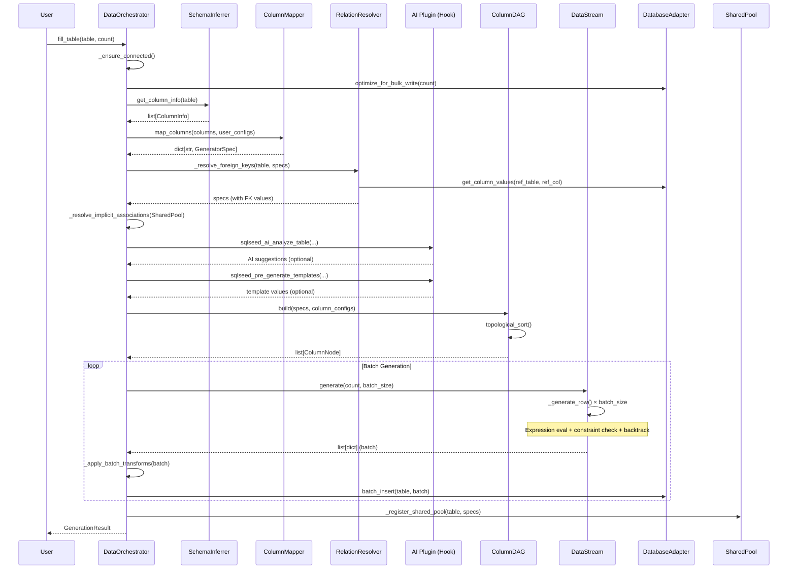
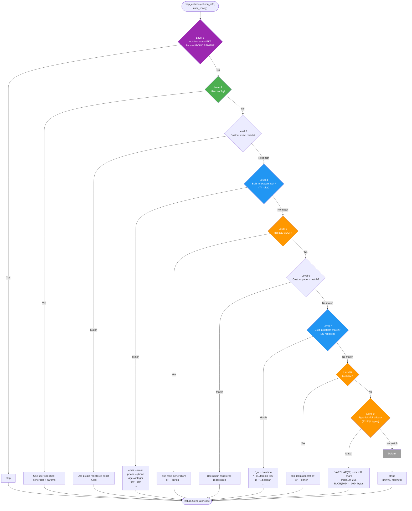
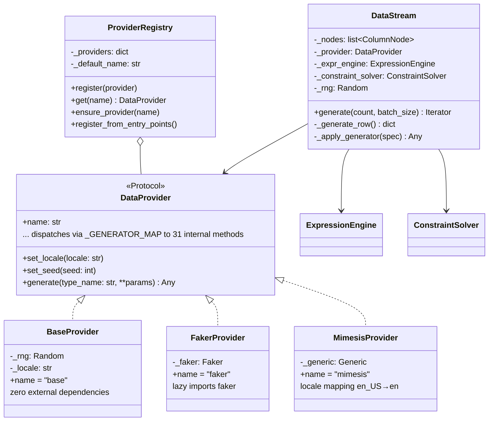
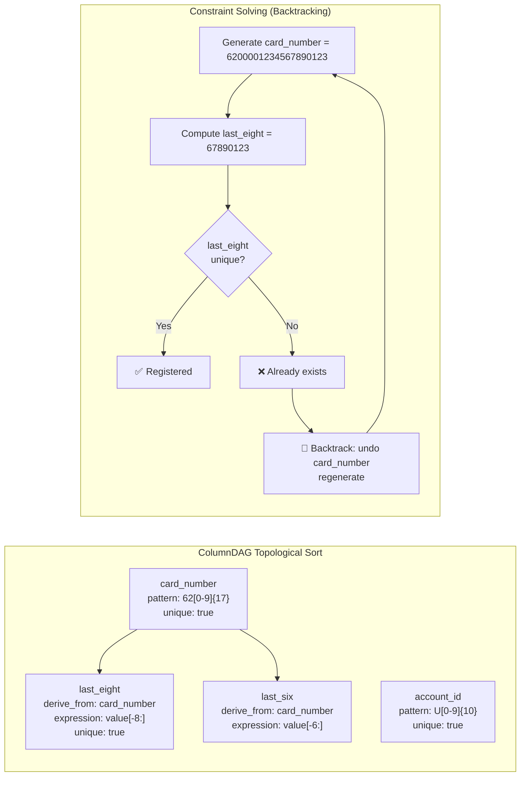
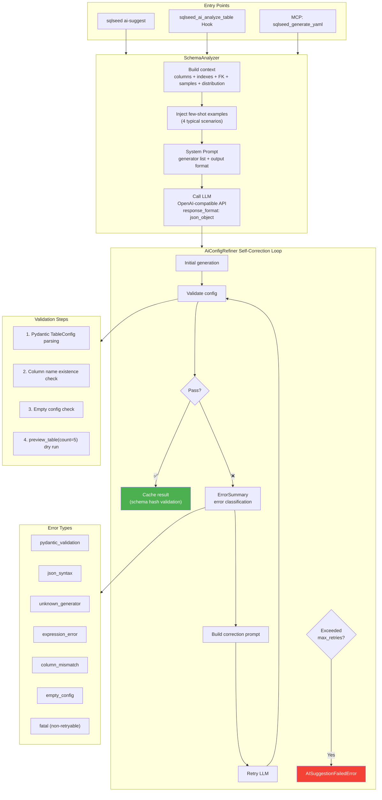
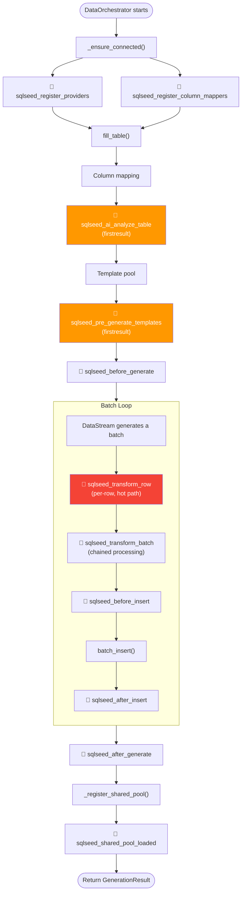
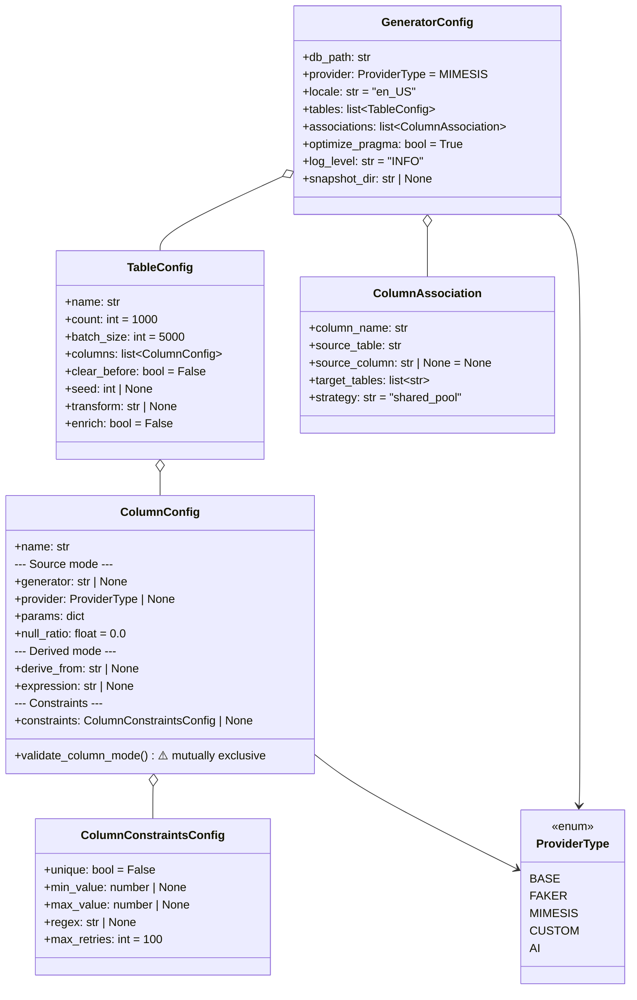
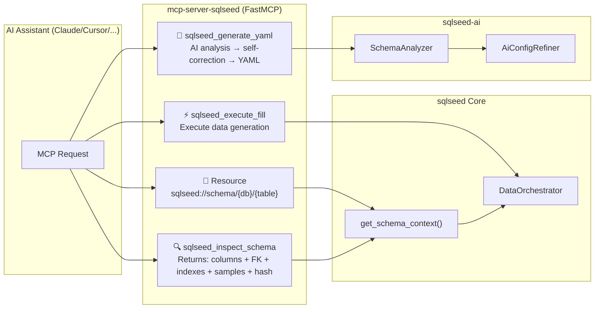

# sqlseed Architecture

**[English](architecture.md)** | [中文](architecture.zh-CN.md)

> This document uses Mermaid diagrams to visualize sqlseed's overall architecture and internal module structures.

---

## 1. System Architecture

```mermaid
graph TB
    subgraph User["👤 User Entry Points"]
        CLI["CLI<br/>click commands"]
        API["Python API<br/>fill / connect / preview"]
        YAML["YAML/JSON<br/>config files"]
        MCP["MCP Server<br/>AI assistant integration"]
    end

    subgraph Core["🧠 Core Orchestration (core/)"]
        Orch["DataOrchestrator<br/>main orchestrator"]
        Mapper["ColumnMapper<br/>9-level strategy chain"]
        Schema["SchemaInferrer<br/>schema inference"]
        Relation["RelationResolver<br/>FK resolution"]
        Pool["SharedPool<br/>cross-table value pool"]
        DAG["ColumnDAG<br/>column dependency graph"]
        Expr["ExpressionEngine<br/>expression evaluation"]
        Constraint["ConstraintSolver<br/>constraint backtracking"]
        Transform["TransformLoader<br/>script loading"]
        Result["GenerationResult<br/>result statistics"]
    end

    subgraph Gen["⚡ Generator Layer (generators/)"]
        Protocol["DataProvider<br/>Protocol"]
        Registry["ProviderRegistry<br/>registry"]
        Base["BaseProvider<br/>built-in"]
        Faker["FakerProvider<br/>Faker"]
        Mimesis["MimesisProvider<br/>Mimesis"]
        Stream["DataStream<br/>streaming generation"]
    end

    subgraph DB["💾 Database Layer (database/)"]
        DBProto["DatabaseAdapter<br/>Protocol"]
        SU["SQLiteUtilsAdapter<br/>default"]
        Raw["RawSQLiteAdapter<br/>fallback"]
        Pragma["PragmaOptimizer<br/>3-tier optimization"]
    end

    subgraph Plugin["🧩 Plugin Layer (plugins/)"]
        HookSpec["SqlseedHookSpec<br/>11 hooks"]
        PM["PluginManager<br/>pluggy"]
    end

    subgraph Config["⚙️ Config Layer (config/)"]
        Models["Pydantic Models<br/>GeneratorConfig"]
        Loader["Loader<br/>YAML/JSON"]
        Snapshot["SnapshotManager<br/>snapshot replay"]
    end

    subgraph AI["🤖 AI Plugin (sqlseed-ai)"]
        Analyzer["SchemaAnalyzer<br/>LLM analysis"]
        Refiner["AiConfigRefiner<br/>self-correction loop"]
        Examples["Few-shot<br/>example library"]
        Errors["ErrorSummary<br/>error classification"]
    end

    subgraph Utils["🔧 Utilities (_utils/)"]
        SQL["sql_safe<br/>SQL injection protection"]
        Helpers["schema_helpers<br/>AUTOINCREMENT"]
        Metrics["MetricsCollector<br/>performance metrics"]
        Progress["Progress<br/>Rich progress bar"]
        Logger["Logger<br/>structlog"]
    end

    CLI --> Orch
    API --> Orch
    YAML --> Loader --> Orch
    MCP --> Orch

    Orch --> Schema
    Orch --> Mapper
    Orch --> Relation
    Orch --> DAG
    Orch --> Stream
    Orch --> Pool
    Orch --> Result
    Orch --> PM

    DAG --> Expr
    DAG --> Constraint
    Stream --> Expr
    Stream --> Constraint
    Stream --> Transform
    Stream --> Protocol

    Mapper --> DBProto
    Schema --> DBProto
    Relation --> DBProto
    Relation --> Pool

    Registry --> Base
    Registry --> Faker
    Registry --> Mimesis
    Registry --> Protocol

    DBProto --> SU
    DBProto --> Raw
    SU --> Pragma
    Raw --> Pragma

    PM --> HookSpec
    PM --> AI

    Analyzer --> Refiner
    Refiner --> Errors
    Analyzer --> Examples

    Orch --> Config

    Orch -.-> SQL
    Orch -.-> Metrics
    Orch -.-> Progress
    Orch -.-> Logger
    SU -.-> SQL
    Raw -.-> SQL
    SU -.-> Helpers
    Raw -.-> Helpers
```

---

## 2. Core Orchestration Flow (fill_table Execution)

---

## 3. ColumnMapper 9-Level Strategy Chain

---

## 4. Generator Layer Architecture

---

## 5. Database Layer Architecture

---

## 6. Column Dependency DAG & Constraint Backtracking

---

## 7. AI Plugin Architecture

---

## 8. Plugin Hook Lifecycle

---

## 9. Config Model Hierarchy

---

## 10. MCP Server Architecture

