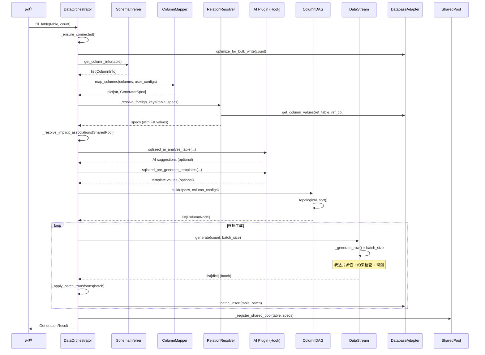
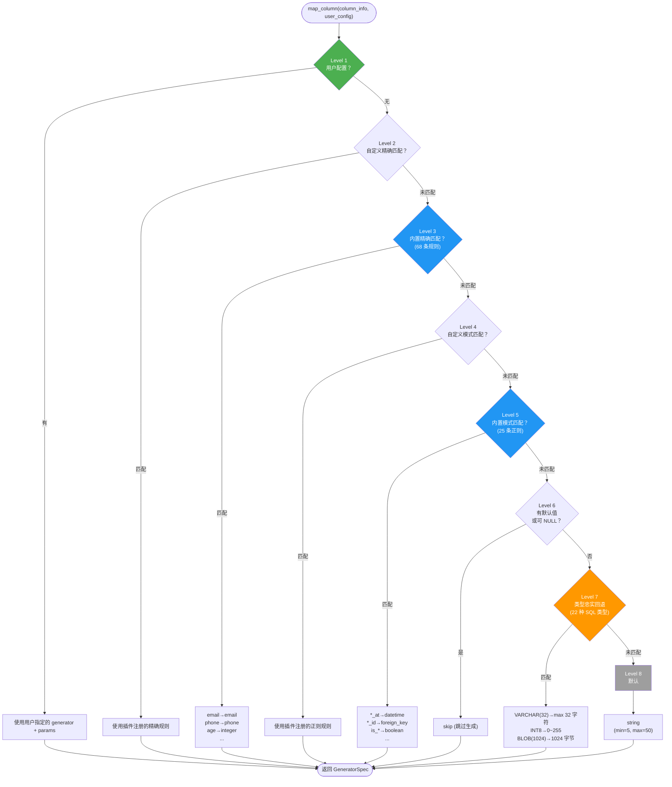
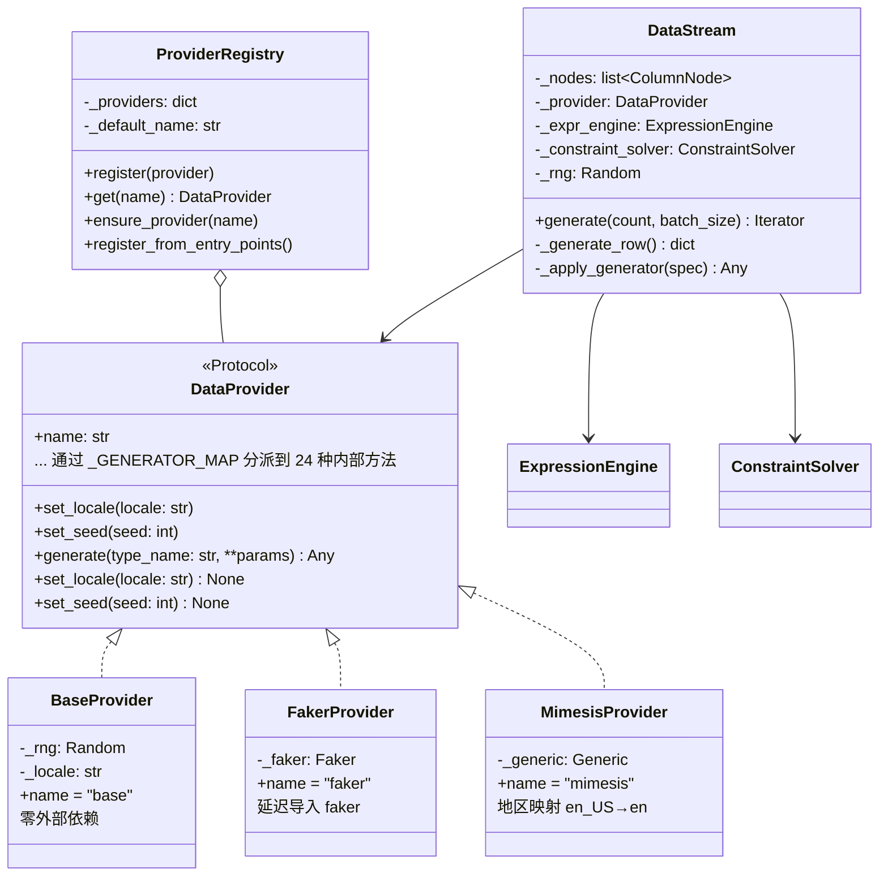
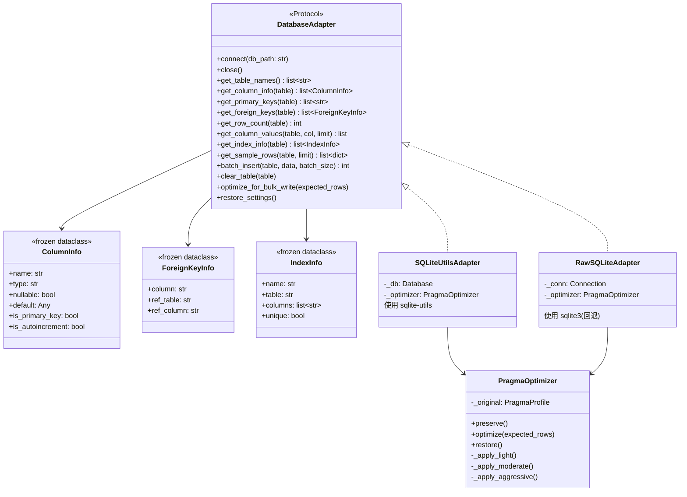
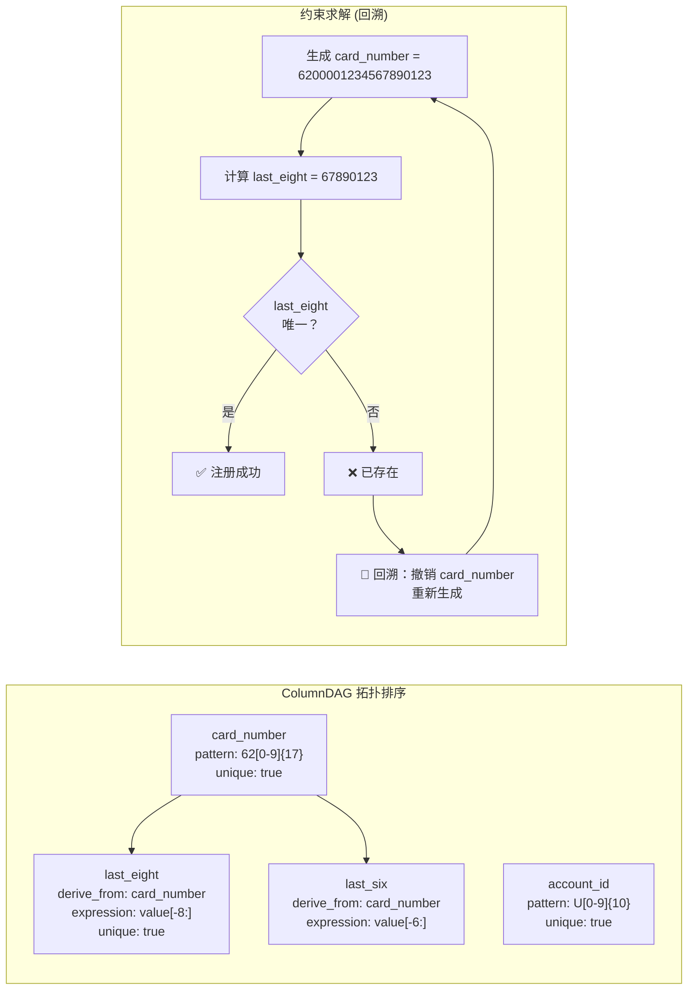
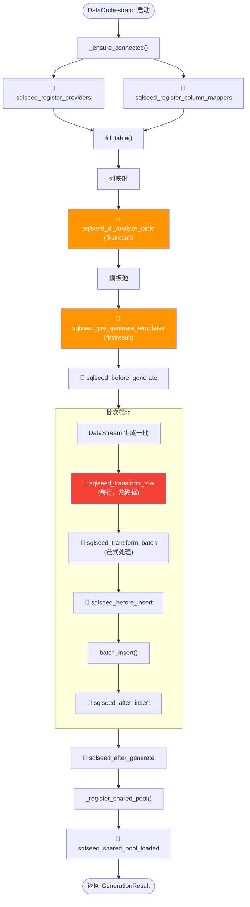
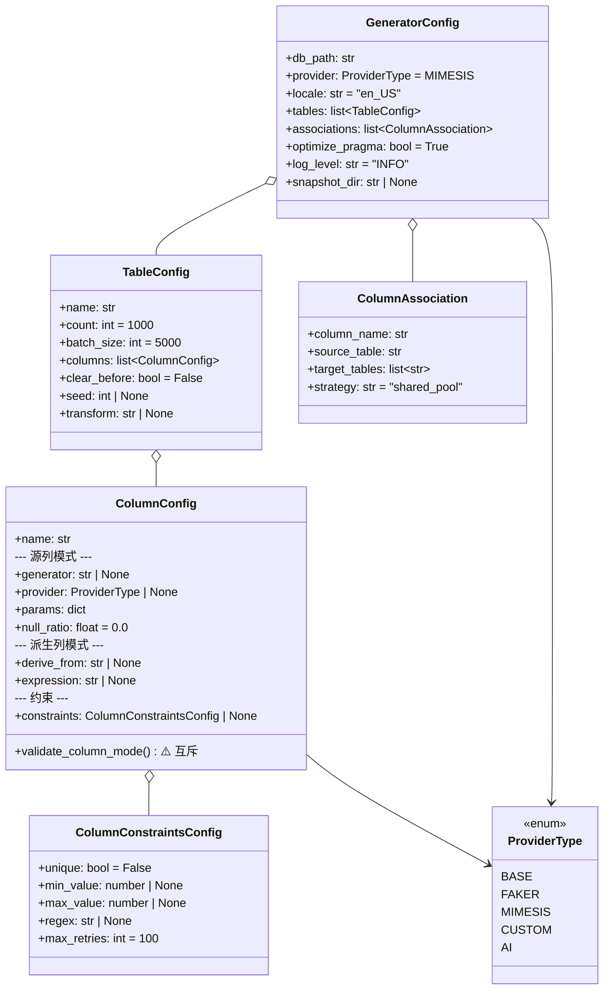
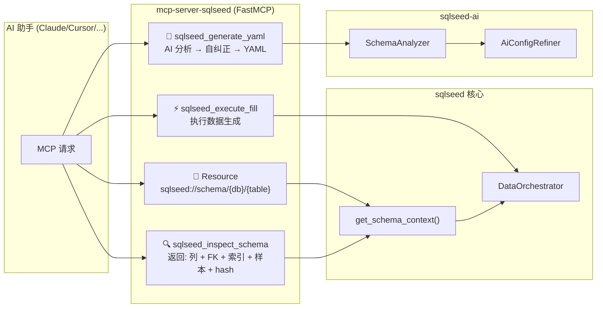

# sqlseed 架构图

> 本文档使用 Mermaid 图表可视化 sqlseed 的整体架构和各模块内部结构。

---

## 1. 整体系统架构

```mermaid
graph TB
    subgraph User["👤 用户入口"]
        CLI["CLI<br/>click 命令行"]
        API["Python API<br/>fill / connect / preview"]
        YAML["YAML/JSON<br/>配置文件"]
        MCP["MCP 服务器<br/>AI 助手交互"]
    end

    subgraph Core["🧠 核心编排层 (core/)"]
        Orch["DataOrchestrator<br/>主编排引擎"]
        Mapper["ColumnMapper<br/>8 级策略链"]
        Schema["SchemaInferrer<br/>Schema 推断"]
        Relation["RelationResolver<br/>外键解析"]
        Pool["SharedPool<br/>跨表值池"]
        DAG["ColumnDAG<br/>列依赖图"]
        Expr["ExpressionEngine<br/>表达式求值"]
        Constraint["ConstraintSolver<br/>约束回溯"]
        Transform["TransformLoader<br/>脚本加载"]
        Result["GenerationResult<br/>结果统计"]
    end

    subgraph Gen["⚡ 数据生成层 (generators/)"]
        Protocol["DataProvider<br/>Protocol"]
        Registry["ProviderRegistry<br/>注册表"]
        Base["BaseProvider<br/>内置"]
        Faker["FakerProvider<br/>Faker"]
        Mimesis["MimesisProvider<br/>Mimesis"]
        Stream["DataStream<br/>流式生成"]
    end

    subgraph DB["💾 数据库层 (database/)"]
        DBProto["DatabaseAdapter<br/>Protocol"]
        SU["SQLiteUtilsAdapter<br/>默认"]
        Raw["RawSQLiteAdapter<br/>回退"]
        Pragma["PragmaOptimizer<br/>三级优化"]
    end

    subgraph Plugin["🧩 插件层 (plugins/)"]
        HookSpec["SqlseedHookSpec<br/>11 个 Hook"]
        PM["PluginManager<br/>pluggy"]
    end

    subgraph Config["⚙️ 配置层 (config/)"]
        Models["Pydantic 模型<br/>GeneratorConfig"]
        Loader["Loader<br/>YAML/JSON"]
        Snapshot["SnapshotManager<br/>快照回放"]
    end

    subgraph AI["🤖 AI 插件 (sqlseed-ai)"]
        Analyzer["SchemaAnalyzer<br/>LLM 分析"]
        Refiner["AiConfigRefiner<br/>自纠正闭环"]
        Examples["Few-shot<br/>示例库"]
        Errors["ErrorSummary<br/>错误分类"]
    end

    subgraph Utils["🔧 工具层 (_utils/)"]
        SQL["sql_safe<br/>SQL 注入防护"]
        Helpers["schema_helpers<br/>AUTOINCREMENT"]
        Metrics["MetricsCollector<br/>性能度量"]
        Progress["Progress<br/>Rich 进度条"]
        Logger["Logger<br/>structlog"]
    end

    CLI --> Orch
    API --> Orch
    YAML --> Loader --> Orch
    MCP --> Orch

    Orch --> Schema
    Orch --> Mapper
    Orch --> Relation
    Orch --> DAG
    Orch --> Stream
    Orch --> Pool
    Orch --> Result
    Orch --> PM

    DAG --> Expr
    DAG --> Constraint
    Stream --> Expr
    Stream --> Constraint
    Stream --> Transform
    Stream --> Protocol

    Mapper --> DBProto
    Schema --> DBProto
    Relation --> DBProto
    Relation --> Pool

    Registry --> Base
    Registry --> Faker
    Registry --> Mimesis
    Registry --> Protocol

    DBProto --> SU
    DBProto --> Raw
    SU --> Pragma
    Raw --> Pragma

    PM --> HookSpec
    PM --> AI

    Analyzer --> Refiner
    Refiner --> Errors
    Analyzer --> Examples

    Orch --> Config

    Orch -.-> SQL
    Orch -.-> Metrics
    Orch -.-> Progress
    Orch -.-> Logger
    SU -.-> SQL
    Raw -.-> SQL
    SU -.-> Helpers
    Raw -.-> Helpers
```

---

## 2. 核心编排流程（fill_table 执行链路）

---

## 3. ColumnMapper 8 级策略链

---

## 4. 数据生成层架构

---

## 5. 数据库层架构

---

## 6. 列依赖 DAG 与约束回溯

---

## 7. AI 插件架构

---

## 8. 插件 Hook 生命周期

---

## 9. 配置模型层次结构

---

## 10. MCP 服务器架构

