# sqlseed Architecture

**[English](architecture.md)** | [中文](architecture.zh-CN.md)

> This document uses Mermaid diagrams to visualize sqlseed's overall architecture and internal module structures.

---

## 1. System Architecture

This page describes the five-package implementation on `main`; see [migration](migration.md)
for installation and differences from published packages. Core does not depend on
entry-point plugins. `DataStream` belongs to Core; Web runtime and maintenance
processes are covered in section 12.

```mermaid
graph TB
    subgraph User["👤 User Entry Points"]
        CLI["CLI<br/>click commands"]
        API["Python API<br/>fill / connect / preview"]
        YAML["YAML/JSON<br/>config files"]
        MCP["MCP Server<br/>AI assistant integration"]
    end

    subgraph Core["🧠 Core Orchestration (core/)"]
        Orch["DataOrchestrator<br/>main orchestrator"]
        Mapper["ColumnMapper<br/>9-level strategy chain"]
        Schema["SchemaInferrer<br/>schema inference"]
        Relation["RelationResolver<br/>FK resolution"]
        Pool["SharedPool<br/>cross-table value pool"]
        DAG["ColumnDAG<br/>column dependency graph"]
        Expr["ExpressionEngine<br/>expression evaluation"]
        Constraint["ConstraintSolver<br/>constraint backtracking"]
        Transform["TransformLoader<br/>script loading"]
        Result["GenerationResult<br/>result statistics"]
        Stream["DataStream<br/>streaming generation"]
        CheckParser["check_parser.py<br/>CHECK constraint parsing"]
        SchemaFallback["schema_fallback.py<br/>schema-only fallback generator"]
        Features["features.py<br/>normalized structural features"]
    end

    subgraph Gen["⚡ Generator Layer (generators/)"]
        Protocol["DataProvider<br/>Protocol"]
        Registry["ProviderRegistry<br/>registry"]
        Base["BaseProvider<br/>built-in"]
        Faker["FakerProvider<br/>Faker"]
        Mimesis["MimesisProvider<br/>Mimesis"]
    end

    subgraph DB["💾 Database Layer (database/)"]
        DBProto["DatabaseAdapter<br/>Protocol"]
        SU["SQLAlchemyAdapter<br/>required (SQLite/PostgreSQL)"]
        Raw["RawSQLiteAdapter<br/>test-only"]
        Pragma["PragmaOptimizer<br/>3-tier optimization"]
        Dialect["_dialect.py<br/>dialect abstraction"]
        TypeNorm["_type_normalizer.py<br/>type normalization"]
        BulkOpt["_bulk_optimizer.py<br/>bulk write optimization"]
        BaseAdapt["_base_adapter.py<br/>shared base"]
        Helpers["_helpers.py<br/>batch insert helpers"]
    end

    subgraph Plugin["🧩 Plugin Layer (plugins/)"]
        HookSpec["SqlseedHookSpec<br/>12 hooks"]
        PM["PluginManager<br/>pluggy"]
    end

    subgraph Config["⚙️ Config Layer (config/)"]
        Models["Pydantic Models<br/>GeneratorConfig"]
        Loader["Loader<br/>YAML/JSON"]
        Snapshot["SnapshotManager<br/>snapshot save/load"]
    end

    subgraph AI["🤖 AI Plugin (sqlseed-ai)"]
        Analyzer["SchemaAnalyzer<br/>LLM analysis"]
        Refiner["AiConfigRefiner<br/>self-correction loop"]
        Examples["Few-shot<br/>example library"]
        Errors["ErrorSummary<br/>error classification"]
        GemmaModel["GemmaModel<br/>Gemma 4 model adapter"]
        AIBackend["AIBackend<br/>multi-backend router"]
        GemmaTools["GEMMA_TOOLS<br/>Native Function Calling"]
    end

    subgraph Utils["🔧 Utilities (_utils/)"]
        SQL["sql_safe<br/>SQL injection protection"]
        Metrics["MetricsCollector<br/>performance metrics"]
        Progress["Progress<br/>multi-backend: Rich/tqdm/Null"]
        Paths["Paths<br/>platform cache dirs"]
        Logger["Logger<br/>structlog"]
    end

    CLI --> Orch
    API --> Orch
    YAML --> Loader --> Orch
    MCP --> Orch

    Orch --> Schema
    Orch --> Mapper
    Orch --> Relation
    Orch --> DAG
    Orch --> Stream
    Orch --> Pool
    Orch --> Result
    Orch --> PM

    DAG --> Expr
    DAG --> Constraint
    Stream --> Expr
    Stream --> Constraint
    Stream --> Transform
    Stream --> Protocol

    Mapper --> DBProto
    Schema --> DBProto
    Relation --> DBProto
    Relation --> Pool

    Registry --> Base
    Registry --> Faker
    Registry --> Mimesis
    Registry --> Protocol

    DBProto --> SU
    DBProto --> Raw
    SU --> Pragma
    Raw --> Pragma
    SU --> Dialect
    SU --> TypeNorm
    SU --> BulkOpt
    SU --> BaseAdapt
    SU --> Helpers
    Raw --> BaseAdapt
    Raw --> Helpers

    PM --> HookSpec
    PM --> AI

    Analyzer --> Refiner
    Refiner --> Errors
    Analyzer --> Examples
    AIBackend --> GemmaModel
    AIBackend --> Analyzer
    GemmaModel --> GemmaTools

    Orch --> Config

    Orch -.-> SQL
    Orch -.-> Metrics
    Orch -.-> Progress
    Orch -.-> Logger
    SU -.-> SQL
    Raw -.-> SQL
    SU -.-> Helpers
    Raw -.-> Helpers
```

---

## 2. Core Orchestration Flow (fill_table)

This diagram summarizes the normal execution path. Schema support preflight
precedes clearing and writing. Ordinary Core batch execution can retain earlier
committed batches after a later failure; check both `errors` and `count` as
described in [failure semantics](maintainable-release.md#write-semantics).

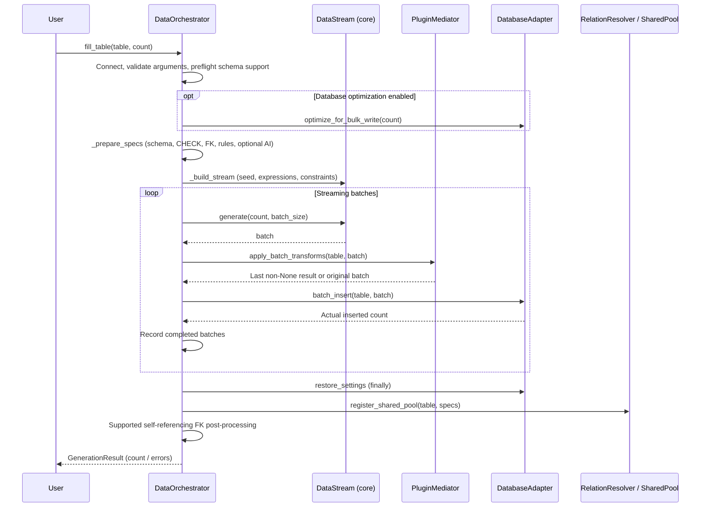
```mermaid
sequenceDiagram
    participant U as User
    participant O as DataOrchestrator
    participant ST as DataStream (core)
    participant PM as PluginMediator
    participant DB as DatabaseAdapter
    participant P as RelationResolver / SharedPool

    U->>O: fill_table(table, count)
    O->>O: Connect, validate arguments, preflight schema support
    opt Database optimization enabled
        O->>DB: optimize_for_bulk_write(count)
    end
    O->>O: _prepare_specs (schema, CHECK, FK, rules, optional AI)
    O->>ST: _build_stream (seed, expressions, constraints)
    loop Streaming batches
        O->>ST: generate(count, batch_size)
        ST-->>O: batch
        O->>PM: apply_batch_transforms(table, batch)
        PM-->>O: Last non-None result or original batch
        O->>DB: batch_insert(table, batch)
        DB-->>O: Actual inserted count
        O->>O: Record completed batches
    end
    O->>DB: restore_settings (finally)
    O->>P: register_shared_pool(table, specs)
    O->>O: Supported self-referencing FK post-processing
    O-->>U: GenerationResult (count / errors)
```

---

## 3. ColumnMapper 9-Level Strategy Chain

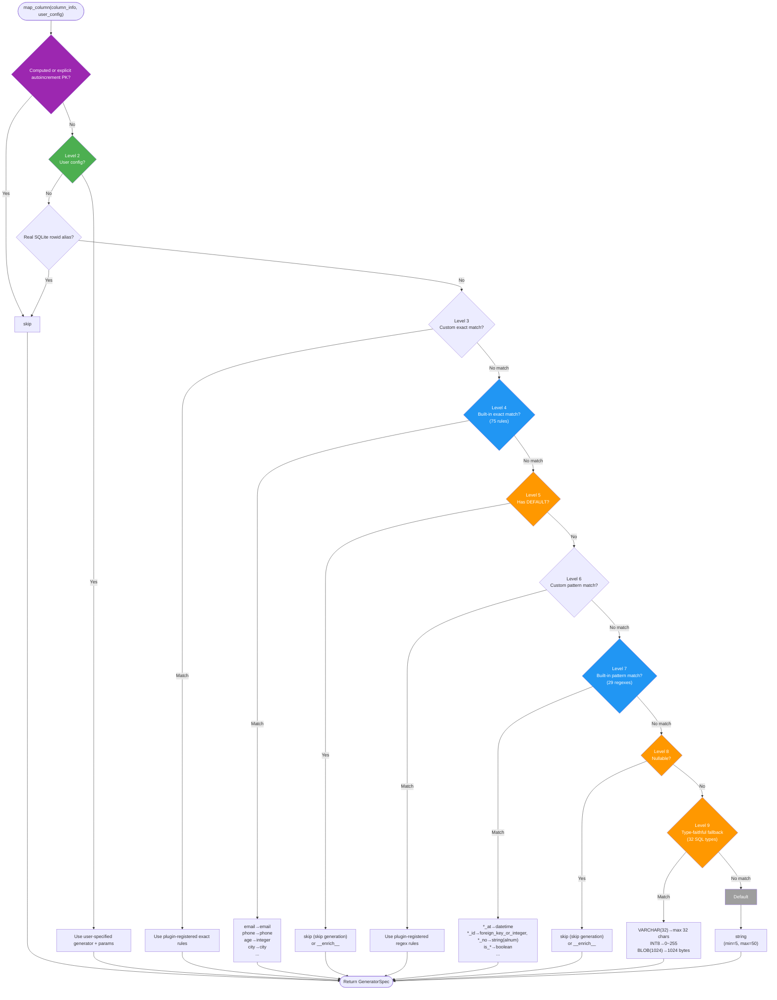
```mermaid
flowchart TD
    Start(["map_column(column_info, user_config)"]) --> L1

    L1{"Computed or explicit autoincrement PK?"} -->|Yes| R1["skip"]
    L1 -->|No| L2

    L2{"Level 2<br/>User config?"} -->|Yes| R2["Use user-specified generator + params"]
    L2 -->|No| Rowid{"Real SQLite rowid alias?"}
    Rowid -->|Yes| R1
    Rowid -->|No| L3

    L3{"Level 3<br/>Custom exact match?"} -->|Match| R3["Use plugin-registered exact rules"]
    L3 -->|No match| L4

    L4{"Level 4<br/>Built-in exact match?<br/>(<!-- BEGIN:AUTO-GENERATED:exact-match-rule-count -->75<!-- END:AUTO-GENERATED:exact-match-rule-count --> rules)"} -->|Match| R4["email→email<br/>phone→phone<br/>age→integer<br/>city→city<br/>..."]
    L4 -->|No match| L5

    L5{"Level 5<br/>Has DEFAULT?"} -->|Yes| R5["skip (skip generation)<br/>or __enrich__"]
    L5 -->|No| L6

    L6{"Level 6<br/>Custom pattern match?"} -->|Match| R6["Use plugin-registered regex rules"]
    L6 -->|No match| L7

    L7{"Level 7<br/>Built-in pattern match?<br/>(<!-- BEGIN:AUTO-GENERATED:pattern-match-rule-count -->29<!-- END:AUTO-GENERATED:pattern-match-rule-count --> regexes)"} -->|Match| R7["*_at→datetime<br/>*_id→foreign_key_or_integer, *_no→string(alnum)<br/>is_*→boolean<br/>..."]
    L7 -->|No match| L8

    L8{"Level 8<br/>Nullable?"} -->|Yes| R8["skip (skip generation)<br/>or __enrich__"]
    L8 -->|No| L9

    L9{"Level 9<br/>Type-faithful fallback<br/>(32 SQL types)"} -->|Match| R9["VARCHAR(32)→max 32 chars<br/>INT8→0~255<br/>BLOB(1024)→1024 bytes"]
    L9 -->|No match| L10

    L10["Default"] --> R10["string<br/>(min=5, max=50)"]

    R1 --> Done(["Return GeneratorSpec"])
    R2 --> Done
    R3 --> Done
    R4 --> Done
    R5 --> Done
    R6 --> Done
    R7 --> Done
    R8 --> Done
    R9 --> Done
    R10 --> Done

    style L1 fill:#9C27B0,color:#fff
    style L2 fill:#4CAF50,color:#fff
    style L4 fill:#2196F3,color:#fff
    style L5 fill:#FF9800,color:#fff
    style L7 fill:#2196F3,color:#fff
    style L8 fill:#FF9800,color:#fff
    style L9 fill:#FF9800,color:#fff
    style L10 fill:#9E9E9E,color:#fff
```

---

## 4. Providers and Core Streaming

Providers and dispatch live in `generators/`. The `DataStream`, expression, and
constraint consumers shown here belong to `core/`; generators do not import Core.

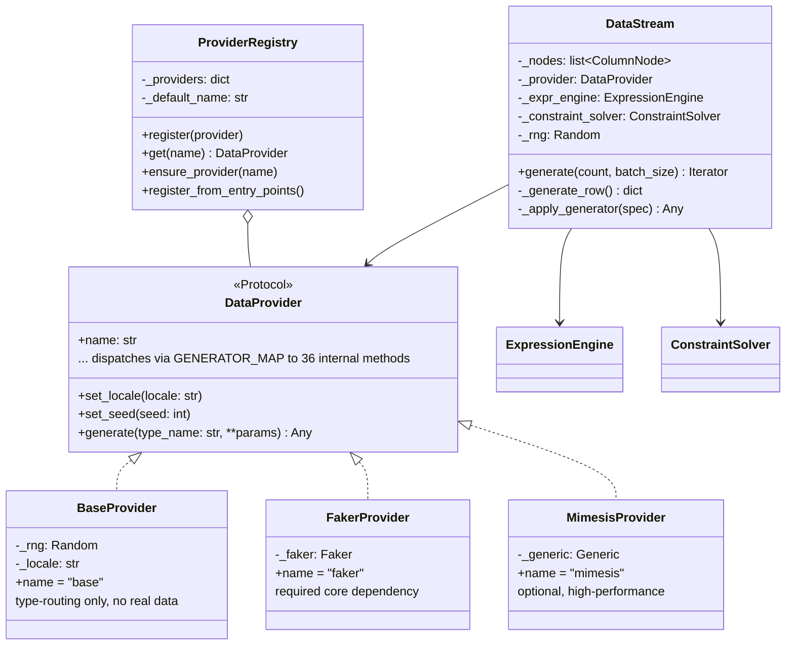
```mermaid
classDiagram
    class DataProvider {
        <<Protocol>>
        +name: str
        +set_locale(locale: str)
        +set_seed(seed: int)
        +generate(type_name: str, **params) Any
        ... dispatches via GENERATOR_MAP to 36 internal methods
    }

    class BaseProvider {
        -_rng: Random
        -_locale: str
        +name = "base"
        type-routing only, no real data
    }

    class FakerProvider {
        -_faker: Faker
        +name = "faker"
        required core dependency
    }

    class MimesisProvider {
        -_generic: Generic
        +name = "mimesis"
        optional, high-performance
    }

    class ProviderRegistry {
        -_providers: dict
        -_default_name: str
        +register(provider)
        +get(name) DataProvider
        +ensure_provider(name)
        +register_from_entry_points()
    }

    class DataStream {
        -_nodes: list~ColumnNode~
        -_provider: DataProvider
        -_expr_engine: ExpressionEngine
        -_constraint_solver: ConstraintSolver
        -_rng: Random
        +generate(count, batch_size) Iterator
        -_generate_row() dict
        -_apply_generator(spec) Any
    }

    DataProvider <|.. BaseProvider
    DataProvider <|.. FakerProvider
    DataProvider <|.. MimesisProvider
    ProviderRegistry o-- DataProvider
    DataStream --> DataProvider
    DataStream --> ExpressionEngine
    DataStream --> ConstraintSolver
```

---

## 5. Database Layer Architecture

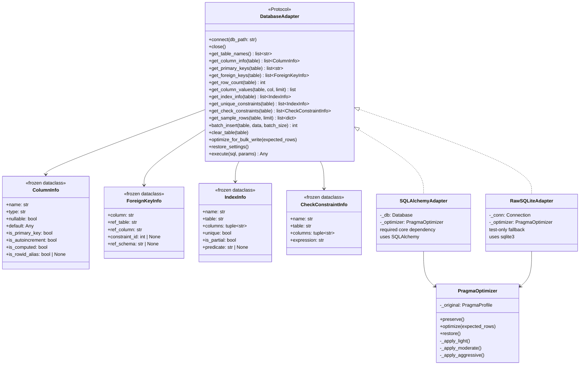
```mermaid
classDiagram
    class DatabaseAdapter {
        <<Protocol>>
        +connect(db_path: str)
        +close()
        +get_table_names() list~str~
        +get_column_info(table) list~ColumnInfo~
        +get_primary_keys(table) list~str~
        +get_foreign_keys(table) list~ForeignKeyInfo~
        +get_row_count(table) int
        +get_column_values(table, col, limit) list
        +get_index_info(table) list~IndexInfo~
        +get_unique_constraints(table) list~IndexInfo~
        +get_check_constraints(table) list~CheckConstraintInfo~
        +get_sample_rows(table, limit) list~dict~
        +batch_insert(table, data, batch_size) int
        +clear_table(table)
        +optimize_for_bulk_write(expected_rows)
        +restore_settings()
        +execute(sql, params) Any
    }

    class ColumnInfo {
        <<frozen dataclass>>
        +name: str
        +type: str
        +nullable: bool
        +default: Any
        +is_primary_key: bool
        +is_autoincrement: bool
        +is_computed: bool
        +is_rowid_alias: bool | None
    }

    class ForeignKeyInfo {
        <<frozen dataclass>>
        +column: str
        +ref_table: str
        +ref_column: str
        +constraint_id: int | None
        +ref_schema: str | None
    }

    class IndexInfo {
        <<frozen dataclass>>
        +name: str
        +table: str
        +columns: tuple~str~
        +unique: bool
        +is_partial: bool
        +predicate: str | None
    }

    class CheckConstraintInfo {
        <<frozen dataclass>>
        +name: str
        +table: str
        +columns: tuple~str~
        +expression: str
    }

    class SQLAlchemyAdapter {
        -_db: Database
        -_optimizer: PragmaOptimizer
        required core dependency
        uses SQLAlchemy
    }

    class RawSQLiteAdapter {
        -_conn: Connection
        -_optimizer: PragmaOptimizer
        test-only fallback
        uses sqlite3
    }

    class PragmaOptimizer {
        -_original: PragmaProfile
        +preserve()
        +optimize(expected_rows)
        +restore()
        -_apply_light()
        -_apply_moderate()
        -_apply_aggressive()
    }

    DatabaseAdapter <|.. SQLAlchemyAdapter
    DatabaseAdapter <|.. RawSQLiteAdapter
    SQLAlchemyAdapter --> PragmaOptimizer
    RawSQLiteAdapter --> PragmaOptimizer
    DatabaseAdapter --> ColumnInfo
    DatabaseAdapter --> ForeignKeyInfo
    DatabaseAdapter --> IndexInfo
    DatabaseAdapter --> CheckConstraintInfo
```

---

`ColumnInfo.is_rowid_alias` is explicit for adapter metadata; its `None` default preserves legacy constructors. SQLite detects real rowid aliases separately from explicit AUTOINCREMENT and preserves ordinary nullable primary keys. `IndexInfo.is_partial` prevents treating conditional uniqueness as unconditional. SQLAlchemy retains the reflected WHERE SQL in `predicate`; raw SQLite metadata may omit its text. The database evaluates predicates during writes. FK metadata retains per-table constraint identity and reflected parent schema.

## 6. Column Dependency DAG & Constraint Backtracking

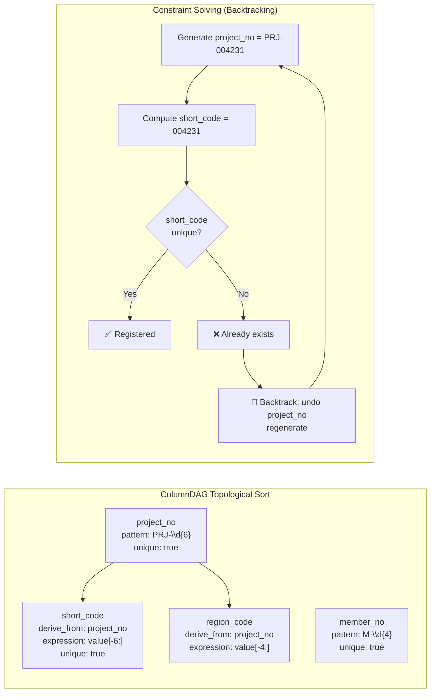
```mermaid
flowchart LR
    subgraph DAG["ColumnDAG Topological Sort"]
        project_no["project_no<br/>pattern: PRJ-\\d{6}<br/>unique: true"]
        short_code_node["short_code<br/>derive_from: project_no<br/>expression: value[-6:]<br/>unique: true"]
        region_code["region_code<br/>derive_from: project_no<br/>expression: value[-4:]"]
        member_no["member_no<br/>pattern: M-\\d{4}<br/>unique: true"]
    end

    project_no --> short_code_node
    project_no --> region_code

    subgraph Backtrack["Constraint Solving (Backtracking)"]
        direction TB
        Gen1["Generate project_no = PRJ-004231"]
        Derive1["Compute short_code = 004231"]
        Check1{"short_code<br/>unique?"}
        Success["✅ Registered"]
        Fail["❌ Already exists"]
        BT["🔄 Backtrack: undo project_no<br/>regenerate"]

        Gen1 --> Derive1 --> Check1
        Check1 -->|Yes| Success
        Check1 -->|No| Fail --> BT --> Gen1
    end
```

---

## 7. AI Plugin Architecture

The AI plugin retains distinct entry points. Single-table `ai-suggest` uses
`SchemaAnalyzer` and `AiConfigRefiner`; `ai-analyze` defaults to
`AutoHealOrchestrator`, while `auto-heal` repairs an existing configuration.
`sqlseed_ai.runtime` constructs configuration, clients, and heal orchestrators;
terminal output and exit codes remain in CLI. Web requests reviewable suggestions
through Python services.

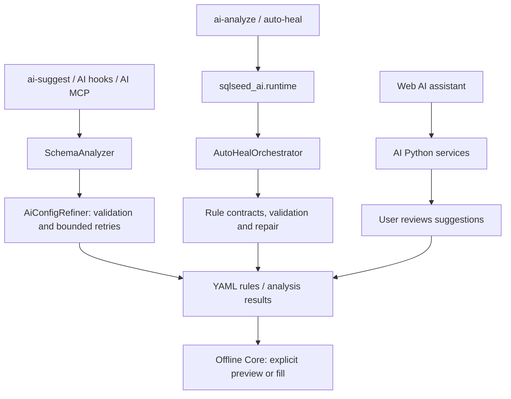
```mermaid
flowchart TB
    Suggest["ai-suggest / AI hooks / AI MCP"] --> Analyzer[SchemaAnalyzer]
    Analyzer --> Refiner["AiConfigRefiner: validation and bounded retries"]
    Analyze["ai-analyze / auto-heal"] --> Runtime[sqlseed_ai.runtime]
    Runtime --> AutoHeal[AutoHealOrchestrator]
    AutoHeal --> Contracts["Rule contracts, validation and repair"]
    Web["Web AI assistant"] --> Services["AI Python services"]
    Refiner --> Rules["YAML rules / analysis results"]
    Contracts --> Rules
    Services --> Review["User reviews suggestions"]
    Review --> Rules
    Rules --> Core["Offline Core: explicit preview or fill"]
```

`ai-suggest --auto-heal` selects the full healing path and processes all tables.
The AI MCP tool `sqlseed_gemma4_agent_fill` is a separate analysis-and-execution
entry point; ordinary analysis commands and Web suggestions do not automatically
write to the database. Model connectivity, output quality, and supported schema
features need separate verification.

---

## 8. Plugin Hook Lifecycle

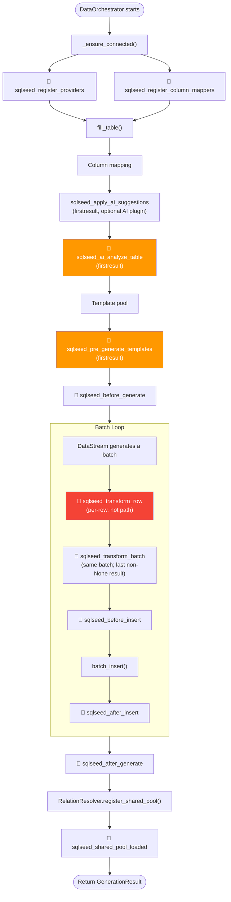
```mermaid
flowchart TB
    Start(["DataOrchestrator starts"]) --> Connect

    Connect["_ensure_connected()"]
    Connect --> H1["🔌 sqlseed_register_providers"]
    Connect --> H2["🔌 sqlseed_register_column_mappers"]

    H1 --> Fill["fill_table()"]
    H2 --> Fill

    Fill --> Mapping["Column mapping"]
    Mapping --> Mediation["sqlseed_apply_ai_suggestions<br/>(firstresult, optional AI plugin)"]
    Mediation --> H3["🤖 sqlseed_ai_analyze_table<br/>(firstresult)"]

    H3 --> Template["Template pool"]
    Template --> H4["🤖 sqlseed_pre_generate_templates<br/>(firstresult)"]

    H4 --> H5["📢 sqlseed_before_generate"]

    H5 --> BatchLoop

    subgraph BatchLoop["Batch Loop"]
        direction TB
        GenBatch["DataStream generates a batch"]
        H6["🔄 sqlseed_transform_row<br/>(per-row, hot path)"]
        H7["🔄 sqlseed_transform_batch<br/>(same batch; last non-None result)"]
        H8["📢 sqlseed_before_insert"]
        Insert["batch_insert()"]
        H9["📢 sqlseed_after_insert"]

        GenBatch --> H6 --> H7 --> H8 --> Insert --> H9
    end

    BatchLoop --> H10["📢 sqlseed_after_generate"]

    H10 --> RegisterPool["RelationResolver.register_shared_pool()"]
    RegisterPool --> H11["📢 sqlseed_shared_pool_loaded"]

    H11 --> Done(["Return GenerationResult"])

    style H3 fill:#FF9800,color:#fff
    style H4 fill:#FF9800,color:#fff
    style H6 fill:#F44336,color:#fff
```

---

## 9. Config Model Hierarchy

For source columns, `params` accepts a mapping; omitted or `null` values retain
the empty-parameter behavior. Strings, lists, and other non-mapping values are
rejected during configuration loading instead of silently discarding the rules.
Top-level generator arguments still override keys in nested `params`.

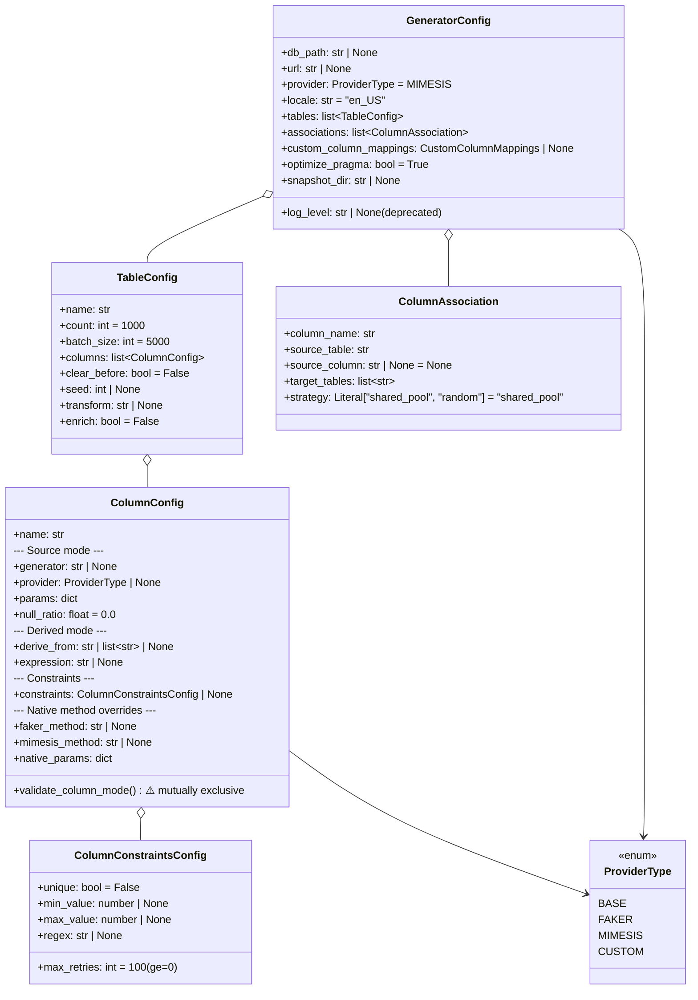
```mermaid
classDiagram
    class GeneratorConfig {
        +db_path: str | None
        +url: str | None
        +provider: ProviderType = MIMESIS
        +locale: str = "en_US"
        +tables: list~TableConfig~
        +associations: list~ColumnAssociation~
        +custom_column_mappings: CustomColumnMappings | None
        +optimize_pragma: bool = True
        +snapshot_dir: str | None
        +log_level: str | None (deprecated)
    }

    class TableConfig {
        +name: str
        +count: int = 1000
        +batch_size: int = 5000
        +columns: list~ColumnConfig~
        +clear_before: bool = False
        +seed: int | None
        +transform: str | None
        +enrich: bool = False
    }

    class ColumnConfig {
        +name: str
        --- Source mode ---
        +generator: str | None
        +provider: ProviderType | None
        +params: dict
        +null_ratio: float = 0.0
        --- Derived mode ---
        +derive_from: str | list~str~ | None
        +expression: str | None
        --- Constraints ---
        +constraints: ColumnConstraintsConfig | None
        --- Native method overrides ---
        +faker_method: str | None
        +mimesis_method: str | None
        +native_params: dict
        +validate_column_mode() ⚠️ mutually exclusive
    }

    class ColumnConstraintsConfig {
        +unique: bool = False
        +min_value: number | None
        +max_value: number | None
        +regex: str | None
        +max_retries: int = 100 (ge=0)
    }

    class ColumnAssociation {
        +column_name: str
        +source_table: str
        +source_column: str | None = None
        +target_tables: list~str~
        +strategy: Literal["shared_pool", "random"] = "shared_pool"
    }

    class ProviderType {
        <<enum>>
        BASE
        FAKER
        MIMESIS
        CUSTOM
    }

    GeneratorConfig o-- TableConfig
    GeneratorConfig o-- ColumnAssociation
    GeneratorConfig --> ProviderType
    TableConfig o-- ColumnConfig
    ColumnConfig o-- ColumnConstraintsConfig
    ColumnConfig --> ProviderType
```

---

## 10. MCP Server Architecture

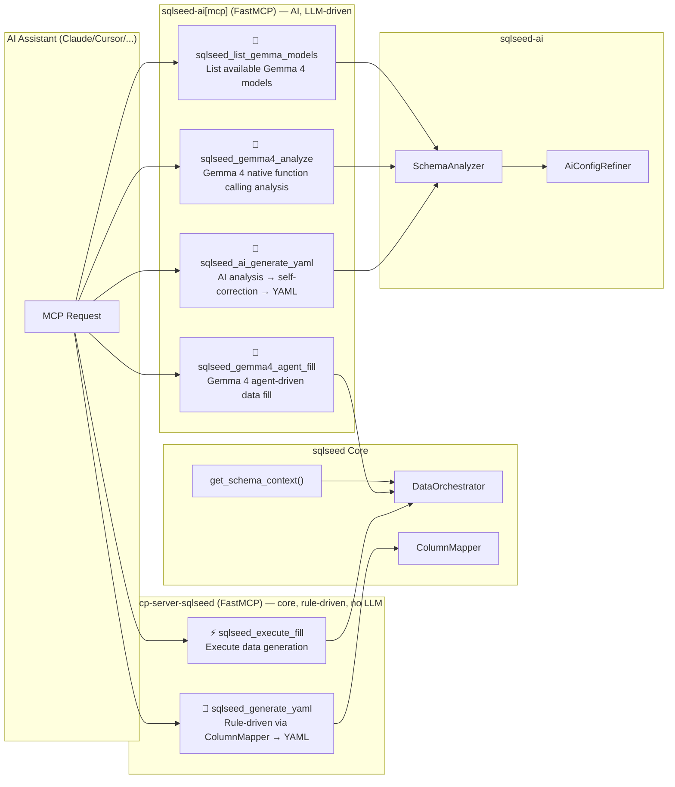
```mermaid
flowchart LR
    subgraph Client["AI Assistant (Claude/Cursor/...)"]
        Request["MCP Request"]
    end

    subgraph MCPServer["mcp-server-sqlseed (FastMCP) — core, rule-driven, no LLM"]
        Tool2["🤖 sqlseed_generate_yaml<br/>Rule-driven via ColumnMapper → YAML"]
        Tool3["⚡ sqlseed_execute_fill<br/>Execute data generation"]
    end

    subgraph AIMCP["sqlseed-ai[mcp] (FastMCP) — AI, LLM-driven"]
        ToolAI["🤖 sqlseed_ai_generate_yaml<br/>AI analysis → self-correction → YAML"]
        Tool4["💎 sqlseed_gemma4_analyze<br/>Gemma 4 native function calling analysis"]
        Tool5["💎 sqlseed_gemma4_agent_fill<br/>Gemma 4 agent-driven data fill"]
        Tool6["💎 sqlseed_list_gemma_models<br/>List available Gemma 4 models"]
    end

    subgraph SQLSeed["sqlseed Core"]
        Orchestrator["DataOrchestrator"]
        SchemaCtx["get_schema_context()"]
        Mapper["ColumnMapper"]
    end

    subgraph AIPlugin["sqlseed-ai"]
        SA["SchemaAnalyzer"]
        ACR["AiConfigRefiner"]
    end

    Request --> Tool2
    Request --> Tool3
    Request --> ToolAI
    Request --> Tool4
    Request --> Tool5
    Request --> Tool6

    Tool2 --> Mapper
    Tool3 --> Orchestrator
    ToolAI --> SA --> ACR
    Tool4 --> SA
    Tool5 --> Orchestrator
    Tool6 --> SA

    SchemaCtx --> Orchestrator
```

---

## 11. Gemma 4 Tool-Calling Protocol

This is the structured-response path in `SchemaAnalyzer`. `AIConfig` resolves
`gemma4`, `openai`, or `none` against the active backend. Tool-call arguments are
parsed and validated locally; this path does not register arbitrary Core tools
or execute a multi-turn loop that injects `tool_result` messages.

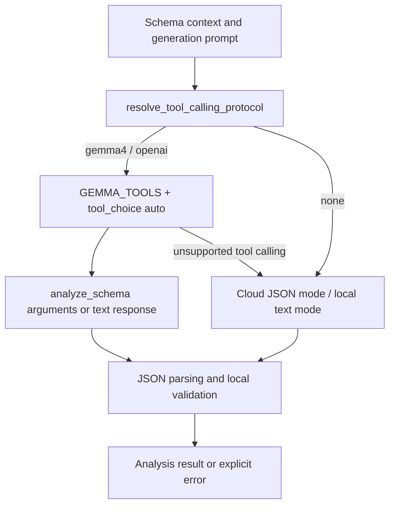
```mermaid
flowchart TD
    Context["Schema context and generation prompt"] --> Protocol[resolve_tool_calling_protocol]
    Protocol -->|gemma4 / openai| Request["GEMMA_TOOLS + tool_choice auto"]
    Request --> Response["analyze_schema arguments or text response"]
    Response --> Parse["JSON parsing and local validation"]
    Request -->|unsupported tool calling| Fallback["Cloud JSON mode / local text mode"]
    Protocol -->|none| Fallback
    Fallback --> Parse
    Parse --> Result["Analysis result or explicit error"]
```

See [Gemma 4 integration](gemma4-integration.md) for protocol/backend limits.
Model availability depends on the actual service; the project model registry
is not a guarantee that an endpoint hosts a particular model.

## 12. Web workbench and component lifecycle

The project contains five distributions: Core, CLI, AI, MCP and Web. Web calls offline core directly; optional AI Python services produce user-requested suggestions, and accepted rules can run offline. The supervisor coordinates business and maintenance workers during component changes. Availability requires both distribution metadata and successful imports; removing a component preserves configuration and explains affected features. See the [Web guide](web-workbench.md) and [support scope](maintainable-release.md).

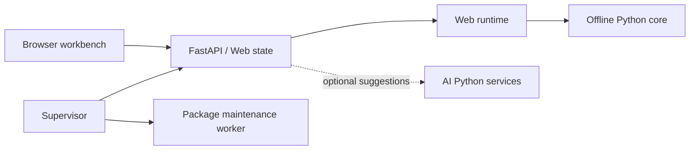
```mermaid
flowchart LR
    Browser[Browser workbench] --> HTTP[FastAPI / Web state]
    HTTP --> Runtime[Web runtime]
    Runtime --> Core[Offline Python core]
    HTTP -. optional suggestions .-> AI[AI Python services]
    Supervisor[Supervisor] --> HTTP
    Supervisor --> Maintenance[Package maintenance worker]
```
