# sqlseed 架构图

[English](architecture.md) | **[中文](architecture.zh-CN.md)**

> 本文档使用 Mermaid 图表可视化 sqlseed 的整体架构和各模块内部结构。

***

## 1. 整体系统架构

本文描述 `main` 的五包实现；安装与已发布版本的区别见[升级说明](migration.zh-CN.md)。
Core 不依赖入口插件，`DataStream` 属于 Core；Web 的运行与维护进程见第 12 节。

```mermaid
graph TB
    subgraph User["👤 用户入口"]
        CLI["CLI<br/>click 命令行"]
        API["Python API<br/>fill / connect / preview"]
        YAML["YAML/JSON<br/>配置文件"]
        MCP["MCP 服务器<br/>AI 助手交互"]
    end

    subgraph Core["🧠 核心编排层 (core/)"]
        Orch["DataOrchestrator<br/>主编排引擎"]
        Mapper["ColumnMapper<br/>9 级策略链"]
        Schema["SchemaInferrer<br/>Schema 推断"]
        Relation["RelationResolver<br/>外键解析"]
        Pool["SharedPool<br/>跨表值池"]
        DAG["ColumnDAG<br/>列依赖图"]
        Expr["ExpressionEngine<br/>表达式求值"]
        Constraint["ConstraintSolver<br/>约束回溯"]
        Transform["TransformLoader<br/>脚本加载"]
        Result["GenerationResult<br/>结果统计"]
        Stream["DataStream<br/>流式生成"]
        CheckParser["check_parser.py<br/>CHECK 约束解析"]
        SchemaFallback["schema_fallback.py<br/>纯 schema 回退生成器"]
        Features["features.py<br/>规范化结构特征"]
    end

    subgraph Gen["⚡ 数据生成层 (generators/)"]
        Protocol["DataProvider<br/>Protocol"]
        Registry["ProviderRegistry<br/>注册表"]
        Base["BaseProvider<br/>内置"]
        Faker["FakerProvider<br/>Faker"]
        Mimesis["MimesisProvider<br/>Mimesis"]
    end

    subgraph DB["💾 数据库层 (database/)"]
        DBProto["DatabaseAdapter<br/>Protocol"]
        SU["SQLAlchemyAdapter<br/>必选（SQLite/PostgreSQL）"]
        Raw["RawSQLiteAdapter<br/>仅测试"]
        Pragma["PragmaOptimizer<br/>三级优化"]
        Dialect["_dialect.py<br/>方言抽象"]
        TypeNorm["_type_normalizer.py<br/>类型归一化"]
        BulkOpt["_bulk_optimizer.py<br/>批量写入优化"]
        BaseAdapt["_base_adapter.py<br/>共享基类"]
        Helpers["_helpers.py<br/>批量插入辅助"]
    end

    subgraph Plugin["🧩 插件层 (plugins/)"]
        HookSpec["SqlseedHookSpec<br/>12 个 Hook"]
        PM["PluginManager<br/>pluggy"]
    end

    subgraph Config["⚙️ 配置层 (config/)"]
        Models["Pydantic 模型<br/>GeneratorConfig"]
        Loader["Loader<br/>YAML/JSON"]
        Snapshot["SnapshotManager<br/>快照保存/加载"]
    end

    subgraph AI["🤖 AI 插件 (sqlseed-ai)"]
        Analyzer["SchemaAnalyzer<br/>LLM 分析"]
        Refiner["AiConfigRefiner<br/>自纠正闭环"]
        Examples["Few-shot<br/>示例库"]
        Errors["ErrorSummary<br/>错误分类"]
        GemmaModel["GemmaModel<br/>Gemma 4 模型适配器"]
        AIBackend["AIBackend<br/>多后端路由"]
        GemmaTools["GEMMA_TOOLS<br/>原生函数调用"]
    end

    subgraph Utils["🔧 工具层 (_utils/)"]
        SQL["sql_safe<br/>SQL 注入防护"]
        Metrics["MetricsCollector<br/>性能度量"]
        Progress["Progress<br/>多后端：Rich/tqdm/Null"]
        Paths["Paths<br/>平台缓存路径"]
        Logger["Logger<br/>structlog"]
    end

    CLI --> Orch
    API --> Orch
    YAML --> Loader --> Orch
    MCP --> Orch

    Orch --> Schema
    Orch --> Mapper
    Orch --> Relation
    Orch --> DAG
    Orch --> Stream
    Orch --> Pool
    Orch --> Result
    Orch --> PM

    DAG --> Expr
    DAG --> Constraint
    Stream --> Expr
    Stream --> Constraint
    Stream --> Transform
    Stream --> Protocol

    Mapper --> DBProto
    Schema --> DBProto
    Relation --> DBProto
    Relation --> Pool

    Registry --> Base
    Registry --> Faker
    Registry --> Mimesis
    Registry --> Protocol

    DBProto --> SU
    DBProto --> Raw
    SU --> Pragma
    Raw --> Pragma
    SU --> Dialect
    SU --> TypeNorm
    SU --> BulkOpt
    SU --> BaseAdapt
    SU --> Helpers
    Raw --> BaseAdapt
    Raw --> Helpers

    PM --> HookSpec
    PM --> AI

    Analyzer --> Refiner
    Refiner --> Errors
    Analyzer --> Examples
    AIBackend --> GemmaModel
    AIBackend --> Analyzer
    GemmaModel --> GemmaTools

    Orch --> Config

    Orch -.-> SQL
    Orch -.-> Metrics
    Orch -.-> Progress
    Orch -.-> Logger
    SU -.-> SQL
    Raw -.-> SQL
    SU -.-> Helpers
    Raw -.-> Helpers
```

***

## 2. 核心编排流程（fill_table）

下图概括正常执行路径。结构支持预检先于清空和写入；普通 Core 批量执行可能
保留失败前已提交的批次。调用方仍需检查结果中的 `errors` 和 `count`，具体见
[写入与失败语义](maintainable-release.md#write-semantics)。

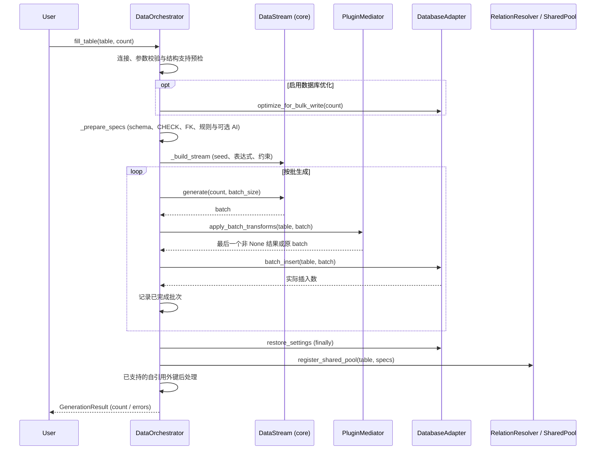

***

## 3. ColumnMapper 9 级策略链

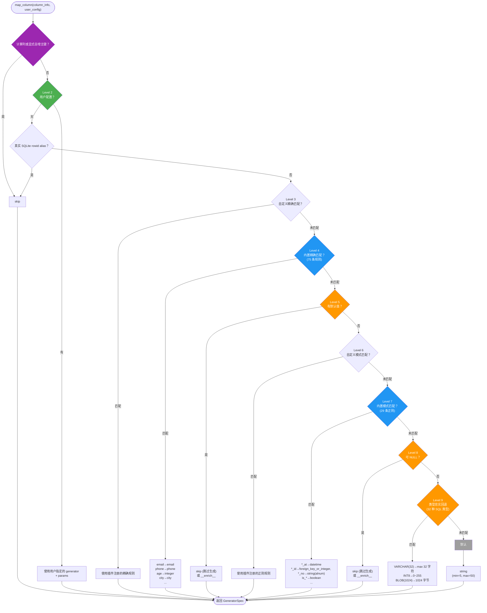

***

## 4. Provider 与 Core 流式生成

Provider 与 dispatch 位于 `generators/`；图中的 `DataStream`、表达式和约束
处理器属于 `core/`，由 Core 调用 provider。生成器层不导入 Core。

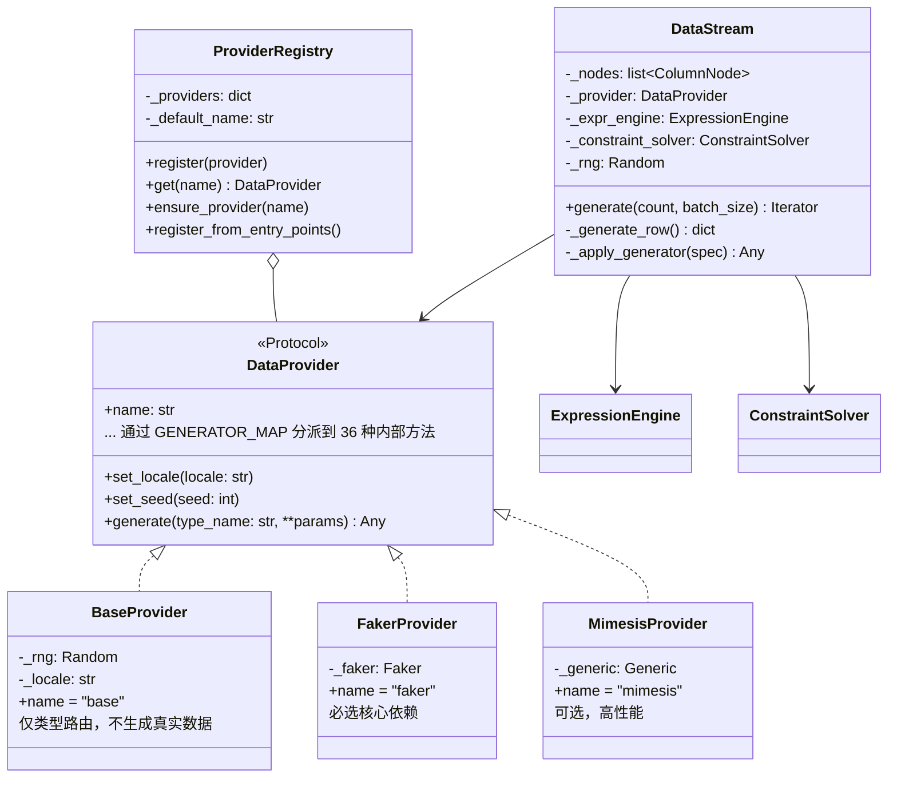

***

## 5. 数据库层架构

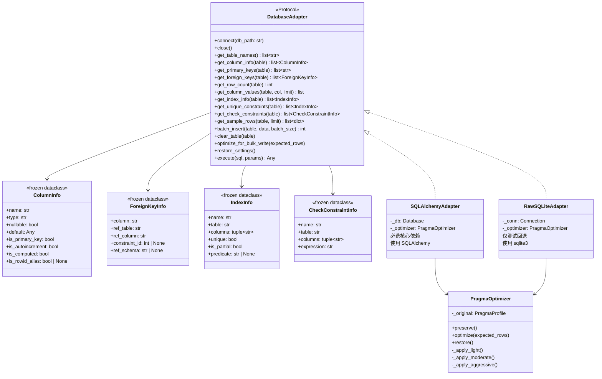

***

adapter 明确报告 `ColumnInfo.is_rowid_alias`，默认 `None` 兼容旧构造。SQLite 区分真实 rowid 别名与显式 AUTOINCREMENT，并保留普通主键的可空语义。`IndexInfo.is_partial` 防止将条件唯一性误当作无条件 UNIQUE；SQLAlchemy 在 `predicate` 保留反射出的 WHERE SQL，RawSQLite 可不提供条件原文。谓词由数据库在写入时执行。FK 元数据保留表内约束身份和反射出的父 schema。

## 6. 列依赖 DAG 与约束回溯

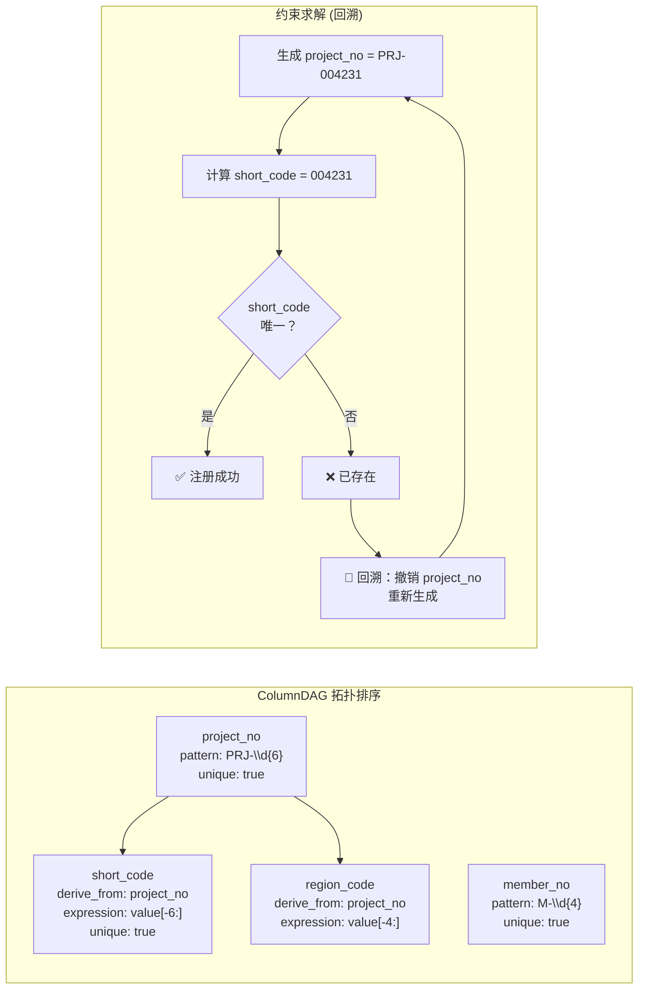

***

## 7. AI 插件架构

AI 插件保留不同职责的入口。单表 `ai-suggest` 使用 `SchemaAnalyzer` 与
`AiConfigRefiner`；`ai-analyze` 默认使用 `AutoHealOrchestrator`，`auto-heal`
修复已有配置。共享构造入口 `sqlseed_ai.runtime` 负责配置、客户端和修复编排器，
终端输出与退出码留在 CLI。Web 通过 Python 服务提供待审阅的规则建议。

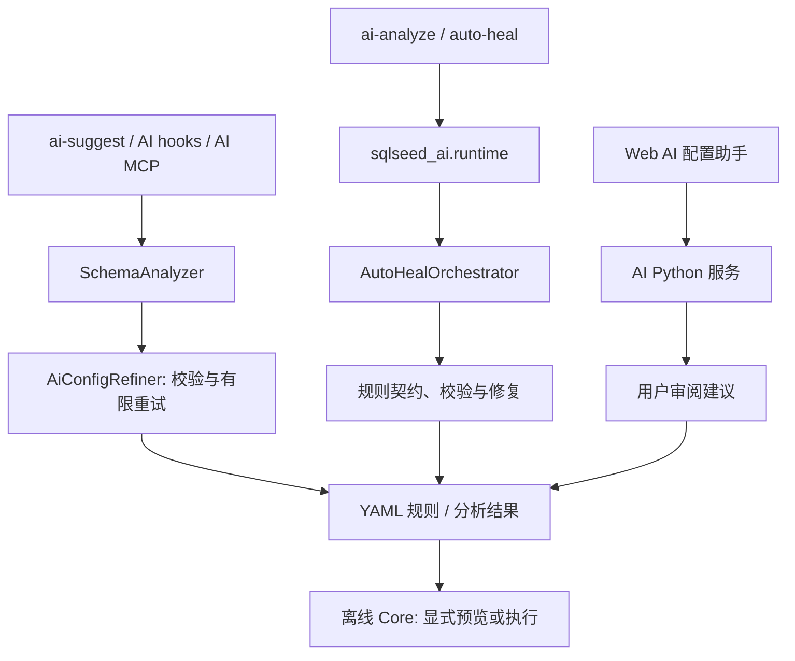

`ai-suggest --auto-heal` 选择完整修复流程，并处理所有表。
AI MCP 的 `sqlseed_gemma4_agent_fill` 是分析后执行的独立入口；普通分析命令
与 Web 建议不因此自动写入数据库。真实模型可达性、输出质量和支持范围须单独验证。

***

## 8. 插件 Hook 生命周期

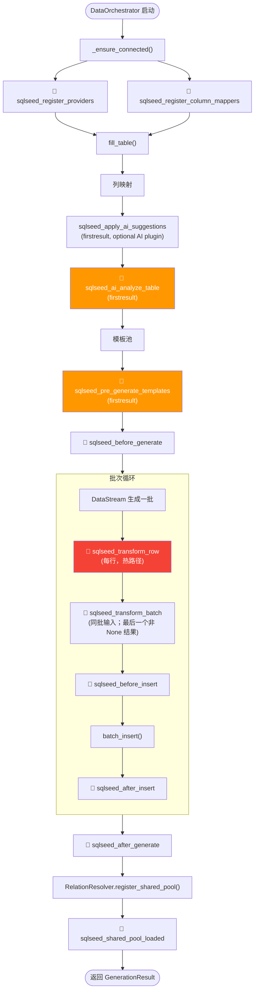

***

## 9. 配置模型层次结构

源列的 `params` 接受映射；省略或填写 `null` 时保留空参数行为。字符串、列表等
非映射值会在配置加载时明确拒绝，不会静默丢弃规则。顶层生成器参数仍覆盖嵌套
`params` 中的同名参数。

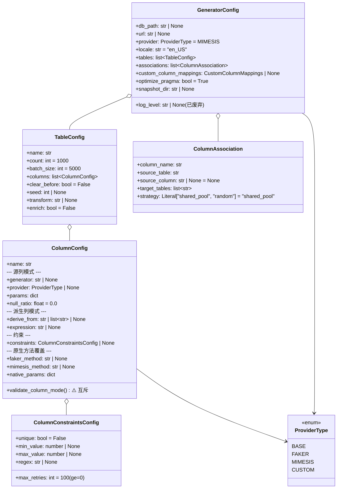

***

## 10. MCP 服务器架构

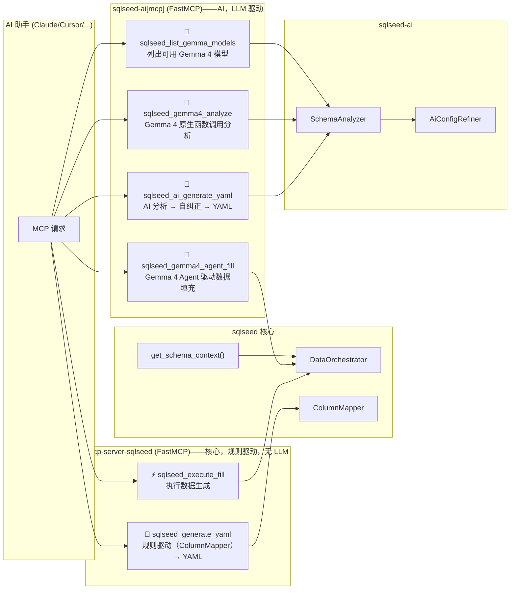

***

## 11. Gemma 4 工具调用协议

以下流程属于 `SchemaAnalyzer` 的结构化响应路径。`AIConfig` 根据后端解析
`gemma4`、`openai` 或 `none` 协议；工具调用返回值供本地解析与校验。
这里没有自动注册任意 Core 工具、执行工具后回注 `tool_result` 的多轮执行循环。

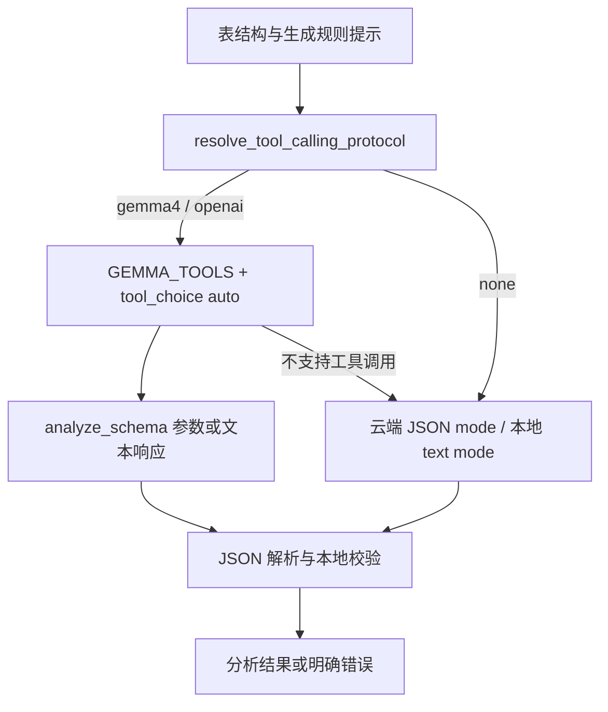

协议和后端限制见 [Gemma 4 集成](gemma4-integration.zh-CN.md)。后端服务当前
是否提供某个模型，由实际服务决定；项目中的模型注册表不构成可用性保证。

## 12. Web 工作台与组件生命周期

当前项目包含 Core、CLI、AI、MCP 和 Web 五个发行包。Web 直接调用离线 core；模型建议仅在用户请求时通过可选 AI 包生成，确认后的规则可离线执行。supervisor 在组件变更时协调业务和维护进程，避免对正在导入或执行的包直接修改。可用性同时检查发行包与导入结果；卸载后保留配置并说明受影响功能。详见 [Web 指南](web-workbench.md) 和 [支持范围](maintainable-release.md)。

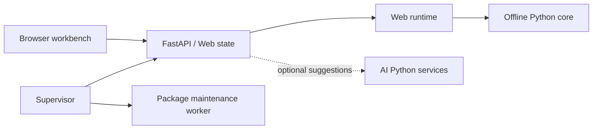
