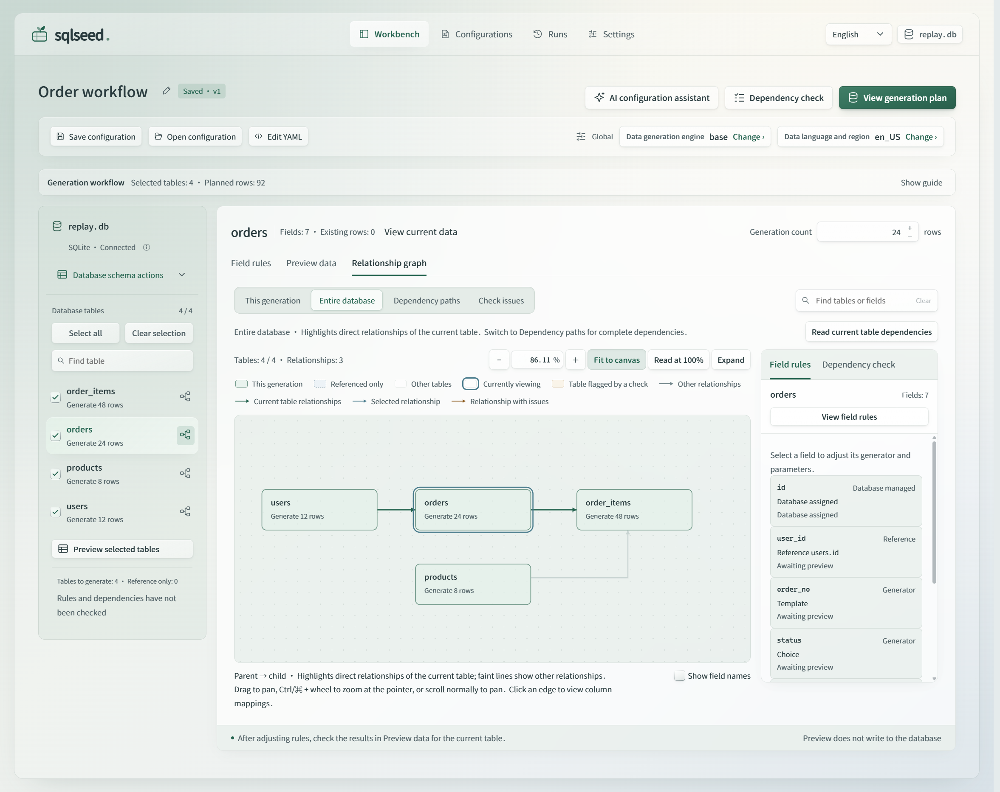

# sqlseed

**Test data for SQLite and PostgreSQL, from your existing schema.**

sqlseed fills existing tables with generated data. It infers rules for common
columns such as names and email addresses, and lets you define application-specific
values and relationships in Python or YAML. Core runs offline; AI is optional.

## Choose how to use it

Use a Python 3.10+ virtual environment and install the entry point you need.
The four interface packages use the same offline Core and install it as a dependency.

| Package | Use it for | Install | Guide |
| --- | --- | --- | --- |
| `sqlseed` | Generate data from Python or YAML rules | `python -m pip install sqlseed` | [Python API](api.md) |
| `sqlseed-web` | Edit rules, preview data, and review runs in a browser | `python -m pip install sqlseed-web` | [Web guide (中文)](web-workbench.md) |
| `sqlseed-cli` | Inspect, preview, fill, create templates, and replay snapshots | `python -m pip install sqlseed-cli` | [CLI reference](guide.md#cli-reference) |
| `sqlseed-ai` | Ask a model to suggest, analyze, or repair rules | `python -m pip install sqlseed-ai` | [AI setup](guide.md#ai-plugin) |
| `mcp-server-sqlseed` | Generate rule-driven YAML and execute fills through MCP | `python -m pip install mcp-server-sqlseed` | [MCP setup](guide.md#mcp-server) |

AI installs CLI for its additional commands. Web's ordinary workflow works without
AI. Model-assisted MCP tools are a separate entry point provided by `sqlseed-ai[mcp]`;
`mcp-server-sqlseed` does not require a model service.

These pages describe version 0.2.5, using the five-package layout introduced in
0.2.4. Check [Releases](https://github.com/sunbos/sqlseed/releases) for publication
status. Upgrading an older installation? Read the [migration guide](migration.md).
For source candidates or optional dependencies, see [installation](guide.md#installation).

## Generate your first data

After installing `sqlseed`, save this as `demo.py` in a new directory and run
`python demo.py`. It creates a SQLite table and adds 100 users, with no repository
checkout or external database server:

```python
import sqlite3
from contextlib import closing

import sqlseed

with closing(sqlite3.connect("demo.db")) as conn:
    conn.execute("""
        CREATE TABLE IF NOT EXISTS users (
            id INTEGER PRIMARY KEY AUTOINCREMENT,
            name TEXT NOT NULL,
            email TEXT NOT NULL
        )
    """)
    conn.commit()

result = sqlseed.fill(
    "demo.db",
    table="users",
    count=100,
    provider="faker",
    seed=42,
)
print(result.count, result.errors)  # 100 []
```

Faker is included with Core. Each run appends another 100 rows; it does not clear
the table. Check both `count` and `errors`, because a failed run may retain earlier
committed batches. See [support and maintenance](maintainable-release.md) for
constraint support, write behavior, and reproducibility conditions.

## Try the browser or terminal

With `sqlseed-web` installed, run:

```bash
sqlseed-web
```

Open [http://127.0.0.1:8630](http://127.0.0.1:8630), connect to `demo.db`, select tables,
edit rules, and preview before generating. The command is included with the package;
no custom launcher is required. Save configurations, inspect table relationships,
and review per-table results in run history. The interface supports English and
Simplified Chinese, with light and dark appearances.



The actual released 0.2.5 interface.
[Open the full-size PNG](assets/screenshots/web-workbench-en-light.png)
or [see the read-only sample preview in the dark theme](assets/screenshots/web-workbench-en-dark.png).
Follow the [Web guide (中文)](web-workbench.md)
or the [English Web README](https://github.com/sunbos/sqlseed/blob/main/plugins/sqlseed-web/README.md)
for setup and workflow details.

With `sqlseed-cli` installed, use the same database:

```bash
sqlseed inspect demo.db --table users --show-mapping
sqlseed preview demo.db -t users -n 5 --provider faker
sqlseed fill demo.db -t users -n 100 --provider faker --no-ai
```

## Next steps

- [User guide](guide.md): YAML rules, generators, expressions, and multi-table configuration.
- [Python API reference](api.md): functions, configuration models, and results.
- [Project walkthrough](project-showcase.md): constraints, failure diagnosis, and replay.
- [AI setup](guide.md#ai-plugin): model configuration and optional rule suggestions.
- [Architecture](architecture.md): package boundaries and extension points.
