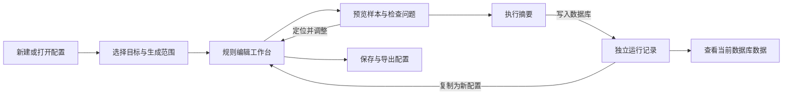

# sqlseed Web 重设计提案

日期：2026-09-06。状态：设计提案，供评审；不是已实现功能清单。本轮新增设计文档与独立编辑器样稿，不修改正式应用、数据库或运行服务。

> **2026-09-07 当前实施入口：** [v8 整体重建契约](../plans/2026-09-07-web-v8-rebuild.md)。用户要求按已确认的 v8 全新建立正式产品 shell 与 presentation。本文保留设计演进，规范顺序为当前契约 → v8 原型 → 本文未被覆盖的业务规则；各轮“尚未接通/未实现”描述对应当时阶段，不是当前后端能力清单。

| 历史段落 | 当前有效决策 |
|---|---|
| 第 3/10 节独立“生成配置 / 数据库 / 运行记录” | 第 19 节统一工作台；当前仅工作台/运行记录，连接弹窗与空状态同主题 |
| 第 19 节点表名进入关系图、第 20 节换表保留视图 | 第 21 节固定入口：表名到字段，节点图标到完整路径，库名到整库 |
| 早期“实际尺寸” | 第 21 节“放大阅读”，100% 始终表示适应画布 |
| 第 22 节作用范围与定位 | 保留：配置顶栏、数据库工具栏、表数量、字段抽屉，集中依赖面板 |

前述被替代段落仅供历史查询，不得与最终规则同时作为验收预期。当前契约统一列出全部必要视口；旧截图分类与旧向导计划不构成额外产品范围。

## 1. 设计判断

推荐以“可复用的生成配置”为中心，采用“首次轻量引导 + 持续编辑工作台 + 执行摘要 + 运行记录”的流程。参考图片中的对象树、字段详情、类型专属控件、即时样例和配置保存值得保留。

目标用户按本地开发者与测试工程师设计。主要任务是为现有 SQLite / PostgreSQL 数据库生成符合结构与业务规则的测试数据，并反复调整、复用配置。暂不扩展为数据库管理器、团队协作平台或通用 AI 聊天产品。

比较过的方向：

| 方向 | 优点 | 局限 | 决定 |
| --- | --- | --- | --- |
| 完整分步向导 | 初次操作有引导，适合一次性生成 | 修改与预览来回跳转，配置复用不突出 | 仅用于首次建立配置与写入前确认 |
| YAML 为主的编辑器 | 与 CLI 一致，适合高级配置 | 不利于探索类型与理解约束 | 保留为同一配置的高级视图 |
| 配置工作台 | 可持续编辑、定位问题、预览和复用 | 需要统一配置状态与执行接口 | 推荐作为主界面 |

## 2. 参考图片的事实与取舍

本轮实际检查了根目录全部 5 张流程截图、2 张完整类型菜单，以及数字、枚举、外键、图像或二进制、日期时间、序列、姓名、地址等关键类型详情。部分详情由并行审查独立核对。

| 参考文件 | 图片中的实际内容 | 采用方式 |
| --- | --- | --- |
| 05.33.23（本地截图 `截屏2026-08-30 05.33.23.png`） | 连接树、已有 employees 数据、表信息 | 数据库页面保留表格与上下文；已有数据明确区别于新生成样本 |
| 05.34.13（本地截图 `截屏2026-08-30 05.34.13.png`） | 选择连接、数据库，查看目标信息，保存/加载配置 | 新建配置时提供紧凑目标选择，不复制半屏装饰图 |
| 05.35.05（本地截图 `截屏2026-08-30 05.35.05.png`） | 左侧表/列树，右侧姓名格式、语言、样例、通用选项 | 采用树与详情联动、类型专属控件、邻近预览 |
| 05.35.13（本地截图 `截屏2026-08-30 05.35.13.png`） | 自引用外键的引用目标与采样方式 | 独立关系详情；真实数据库外键的引用目标只读 |
| 05.36.31（本地截图 `截屏2026-08-30 05.36.31.png`） | 多表选择、字段映射、多语言选项 | 保留范围切换，系统表不可作为普通生成目标 |
| 类型菜单 1（本地截图 `生成数据类型/生成数据类型1.png`）、类型菜单 2（本地截图 `生成数据类型/生成数据类型2.png`） | 7 组、44 项生成内容/取值方式 | 作为内容覆盖参考，不作为 sqlseed 已支持能力清单 |

这 5 张流程图能够确认目标选择和规则编辑；没有展示实际执行、完成或错误结果，后续执行设计依据项目实现补充。

不能照搬的内容：

- 图片中的 `sqlite_sequence` 出现在可选表中；sqlseed 默认只展示可生成的业务表。
- `username` 显示姓名、DATE 字段显示数字，说明截图中的当前选项不能直接作为自动映射规则。
- 巨长类型菜单、表单横向滚动和多层纵向滚动不适合当前约 1144 px 的浏览器视口。
- NOT NULL、数据库自增与真实外键必须遵守当前 schema；不能因参考面板存在复选框就允许无效配置。
- 多语言池、默认值比例、独立序列、每个父值重复 N 次等需以实际能力为准。
- 参考中的视图、索引、触发器、用户、备份、BI 等数据库管理入口不纳入此次产品范围。

旧 [generator_ui_reference.md](../plans/generator_ui_reference.md) 可继续作为截图资料，旧 [generator_parity.md](../plans/generator_parity.md) 可作为历史差距记录。其中连接级 locale、严格复制分类、空分类占位等旧选择不作为本提案的设计约束。

## 3. 导航与领域对象

顶部一级导航：**生成配置 / 数据库 / 运行记录**。设置、帮助、版本信息位于次级入口。品牌显示 sqlseed；不重复显示 Web、控制台等容器描述。

| 对象 | 应包含的信息 | 生命周期 |
| --- | --- | --- |
| 连接 | 显示名称、SQLite 路径或 PostgreSQL 连接参数、连接状态 | 可以被多份配置引用 |
| 生成配置 | 名称、目标绑定、生成引擎与语言地区、表规则、字段规则、关联、版本 | 保存后可再次打开、复制、导出 |
| 表规则 | 参与生成、行数、字段设置、表级种子与高级执行默认值 | 属于配置 |
| 字段规则 | 取值方式、生成内容、参数、允许的空值/唯一/派生设置 | 属于表规则 |
| 本次运行 | 固定的有效配置版本、目标、覆盖值、逐表执行结果 | 创建后不随编辑变化 |

配置默认值和本次覆盖分开显示。`provider` 与 `locale` 在产品上属于生成配置；现有 Web 将它们绑定长生命周期 orchestrator，需要修改应用层组装方式，不能只把控件移到另一页。

保存到工作台与导出 YAML 是两件事。工作台元数据（名称、版本、折叠状态）存入本地应用存储，不随意加到 core 配置模型。首次可以默认命名为“数据库名 · 测试数据”，无需多填一道表单。连接凭据按连接管理，不将其作为普通运行日志内容保存。

## 4. 页面与流程

### 4.1 生成配置首页

主操作为“新建配置”“导入 YAML / JSON”。有历史时展示最近配置、目标、表数、最后修改时间与最近运行结果。无历史时展示简短引导，不展示空的统计看板。

新建：选择已有连接或添加连接，读取 schema，选择表，即进入编辑区。规则推断自动完成；AI 未安装或不可达不妨碍这条流程。

打开配置：直接进入编辑区，恢复选择位置；连接变化或 schema 变化时指出失效的表、字段与规则，再检查。切换目标前保留原配置，不能把一次切库理解为丢弃全部编辑。

### 4.2 配置编辑工作台

默认使用两栏，借鉴参考图的操作空间。

| 区域 | 内容与行为 |
| --- | --- |
| 顶部上下文 | 配置名、保存状态、目标数据库；目标可展开查看完整路径/连接信息 |
| 左侧对象区 | 表列表与可展开字段、搜索、问题数量、当前编辑项；表复选框只控制该表参与本次配置范围 |
| 右侧主区 | 点击表显示整表规则概览；点击字段显示宽字段详情；提供返回表概览和前后字段切换 |
| 配置工具 | 保存、导入/导出、撤销编辑、查看 YAML，位置稳定 |
| 主操作 | “预览与检查”；进入执行摘要后才出现“写入数据库” |

整表概览列：字段名、数据库类型、取值方式、规则摘要、样例、问题/修改状态。行数在表标题附近直接编辑；支持对选中表批量设置数量，但要显示各表最终值。

不要求固定三栏。宽屏可把详情并排展开；约 1144×816 视口下，主区切换到字段详情，避免给参数区留下过窄空间。布局切换不创建另一份配置状态。

对象树不默认展开所有表。搜索可直接定位表或字段；可筛选“有问题”“已修改”。数据库生成、自动推断、人工覆盖、待审阅 AI 建议用短文字与图标表达，不依赖颜色区分。

**不复制逐列是否生成的复选框。** core 的列配置是覆盖项，缺少覆盖仍会自动推断。点击字段表示编辑焦点；其行为由取值方式明确表达。“从 INSERT 中省略/使用数据库默认值”只有后端确认可用才开放，不能把删除覆盖项当成跳过生成。

### 4.3 预览与检查

字段详情提供少量样例和刷新；整表/跨表检查进入同一配置下的“预览与检查”视图，保持返回编辑的位置。

分别显示配置结构检查、规则/关联检查、样本生成结果。普通样本预览不写库，但不能命名为完整试运行。可选 AI 包的确定性检查与模型调用是不同能力，不用“未连接模型”阻止已安装的确定性检查。

问题列表必须能定位到表、字段或字段组。每项包含原因、影响和操作，例如“orders.user_id 引用 users.id，但 users 当前为空且未选择生成”。提供“查看父表”“将父表加入生成范围”等具体操作；后者会显示新增范围和数量，不能默默扩大写入范围。

配置或 schema 改变后，旧样例和检查报告标为过期。请求带配置版本与 schema 标识，旧请求返回不得覆盖新结果。所谓“可执行”只代表本次检查覆盖的项目通过，不保证未来大规模写入必定成功。

当前草稿有无效输入或阻断错误时，不允许进入写入。不能偷偷执行最近一次有效的旧规则。工作台可以保存未完成草稿，但导出的可执行配置、执行摘要、检查结果和提交必须对应同一已验证版本；摘要打开后又发生编辑，需要重新检查。非阻断提示在摘要中明确列出，用户通过“写入数据库”按当前范围执行，不为每条提示另设确认弹窗。

### 4.4 执行摘要与运行记录

写入前集中展示目标、逐表数量、追加/清空方式、依赖顺序、种子、有效配置与未解决问题。清空再生成须明确具体表及其当前行数；普通预览无需重复确认。

清空和生成使用不同的依赖计划：可支持的无环关系通常先按子表到父表清空，再按父表到子表生成，不沿用“逐表清空后立即填充”的简单循环。清空影响未选中的子表、循环关系或其他无法生成合法清空计划的组合时，阻止执行并指出依赖，不自动扩大清空范围。清空事件独立记录；即使后续生成失败，也明确展示哪些表已经被清空。该能力需要服务端执行计划与实际数据库验证。

运行后进入独立运行详情：每张表的等待、执行、完成、失败、未执行状态；实际提交数量、耗时、错误与结果可见。浏览器离开编辑页不应丢失任务控制，完整多表任务应由服务端管理。

任务状态不是一个整体绿色/红色标记。允许部分完成；通信中断显示连接/状态未知，不伪装成服务端已取消。重试表示按新任务执行，不能自动假设能够从失败批次续跑。尚未有取消实现时不提供假按钮。

首版固定采用“首个表失败即停止调度后续表”，包括尚未执行的独立表；保留已经提交的数据，其他表标为“未执行：前序任务失败”。清空阶段失败同样停止后续操作。暂不增加自动继续、自动重试或自行切换策略。

从运行结果可查看当前数据库、查看当次有效配置、复制为新配置。除非后端能准确标识本次插入行，否则链接标为“查看当前表数据”，不声称筛选出了本次新增行。

## 5. 字段详情与类型选择

数据库类型与生成内容分开命名。`INTEGER / TEXT / DATE` 是 schema；“姓名 / 数值 / 地址 / 枚举”是生成内容；“数据库生成 / 外键引用 / 派生计算”是取值机制，不能混为一张无条件可选的生成器列表。

字段详情顺序：字段名与数据库约束 → 取值方式 → 生成内容与专属参数 → 样例 → 可用的空值/唯一选项 → 高级设置与重置。样例可与简短参数并排，不必为了复制参考顺序把关键控件推到屏幕外。

| 情况 | 展示 | 编辑规则 |
| --- | --- | --- |
| 普通自动推断列 | 推断内容及规则摘要 | 可覆盖，能恢复自动推断 |
| 显式自增/计算列 | 数据库生成及原因 | 不出现无效的生成器控件 |
| 普通 DEFAULT 列 | 默认表达式及当前取值行为 | 可在能力允许时使用数据库默认值或显式生成；不能全部锁死 |
| 真实外键 | 来源表/列、可用父数据、自引用/复合关系 | 引用结构只读；开放实际支持的采样/空值选项 |
| 用户声明的数据关联 | 关联来源及作用范围 | 与数据库外键区分，并验证类型与依赖 |
| 派生列 | 输入列、表达式、例值 | 与普通生成模式互斥；显示依赖环等错误 |

类型选择器采用中文搜索与分类浏览，显示适用类型和简短样例；支持键盘选择、Enter 接受、Esc 关闭。搜索英文配置标识也能命中，但英文标识不必重复放进每个标题。优先展示与列类型相容的类型；需要转换的选择先说明结果，不仅靠 `_id` 或名称判断。

建议用户分类为“基础值 / 日期与时间 / 个人信息 / 地理位置 / 企业与商品 / 支付 / 网络与文件 / 结构化与规则”。这些是面向任务的分类，不与底层 dispatch 一一对应；没有可用类型的组不占位，未实现功能留在路线图中。

示例映射：数字面板内选择整数/小数，对应 `integer/float`；姓名面板选择全名/名/姓，对应 `name/first_name/last_name`；枚举面板选择等概率/权重，对应 `choice/weighted_choice`。YAML 仍使用现有明确标识，不另造一套配置语法。

## 6. 参考类型全集与能力划分

完整 44 项来自两张类型菜单；同类的参数覆盖程度仍需分别判断。

| 参考分类 | 数量 | 完整成员 |
| --- | --- | --- |
| 通用 | 12 | 数字、日期时间、日期、时间、序列、枚举、文本、布尔值、图像或二进制、外键、UUID、正则表达式 |
| 个人 | 8 | 姓名、性别、称谓、婚姻状况、电话号码、电子邮箱、职位名称、社交网络 ID |
| 支付 | 4 | 支付方式、信用卡类型、信用卡卡号、信用卡日期 |
| 商业 | 3 | 公司名称、部门、行业 |
| 位置 | 3 | 地址、城市、地区 |
| 产品 | 7 | 产品名称、产品类别、颜色、尺寸、重量单位、条码、SKU |
| 电脑 | 7 | IP 地址、MAC 地址、文件路径、文件名称、文件扩展名、网址、主机名 |

当前 core dispatch 有 36 个名称。这个数字不能与参考 44 直接相减：有的参考类型被拆为多个 generator，有的本项目类型不在参考中，外键和数据库生成还走单独机制。

| 能力层级 | 典型内容 | 新界面策略 |
| --- | --- | --- |
| 已有明确入口 | 数值、日期时间、枚举、文本、布尔、姓名、电话、邮箱、职位、公司、地址、城市、国家、省州、UUID、正则、IPv4、URL、bytes | 优先完整呈现现有参数，仍按 provider/约束核验结果 |
| 本项目已有的额外内容 | string、username、JSON、template、weighted_choice、password 等 | 保留并合理分组，不因参考菜单缺少而删除 |
| 取值机制 | 数据库自增/计算、真实外键、派生表达式、用户声明关联 | 用专门面板表达，不等同于任意可切换的内容类型 |
| 可由现有通用能力表达的预设 | 自定义性别/部门/行业/尺寸/支付方式词表、SKU 编号格式等 | 作为有明确说明的预设，保存成 choice/template；不能宣称与参考语义完全等价 |
| provider 有底层方法，尚待可靠适配 | 信用卡、颜色、条码、MAC、IPv6、文件路径/名称/扩展名、主机名等 | 完成参数、唯一性、locale、降级处理与能力探测后才发布为稳定类型 |
| 需要新增规则或模型 | 独立可循环序列、默认值占比、列级多语言池、父值重复频率规则 | 后续能力迭代，不放无效控件 |

现有 native 方法通道不能作为所有缺失类型的完成证明：需要去重时可能跳过 native 方法，错误时也可能回落普通生成器。正式类型必须保证启用约束后仍维持内容语义，并能报告不支持的组合。证据见 [stream.py](../../../src/sqlseed/core/stream.py#L560)。

`地区` 要明确区分“国家/地区”和“省/州”；参考详情的地名不能直接映射到 `state`。`skip` 不应叫“序列”；数据库自增、普通列省略、模板编号、独立数字序列是不同能力。

`timestamp` 当前输出 datetime 对象，不应仅凭名称包装成 Unix 整数时间戳。JPEG 在缺少 Pillow 时目前会回落 PNG；新能力目录和格式选择必须反映真实可用格式，不能把选择 JPEG 等同于必然返回 JPEG。

## 7. 参数与约束的交互规则

- 数字：整数/小数、范围、精度联动。CHECK 产生的有效边界清晰可见；用户输入与解析后生效值有差异时说明原因。
- 日期时间：日期范围、全天/时间窗口、星期条件按类型显示。DATE、TIME、DATETIME 分开；不将所有时间概念强制合并。
- 枚举：值与类型明确，支持字符串/数字/布尔，权重用结构化行编辑；不要靠逗号或冒号猜完整数据结构。
- NULL：按 schema 判断是否可用，百分比明确为 0–100；这是概率/期望比例，不在小样本或自引用初始化中承诺精确条数。
- 唯一：显示数据库硬约束及可用的额外去重设置；复合主键不能当成每个成员单列唯一。有限词表并不意味着唯一无意义，应检查候选值数量是否足够，不能复制参考图就一律裁掉选项。
- 默认值：数据库 DEFAULT、固定常量、按比例混入一个值须分别表达。当前未有的比例规则不得通过名字相似的控件伪装实现。
- 语言地区：配置层先采用单一默认值，仅对支持它的生成内容生效；不把 locale 称为默认市场，也不承诺它会自动协调所有姓名、电话、地址关系。逐列覆盖/多语言混合需要另行实现。
- bytes：按随机字节、图像、文件取样等真实模式组织。格式选择须对应实际输出；文件来源明确是服务器本地路径。体积/格式预览可作为后续接口能力，不强行把二进制转成长字符串。
- 模板、JSON、派生：提供适合语法的编辑器、就近错误、样例；无效草稿不覆盖最近有效规则，也不能用于实际执行。
- 重置：区分撤销本次编辑、恢复自动推断、应用 AI 建议；不让一个“重置”按钮同时承担三种含义。

## 8. 外键与关联关系

外键详情显示当前列/字段组、引用列/字段组、父表已有数据、本次是否生成父表和依赖顺序。真实 FK 的引用结构来自 schema，用户不能在造数表单中把它改成另一张表。

用户声明的关联是额外生成规则，有独立标识与编辑入口，不能冒充数据库约束。执行顺序默认由关系计算；只有后端支持并验证了手动排序才开放拖拽。

`employees.manager_id → employees.id` 展示自引用和可空设置；`order_items.order_id/product_id` 分别展示不同来源，NOT NULL 与复合主键组合唯一清楚可见。

复合 FK 应整组展示。当前三列及以上复合 FK 仍有独立采样限制，自引用空表初始化也会影响空值比例；检查报告要呈现这些能力边界，不能统一显示“关联已保证”。参见 [relation.py](../../../src/sqlseed/core/relation.py#L338)。

## 9. AI 如何融入

AI 是配置操作的一种来源，入口位于当前配置或问题列表。工作台未启用 AI 时仍完整可用。

推荐交互：分析/生成建议 → 展示按表/列分组的差异与理由 → 用户应用所需改动 → 重新检查。保留人工编辑，支持撤销本次应用。建议必须绑定发起时的配置版本；编辑已经变化时重新比较，不覆盖新改动。

派生依赖、复合 FK、跨列 CHECK 等相互依赖的修复按关联组应用与撤销，并展示组内涉及的字段；不允许只接受半组却显示修复完成。应用后重新检查，组合不完整或仍有阻断错误时不能写入。

主区显示处理范围、建议数量、未解决问题和可执行操作。模型、预算、耗时、调用次数与诊断放入详情；确定性处理成功但 LLM 调用为 0 属于正常结果，不需要在主流程解释内部层级。

具体调用前说明当前路径会发送的 schema/样本范围；不同 AI 路径输入不同，不能笼统宣称永远只发送表结构。

现阶段分清三个入口：检查当前配置、确定性修复当前配置、从 schema 生成候选配置。当前全量 auto-heal 不应改名成“仅修复选中字段”。局部 AI 范围、保留人工规则与完整变更报告需要新增能力；[CLI v4 的相关参数尚未转发](../../../plugins/sqlseed-ai/src/sqlseed_ai/cli/ai_commands.py#L623)。

## 10. 数据库页与设置

数据库页提供连接、表结构、关系和当前数据浏览。从表的操作可创建生成配置或加入已有配置；从运行记录可回到对应表。SELECT 查询保留为高级入口；不引入未支持的通用数据编辑、DDL、备份恢复等功能。

设置集中管理 AI 服务和应用偏好。生成引擎及语言地区属于配置，技术扩展点和诊断信息放帮助/诊断，不占据用户主导航。PostgreSQL 的 schema 层级只按真实 introspection/执行能力显示；不能照参考图放任意 namespace 选择器。

## 11. 视觉与易用性

用户明确指出旧界面同质化、陈旧，缺乏使用吸引力。因此视觉不沿用旧控制台，参考图片只提供交互素材。第一版选择明亮、精密的数据工作台：冷灰画布、白色操作面、墨蓝正文与克制的深绿色操作状态，减少独立卡片和大面积装饰。主题切换在基础布局验证后再设计，本样稿只有浅色。

辨识度来自 sqlseed 的工作方式：把字段、取值规则与三条完整记录并列，每个样例列纵向对应一条记录；点击外键，在同一工作区看到来源用户与当前引用值的对应。规则改变后刷新整组样例。其他区域保持安静，让关系和数据成为视觉中心。警告只用于需要处理的情况，普通外键说明不渲染为大块黄色告警。

正文建议 14 px 起，辅助文字保证可读；数据库标识和样例可用等宽字体。表格提供紧凑密度，表单输入维持足够点击面积。表单避免横向滚动；数据表可以横向滚动，表头与首列按需固定。

1144×816 为必要验收视口，另检查 1440×900。窄屏切换主区/详情模式；工具栏不遮住末尾控件。键盘可遍历对象树、搜索类型、编辑值并返回；焦点清晰可见，错误与状态包含文字。

分类选择器参考 [WAI-ARIA Combobox Pattern](https://www.w3.org/WAI/ARIA/apg/patterns/combobox/) 的键盘与焦点行为；常用/高级信息分层参考 [NN/G Progressive Disclosure](https://www.nngroup.com/articles/progressive-disclosure/)。这些原则用于检查交互质量，不意味着本提案已有用户研究验证。

## 12. 应用层设计与依赖

保留 Python core、CLI、AI 插件边界。新前端以配置文档为唯一编辑状态，表单和 YAML 是同一文档的视图；运行使用提交时冻结的有效配置。具体前端框架在实施方案中确定，但应采用组件化与明确的类型/接口契约。

| 必须补齐的契约 | 内容 |
| --- | --- |
| 生成器能力目录 | 参数类型、默认值、范围、枚举、适用输出类型、provider/locale 可用性、依赖与限制；当前只有名称和参数名不足以驱动编辑器 |
| 配置解析与检查 | 同一份完整配置供预览/检查/执行；返回生效规则、必要解释及结构化问题，附配置/schema 版本 |
| 配置持久化 | 草稿、名称、版本、导入/导出、保存失败状态；工作台元数据与 core 配置分离 |
| 完整运行服务 | 服务端拥有多表任务、执行范围、顺序、固定配置、逐批实际提交事件、终态与持久记录 |
| AI 建议结果 | 实际处理范围、基线版本、变更内容、未解决问题、降级结果；不能只返回 YAML 字符串 |

现有 core 的批次结果存在部分失败计数风险：只有批次函数全部返回后才更新外层计数，中途抛错可能返回 0 而已有批次提交。必须在记录层使用已提交事实并修正计数链，不能直接把旧 count 作为精确真相。[相关实现](../../../src/sqlseed/core/orchestrator/_generation.py#L322)

普通 preview 不 INSERT；AI 的部分 refiner 路径可能执行事务试写。统一检查产品入口时必须标注各检查阶段的真实行为。首版不承诺整库原子回滚、取消或断点续跑，直到执行能力实现并验证。

## 13. 推荐实施顺序

| 阶段 | 范围 | 完成标准 |
| --- | --- | --- |
| A：设计验证 | 生成配置首页、两栏编辑、外键详情、检查视图、执行结果的可点击原型 | 用户可完成新建、修改少数字段、预览、查看写入摘要，理解每个操作的影响 |
| B：完整的确定性流程 | 新前端、统一配置契约、能力目录、工作台保存、服务端多表运行与记录 | 不启用 AI 也能保存/重开/检查/执行；保存与执行规则一致；部分失败可准确说明 |
| C：AI 建议 | 当前配置检查/修复、候选方案对比、应用/撤销、版本冲突处理 | 不覆盖新人工编辑，处理范围与后端一致；局部调用只在能力落实后开放 |
| D：类型扩展 | 依据44项参考目录，补高频缺失类型与高级参数 | 每个新增类型同时通过参数、locale、唯一、预览/执行一致性测试后才出现在菜单 |

不把44项完全覆盖作为首版重设计的前置条件。先做完整、可靠、可复用的生成流程，再按用户需求补齐生成内容。

## 14. 验收场景

1. 【B】无 AI 环境中，从数据库新建配置，修改表行数和两个字段，预览、保存、重开后设置不丢失。
2. 【B】从配置文件导入，分别通过可视化和 YAML 修改，导出与执行使用相同的有效配置；不支持的字段明确提示，不能静默丢弃。无效草稿不能触发旧配置写入。
3. 【B】只选择子表且父表为空，能看到具体依赖及解决操作；加入父表后显示实际新增范围和执行顺序。清空计划检查未选子表等影响，无法支持时不执行。
4. 【B】自增列、普通 DEFAULT、NOT NULL、自引用、复合主键/外键与派生列分别有正确交互，不因列名猜错类型。
5. 【B；AI 部分属于 C】修改参数后旧预览显示过期，晚到的预览/AI 响应不覆盖当前配置。
6. 【C】AI 候选配置生成后能查看差异，按关联组应用并撤销；未实现局部分析时界面不声称局部调用。
7. 【B】多表生成过程中离开页面，运行仍可找回；后续批次失败时已提交数量与数据库事实相符，后续表停止并标为未执行；已清空的数据状态明确可见。
8. 【A 做原型走查，B 做真实浏览器验收】1144×816 下没有参数表单横向滚动，能用键盘完成类型选择、编辑、预览和返回表概览。
9. 【D】新增类型在所声明的 provider/locale、NULL/UNIQUE 组合下维持语义，实际格式与界面一致；不可用能力不会静默变成普通字符串或另一种格式。

首版生产交付以 B 场景通过为准，C/D 不是 B 的隐含前置条件。

## 15. 当前样稿与待验证内容

已新增 工作台交互样稿（本地评审资料，不随仓库发布），用于评审编辑器视觉方向。页面由 HTML 与同目录的纯 JavaScript 布局模块组成，可离线运行，无网络请求，不连接数据库。工具只读提取的本地数据库结构被保存为快照；页面不读取业务数据。

当前第八版在前两版规则编辑与范围选择的基础上，新增通用关系图布局、五表真实结构快照、24 表复杂结构示例、结构 JSON 导入、缩放/平移/搜索/局部筛选、外键边详情与问题定位。配置文档移到标题操作区；演示来源状态和恢复操作收纳在折叠的“样稿工具”。第四版默认自适应整图，补齐字段标签避让、独立绘制层与相对缩放，并明确结构分析上下文的边界。

第五版的结构图与字段编辑已对齐到同一个本地 SQLite 五表、33 列的只读结构快照。初始生成器、来源记录状态和样例值仍为离线演示，并未转换成该真实库的可执行配置。复杂示例与结构 JSON 导入只影响关系浏览，不因同名表而混入当前规则草稿。

当前仅交付阶段 A 的设计样稿，不代表整个阶段完成。第五版新增真实五表 33 列统一身份、15 种常用生成器手动选择、图中规则编辑与集中依赖面板。第六版恢复字段规则为默认任务，换表保留视图，增加完整路径与分支来源补齐、固定字段入口、纵向顺序和复杂图快捷场景，修复搜索光标与 IME，并纠正自引用的无条件阻断。配置首页、新建流程、完整类型目录、正式执行检查与结果、AI 差异界面仍待展开。第七版进一步将表名/关系图标设为固定入口，加入结构导出与可下载格式示例，收敛尺寸按钮和重复说明。第八版按配置、结构、表和字段的作用范围整理操作，并补齐顺序表名的联动定位。最新验证见第 22 节；浏览器工具仍无法访问本地 HTML，实际视觉、鼠标与键盘交互验收待完成。

## 16. 第二版评审修订：命名、范围与关系

依据用户对第一版的六条浏览器批注，本轮继续修订独立样稿，不替换正式 Web。

1. **配置名称由用户决定。** 默认“数据生成配置”，可以重命名。正式连接后，可用目标数据库名称生成默认名；不会从示例表名断言用户属于电商业务。连接别名、数据库类型和 schema 来自连接元数据，示例内容只属于当前演示 fixture。
2. **区分两个关系范围。** 数据库关系图显示全库表和真实 FK，并标明本次生成、仅引用、未选表；点击节点进入该表。本表关系显示“来源父表 → 当前表 → 下游子表”的依赖路径，可分叉和汇合，不能将一般有向图强行简化成一条链。图中父→子方向代表被引用值流向引用列，不表示全部表都在生成范围内。同表派生规则另行展示，不伪装成 FK。
3. **勾选与浏览分离。** 复选框决定写入范围，表名按钮决定当前查看对象；允许选一张、任意多张、全选或清空。未勾选表的规则可以查看，原草稿参数保留，执行配置仅包含勾选表。摘要分别列出“本次生成”与“仅引用”。
4. **依赖检查先于写入。** 非空 FK 的未选父表有可用引用值时保留在只读来源范围；无可用值则阻断。用户可以明确点击“加入父表”，看到新增表与行数，系统不得静默扩大写入范围。已选父表先生成时，子表可读取当时父表中的数据，当前 core 不保证仅引用本次新增值。空父表可空 FK 的全 NULL 行为、UNIQUE 容量、复合 FK、循环与自引用要单独检查，不能用父表总行数代替完整检查。样稿只模拟普通非空、非唯一、单列 FK，不代表完整检查已实现。
5. **配置文档只有一个入口。** 删除表页内的“配置示意”标签，保留全局“配置文档”；第三版将唯一入口移到标题操作区。该页显示整个所选范围，不挂在某张表的标题下。
6. **AI 关系建议有明确依据。** 模型可依据列名、类型、CHECK、注释和实际提供的样本提出建议；具体业务含义仍可能有歧义。把“检查数据库约束”与“建议业务关系”分开，建议显示来源、条件、目标、依据和待确认项，用户接受后才进入生成配置。现有 `CrossColumnValidator._check_semantic_relations()` 尚未实现通用语义校验；auto-heal 无违规时会跳过模型，不能宣称已理解全部业务逻辑。
7. **数据库界面保持通用。** SQLite 是当前样稿的连接类型，正式产品还需承接现有 PostgreSQL adapter；其他类型在适配器、schema introspection 和约束能力验证完成后再开放，不提前列为已支持。关系、规则与范围编辑共用骨架，特定数据库能力由元数据控制。

第二版可演示两种依赖场景：未选父表已有引用值；未选父表无可用值。切换只改变离线 fixture，不清空或读取任何数据库。检查结果标明演示性质，不将其作为真实可执行保证。

核对依据：[选择范围与排序](../../../src/sqlseed/core/relation.py#L134)、[父值读取](../../../src/sqlseed/core/relation.py#L216)、[非空外键限制](../../../src/sqlseed/core/relation.py#L729)、[同表分析上下文](../../../plugins/sqlseed-ai/src/sqlseed_ai/analyzer/_context.py#L88)、[语义校验占位](../../../plugins/sqlseed-ai/src/sqlseed_ai/validator/cross_column.py#L132)、[跳过 LLM 的路径](../../../plugins/sqlseed-ai/src/sqlseed_ai/auto_heal/orchestrator.py#L208)、[数据库类型分派](../../../src/sqlseed/database/sqlalchemy_adapter.py#L222)。

## 17. 第三版评审修订：整库图与可理解的依赖检查

### 17.1 整库结构和生成顺序分开

实际只读读取 `本地 sqlseed_demo.db` 的 schema，核验到五张表、四条 FK，与用户提供的截图一致：`users → orders → order_items ← products`，以及 `employees.id → employees.manager_id` 自引用。仅提取结构，未读取业务记录、未修改数据库；本地结构快照 不包含数据库完整路径、数据值或凭据。

摘要的 `users → orders → order_items` 在所选范围内有正确的先后顺序，但不是整库关系图。第三版将标题改成“所选表生成顺序”，引用来源单列“有可引用记录 / 缺少可引用记录”；有阻断时明确说明必须先解决问题。依赖分组不代表并行能力。

### 17.2 图的范围和复杂度

关系图从节点与约束边自动布局，不再使用固定四表坐标。每个 FK 是一条有标识的边，保留同一对表的多个 FK、完整列组、自引用、跨表循环和孤立表。未取得唯一约束与基数证据时不统一标注 `1:N`。SCC 循环成员和被循环阻断的下游表分别识别；能够展示循环并不意味着生成器已支持该循环。

提供整库、相邻关系与待处理范围；搜索展示匹配表及其相邻节点，明确显示当前可见/全库表数。图保留可读的节点大小，支持平移、缩放、适应画布、展开画布和点击边查看列。复杂图不承诺把所有字段在一屏内清晰显示，后续大库需要 schema 分组、折叠和按需展开。

当前样稿可导入最多 200 表、1000 条约束边、1 MB 的结构 JSON；仅在本地用于关系浏览，不是直接导入 SQLite 文件或连库生成。内置 24 表复杂示例包含分支、汇合、多重 FK、自引用、跨表循环与孤立表。布局保证当前测试范围内节点不重叠、连线不穿过其他节点，不保证最少交叉线；尚未完成大图浏览器性能/可读性验收。

### 17.3 问题定位和演示工具

“依赖待处理”变成可点击入口，跳到关系图中的具体外键边，保留缺少哪个来源的说明和“加入父表”操作。定位目标会解除遮挡它的搜索/筛选；解决最后一个来源问题后返回整库，不留下没有说明的空图。

来源记录是否存在应由正式后端检查，不能要求初次用户手选事实。样稿把这两个场景移到折叠的“样稿工具”，用分段按钮代替原生下拉菜单，并明确它不清空、不读取数据库。正式摘要只显示结果与解决操作。

### 17.4 控件和标识

字段搜索的图标与输入作为一个圆角控件，使用整体焦点状态；配置文档属于整份配置，移到标题操作区，避免混入本表标签页。恢复初始样稿位于样稿工具，使用回退/历史图标；刷新样例使用循环双箭头。品牌图形试用“数据表 + 种子萌芽”，强调数据生成；这是样稿候选标识，并非已完成品牌验证。

### 17.5 正式接口仍需补齐

当前 Web 的表列表与逐表 schema API 能还原本次五表关系，但 adapter 会把复合 FK 拆成单列，现有外键模型也没有完整的约束组及 schema 命名空间。正式接口应返回稳定的表身份（含 namespace）、稳定的外键身份、两侧列组、列级 nullable、唯一约束等事实，前端才能无损展示复杂数据库。[adapter 当前拆分逻辑](../../../src/sqlseed/database/sqlalchemy_adapter.py#L428)、[Web schema API](../../../plugins/sqlseed-web/src/sqlseed_web/api.py#L650)。本轮没有修改该生产契约。

## 18. 第四版评审修订：默认整图、字段可读与结构分析

### 18.1 缩放的语义

用户希望复杂图首次打开即可看到整个结构。第四版把“适应画布”设为初始状态，工具栏明确标注“适应画布 = 100%”；比例表示相对当前画布适配基线的缩放，不混用原始 SVG 像素比例。适配同时计算图的宽和高，并包含标签与引线的完整边界，不再只对 12 表以内的图自动适配，也不受旧 15% 最低绝对比例限制。

画布调整大小、展开或收起时重新计算基线；手动缩放保持查看中心。“实际尺寸”维持图形原始像素大小；“适应画布”回到完整结构。更换结构、筛选或搜索范围会适配新范围；开关字段名保留当前缩放和查看位置。大图的默认状态用于概览，读取字段需放大或进入相邻关系，不承诺一屏容纳百表所有文字且仍有正常字号。

### 18.2 字段标签和连接信息

旧实现按连线固定位置放文字，普通边间隙不足以容纳字段名，循环边的标签只相隔一个通道宽度。第四版为每个标签分配矩形，按字体保守估宽、长字段名换行；标签避开节点、已有标签及外键主路径。标签在独立前景层绘制，并用细虚线引线对应外键；字段模式显示父列到子列，不截断复合列组。点击标签和点击外键进入同一详情。极密区域优先保留信息，可能增大图的边界，仍可局部筛选。

连接信息仅显示用户需要确认的连接名称、数据库类型及状态。SQLite/PostgreSQL 适配进度和未来支持条件属于设计文档，不出现在正式连接弹窗；样稿仍明确标为离线未连接。

### 18.3 三个范围各自独立

| 范围 | 职责 | 如何扩展 |
|---|---|---|
| 可见范围 | 让用户理解当前表与邻表、对应列和问题 | 默认相邻关系，需要时查看整库或继续展开 |
| 分析上下文 | 为规则推断和约束验证提供充分事实 | 目标表完整列，加必要父表、派生链、复合约束组和循环组，递归补足 |
| 写入范围 | 决定本次会新增哪些表的数据 | 仅由显式选择与用户确认的补齐操作改变 |

图折叠不应裁掉分析所需事实，模型补充上下文也不应自动扩大写入范围。最小相邻视图是一种阅读方式，不是对算法依赖深度的硬限制。

例如选中 `order_items` 时，界面可以只显示 `orders` 与 `products`。如果订单也要新增，分析/计划还需继续检查 `orders.user_id → users.id`；如果只引用已存在且有效的订单，可在此来源停止。`employees ↔ departments` 应保留完整循环组，而不是只看当前一条边。

### 18.4 统一结构索引驱动 UI 与 AI（接入规划）

正式后端维护完整结构索引：稳定的 schema/table/column/constraint 身份、全列类型、可空性、默认值、注释、PK/UNIQUE、成组 FK、CHECK 和用户已定义的派生/业务规则。前端从该索引生成关系图；模型直接获取结构化上下文，不需要从截图反推列名和连线。图导入 JSON 仍仅为表和 FK；第五版为当前五表示例另补充了真实列元数据。通用连接仍需统一完整结构契约，不能把图导入视为已完成所有列属性或业务规则导入。

模型处理流程：先确定目标和生成范围，读取整库概览，再按需检索相关表的完整字段与约束，沿必要依赖展开。上下文过大时按子图分块并保留边界引用，不能静默截断。建议结果标注“数据库已声明 / 用户已定义 / AI 推测”，附依据与受影响字段；未声明的业务推测经用户确认后成为规则，不直接充当数据库约束。

FK 只表达引用关系。`shipped_at` 应晚于 `created_at`，需要 CHECK、用户规则或待确认的语义建议；`orders.amount = SUM(order_items.quantity × unit_price)` 是父子聚合规则，需要单独的表达能力、执行顺序和验证，不能从几条 FK 推导为已支持。最终建议应落入可执行配置，并验证列存在、类型、表达式依赖 DAG、值域和复合键元组一致性，再通过隔离的样本生成检查实际数据库约束。

### 18.5 现有代码能力与后续边界

- AI 已有整库表、类型、PK、UNIQUE、CHECK 与成组 FK 的 [结构快照](../../../plugins/sqlseed-ai/src/sqlseed_ai/validator/schema_snapshot.py#L83)，但仍需补 nullable/default/comment、schema 命名空间与约束身份；应与 Web 的结构契约统一，避免同库在两个插件中出现不同解释。
- [AutoHeal](../../../plugins/sqlseed-ai/src/sqlseed_ai/auto_heal/orchestrator.py#L195) 已按 SCC 拆分并执行确定性配置/验证/修复，没有违规时会跳过 LLM。[Level 1 提示输入](../../../plugins/sqlseed-ai/src/sqlseed_ai/healer/level1_subgraph_healer.py#L92) 目前主要是违规和子图配置，不能据此声称模型已经理解完整整库业务逻辑。
- 单表 analyzer 取得当前表字段、FK、CHECK、索引、样本/分布和整库表名，尚未递归取得所有相关表列：[上下文构建](../../../src/sqlseed/core/orchestrator/_query.py#L72)。正式方案应明确哪些结构/样本会进入模型，遵守用户的数据使用设置。
- [ColumnConfig](../../../src/sqlseed/config/models.py#L132) 已支持派生配置，[列 DAG](../../../src/sqlseed/core/column_dag.py#L178) 处理显式和表达式依赖；当前 lookup 为单键单值查询，[任意业务语义交叉验证](../../../plugins/sqlseed-ai/src/sqlseed_ai/validator/cross_column.py#L132) 仍是占位，不能用配置通过代替业务正确性证明。
- 生成排序不会自动补齐所有祖先；三列以上复合 FK、循环生成与部分 AI CLI 范围参数也不能直接当作已完成能力。正式接入需逐项以真实数据库验证。本轮仅修改离线样稿和方案，未更改 AI、Core 或 Web 生产行为。

## 19. 第五版评审修订：一个工作台内完成结构检查与规则调整

### 19.1 审核结论与导航

用户指出“生成配置”和“数据库”来回跳转、侧栏表与关系图关联弱，且依赖处理分散。审核后采纳统一工作台方案：取消两个对等的顶部入口，保留“工作台”及运行记录；工作台内的图、字段表格、生成范围与规则文档共享当前数据库及草稿。

- 点左侧数据库名称：回到当前库整图，并适配画布。独立信息按钮显示连接详情。
- 点左侧表名：直接聚焦该表的一跳相邻关系，不先经过字段列表。
- 点图节点：在图旁显示该表完整字段与初始规则，允许继续查看上下游。
- 图旁点字段：打开规则抽屉；应用后留在原图，返回原字段焦点。相同规则立即反映到表格样例及配置文档。
- 当前表“字段规则 / 关系图”切换阅读方式，保留表身份。复选框始终单独决定是否写入。

图在普通桌面视口与右侧规则/依赖面板并排；窄屏或展开画布后上下排列。图内不同时铺开整库所有列，以免关系线再次被大量文本覆盖。依赖入口不再引导用户到另一个产品模块。

### 19.2 集中依赖处理

顶部检查入口、左侧数量提示和摘要按钮都进入图旁同一个“依赖检查”面板。缺少哪张父表、哪个引用列、可用来源、明确加入父表的行数和所选表顺序集中展示；图同步定位问题边。摘要只概述范围、来源和顺序，不再复制一套父表补齐按钮。

自引用/循环与普通缺少来源区分。当前样稿保留其关系并显示待检查状态，不把“用户勾选了父表”误当成循环已解决。正式版仍需接入真实前置检查、空值/根记录策略与支持能力。

### 19.3 图与规则先统一元数据

第四版的图用了真实五表 FK 快照，但早期规则编辑器还有虚构字段，这种差异不能带进统一工作台。第五版新增 `schema-fields.js`，只读核对同一数据库，包含 orders 7、users 8、order_items 4、products 8、employees 6，共 33 列。复合主键和 FK、默认值、可空性、独立唯一、CHECK 均保留；移除 `users.name/city` 和 `order_items.id` 等旧虚构列。

只查询结构，没有读取业务记录或写库。固定元数据、人工初始规则和确定性样例仍用于原型评审，不声称已建立实时连接。24 表复杂图与用户导入 JSON 仅提供结构浏览；其完整列/约束/规则尚未载入，不能因为存在同名表就编辑当前五表草稿。

### 19.4 生成器选择与 AI 职责

普通列允许用户手选兼容生成器和参数。样稿目录覆盖 15 个实际 Core 名称（小数为 `float`），包括数值、字符串、枚举、姓名、邮箱、用户名、城市、日期、布尔、UUID 与模板等；目录是演示子集，正式目录从引擎能力获取。按 SQL 类型筛选，先做参数/类型验证，样例来自本地确定性函数，不替代 Provider 或真实 CHECK/唯一/FK 执行验证。

数据库自增保持只读；FK 引用目标由 schema 决定，仅调整支持的采样策略；人工派生规则有专用编辑，不能直接套成无关联的随机生成器。图和表格使用同一 `state.rules`，配置文档导出同一生成器与参数，并区分初始规则和手动覆盖。

正式版先利用已有确定性映射匹配列，AI 根据 schema、约束及用户允许的上下文补充建议，用户可以手动覆盖。AI 的职责是规则匹配、参数/关系建议与必要的修复，不必逐行生成实际数据；实际取值由生成引擎执行。AI 推测的业务规则应带来源与待确认状态，不能伪装成数据库约束。本轮没有调用 AI 或改动生产映射逻辑。

### 19.5 本轮验证边界

自动验证包含 45 项 Node 测试：真实 schema 字段/FK 对照、生成器名称与参数/样例、图布局和标签避让、默认适配、库/表导航不改变范围、规则在图/样例/文档同步、专用字段禁止普通生成器、集中依赖入口，以及已发货/已完成的人工派生条件与延后天数一致性。另有只读 VM 联验 145 个字段与目录组合、64 个五表选择/来源场景。

浏览器工具的本地 HTML 访问仍受安全策略限制，本轮没有通过其他浏览器、localhost 或其他通道绕过；自动验证不等同于浏览器视觉、真实滚动和完整键盘验收。

## 20. 第六版评审修订：任务连续性与完整依赖路径

### 20.1 表身份与视图独立

第五版的表名点击强制进入关系图，打断连续修改字段的任务。第六版将字段规则作为默认视图并保留首位；点表名只切换表，保留规则/图的当前选择。表名旁关系图标是明确的直达路径入口；点数据库名始终打开整库图。切换视图、浏览路径和搜索均不改变勾选范围。查看配置文档后返回工作台，也沿用此前的规则/图选择。

图旁“查看字段与样例”放在面板顶部的独立操作区，与表名和字段数量一起固定在内部滚动区之外。字段列表只滚动内容；无需滚到底部寻找主操作。复杂示例/导入结构只提供关系详情和处理说明，避免同名表错误关联到实际五表规则。

### 20.2 完整路径和阅读范围

“依赖路径”提供四档：完整路径、全部上游、全部下游、仅相邻。默认完整路径先收集焦点表及所有下游，再递归补齐这组表的上游来源。因此 `orders` 包含 `users → orders → order_items ← products`，保留 products 这个下游必需来源；不会继续展开 products 的无关库存分支。循环用访问集合终止遍历，复合外键和平行外键仍按约束身份保留。

仅相邻用于快速定位，不再被命名或解释为完整依赖。单独下游模式说明不补其他来源，避免把影响范围误当成可执行计划。搜索匹配表后显示其相关路径；选中连线后若新焦点使该边离开当前范围，自动切换完整路径，确保刚选的边仍可见。

UI 路径的“完整”指上述指定范围内的 FK 闭包，不表示穷尽所有业务规则，也不改变第 18 节定义的模型上下文和实际写入范围。

### 20.3 依赖顺序与复杂图

生成顺序使用纵向编号分组，同组的表名换行展示，取消窄面板里的横向箭头链。“完整计划”在较宽摘要中显示同一数据；两处均只排列已勾选表。存在跨表环时保留可先安排的组，并分别说明循环参与表和受影响的后续表。同组不代表承诺并行执行。

将复杂示例开关移到页面上方的“样稿场景”。24 表、28 外键图提供以下快速观察入口：

| 场景 | 焦点及模式 | 显示表 / FK | 检查重点 |
|---|---|---|---|
| 订单全链路 | orders / 完整路径 | 11 / 13 | 地址双外键、退款、发货汇合、商品和优惠券来源 |
| 发货来源 | shipment_items / 全部上游 | 7 / 9 | 发货与订单明细两路汇合 |
| 人员与部门循环 | employees / 完整路径 | 2 / 3 | 员工自引用与部门双向引用 |
| 商品影响 | products / 全部下游 | 8 / 7 | 多条分支；明确不是完整来源闭包 |
| 独立表 | audit_logs / 完整路径 | 1 / 0 | 无外键表仍可见 |

这些入口自动适配画布并显示字段标签，仍保持“适应画布 = 100%”。不能因此承诺所有复杂图文字在概览比例下都可直接阅读。

### 20.4 自引用不是统一的阻断原因

员工的上级同样是员工，因此表结构出现自环，记录却可以组成层级：员工 1 的 manager_id 为 NULL，员工 2 引用 1，员工 3 引用 2。应区分表结构自环和业务数据成环。

当前 Core 的跨表排序会排除自引用；常见单主键情形有生成后处理：空来源时先写空引用，再让部分后续记录关联更早主键，顶层保持空。样稿对可空、单 INTEGER PK、引用该 PK 的当前 employees 形状显示两阶段说明，不再直接报错。已有可用记录时显示直接引用来源；非空且无来源、复合 PK 或其他未确认形状继续标为待确认，不伪造预览 ID，不声称结构判断已替代实际执行检查。

跨表循环如员工属于部门、部门负责人来自员工，若负责人可空，可采用部门 → 员工 → 回填负责人的方案。现有 Core 能在排序中选取可空断边，但没有通用跨表回填流程；配置入口逐表生成，亦不能当作已支持统一延迟事务。双方非空且无已有来源时，需要另外验证 ID 预分配、延迟 FK 等方案；延迟 FK 不会跳过 NOT NULL 或免除提交时的引用完整性。

实现核验：[自引用排序](../../../src/sqlseed/core/relation.py#L125)、[可空断边](../../../src/sqlseed/core/relation.py#L183)、[空表自引用](../../../src/sqlseed/core/relation.py#L692)、[生成后自引用处理](../../../src/sqlseed/core/orchestrator/_generation.py#L371)、[逐表配置生成](../../../src/sqlseed/__init__.py#L192)。数据库语义参考 [SQLite 延迟外键](https://www.sqlite.org/foreignkeys.html#fk_deferred)、[PostgreSQL 约束检查时机](https://www.postgresql.org/docs/current/sql-set-constraints.html)。

### 20.5 输入与验证

搜索倒序由整区重绘后只恢复 focus、没有恢复 selection 引起。第六版在重绘前捕获光标、选区方向和横向滚动，重绘后恢复；IME composition 期间不触发重绘，提交后再更新。持久字段搜索框支持程序清空后重新输入相同内容，仅对同次组合提交的重复最终事件作短暂去重。

本轮共 74 项 Node 测试通过，包含输入修复、路径递归、共同来源、100 表有向图、视图保持、复杂快捷场景、自引用能力边界和旧版布局/规则回归。另检查 30 种生成 HTML 状态的标签平衡、重复 ID 与本地资源。没有启动浏览器或绕过本地 URL 限制；不能据此声称已完成真实尺寸下的视觉和交互验收。

## 21. 第七版评审修订：固定入口、可理解的缩放与结构交换

### 21.1 审核结论

第六版“换表保留视图”减少了切表时的跳转，但用户的实际预期是左侧存在两类固定入口。第七版按明确的目标区分：表名和行数区域始终打开字段规则，右侧节点分支图标始终打开依赖路径，复选框单独控制生成范围。节点图标、FK 的链条图标、派生规则的 ƒx 分别表达浏览结构、引用数据与按规则计算，避免同一链条图标承担三种含义。

保留表页的两个标签和图旁顶部“查看字段与样例”：它们是就近切换阅读方式的入口，共用同一状态和规则编辑器；不会形成两份配置。左侧导航的规则入口不再依赖上次停留的模式。

### 21.2 放大阅读

只读计算与 DOM 边界联验未复现“实际尺寸”绑定失效：534×390 画布内，order_items 完整路径从适配比例 0.559 放大到 1，显示比例从 100% 变为约 179%；24 表图对应约 361%。但单表小图的适配比例本来为 1，所以两按钮确实同效。问题主要在尺寸基准和操作含义，而非已确认的 CSS 覆盖。

将“实际尺寸”改为“放大阅读”。当前绝对比例小于 1 时启用，点击恢复阅读字号并定位当前表；没有焦点时定位首个可见节点。小图或手动放大到阅读字号以上时禁用，避免无效果或反而缩小。保留适应画布和加减缩放；百分比的提示解释“适应画布 = 100%”，移除工具栏重复提示文字。

### 21.3 结构导入、导出与首次使用

图标题操作区提供“导出整库结构”和“导入结构 JSON”。导出始终使用当前载入的完整数据集，包含隐藏在筛选/搜索之外的节点和边；不混入生成范围、行数、样例、规则或连接信息。复合外键的两侧列组、可空性和平行边身份保留。

导入弹窗包含“下载格式示例”“选择 JSON 文件”和字段约定说明。示例文件为两表一条引用，和页面内示例保持一致。输出格式携带 `format: sqlseed-schema-graph` 与 `version: 1`，仍接受旧版未带版本字段的结构；不支持的格式或版本就近报错。结构导入不等于完整字段元数据或生成配置导入。

已导入图保留为独立场景，点当前数据库表名回到字段规则后仍可返回；恢复初始样稿清除该临时场景。导入在解析与结构检查通过后原子替换当前图；错误保留旧图。文件输入放在弹窗内部，避免依赖已 inert 的背景元素。关闭弹窗或开始新的读取后，旧读取结果不再覆盖当前视图。导出提供标准 JSON 文件，资源 URL 在下载触发后释放。

### 21.4 整体收敛

- 复杂结构“关系详情”仅显示表和外键映射；处理方案集中在“处理说明”，取消同一长说明的两次展示。
- 普通 DATETIME 和派生日期统一显示日期/时间两行，避免最有用的时间部分被省略，title 保留完整原值。
- 运行记录标明“未接入”并禁用，不再以空操作冒充可用页面。
- 复杂/导入结构标题说明仅用于浏览，左侧仍是当前五表草稿；顶部配置操作同时显示该草稿范围。
- 图底部保留平移与列映射提示，去掉重复的完整路径说明。路径深度及边界只在路径控制区解释。

以上判断只表示阶段 A 样稿的交互已趋于收敛。除 AI 以外，数据库连接/结构刷新、草稿持久化、真实约束检查与预览、多表执行和运行记录仍是阶段 B 的必要工作；本轮未实现这些生产能力，也未新增 AI 调用。

### 21.5 验证

第七版共 91 项 Node 测试通过。在旧实现上先观察到固定导航、结构交换、日期时间和去重说明相关回归失败，再完成实现。覆盖结构导出/回导、模板一致性、schema 版本拒绝、原有 FK/样例/规则与缩放功能；DOM 边界测试另验证放大阅读的真实 handler 与下载/文件选择流程。测试不启动浏览器，不替代真实页面的视觉和完整键盘验收。

## 22. 第八版评审收尾：操作作用范围与联动定位

保持已确认的视觉和主流程，只调整本轮三个具体问题。

| 操作范围 | 位置与操作 |
|---|---|
| 整份生成配置 | 顶栏：配置文档、依赖检查、生成摘要、刷新整组样例 |
| 数据库结构 | 当前表标题之上的独立工具栏：结构名称、整库表/FK 数量、导入与导出 |
| 当前表 | 表标题旁：生成数量、加入生成；标签切换字段规则与关系图 |
| 当前字段/画布 | 字段规则抽屉；图旁的范围、缩放、字段标签与定位 |

“刷新整组样例”符合实际共享 round 的行为，不暗示只刷新当前一张表。依赖检查增加清单勾选图标，动态更新文字和计数时只更新独立 span，避免 render 的 textContent 清除 SVG。

结构工具栏在字段规则和图视图均可使用，事件从 bindGraph 移到通用绑定；导出始终针对工具栏显示名称对应的全部结构。移除图内重复的结构标题和导入/导出，避免表标题下的工具被误认作本表操作。复杂/导入结构继续明确仅用于浏览，左侧保留当前五表草稿；导入成功不会修改生成范围或规则。

依赖面板与摘要中的生成顺序复用可点击表名。点击时定位图节点并同步左侧当前表高亮，保持依赖检查面板；可见目标保留当前图范围，搜索被清除，待处理筛选隐藏目标时切到完整路径。由摘要触发时关闭弹窗，将焦点交给图节点，同时滚动左侧表项到可见位置。定位不会修改勾选、行数或规则；表名入口仍按第七版约定打开字段规则，图标仍打开依赖路径。

本轮验证覆盖结构工具栏在字段页的通用绑定、动态计数后的图标保留、面板与摘要定位、隐藏目标恢复和配置范围不变。103 项 Node 计算与 DOM 边界测试全部通过；根 HTML 与 34 个生成状态通过标签、唯一 ID 和图标引用检查。浏览器本地 HTML 限制仍存在，没有新增真实视觉验收结论。
