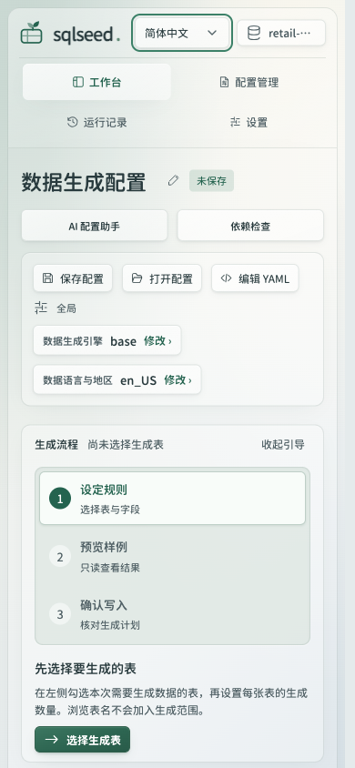
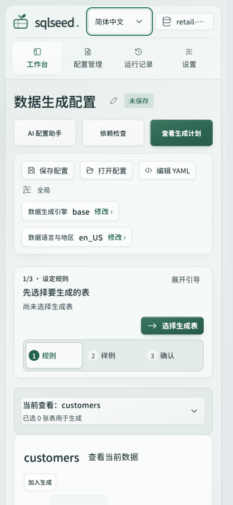
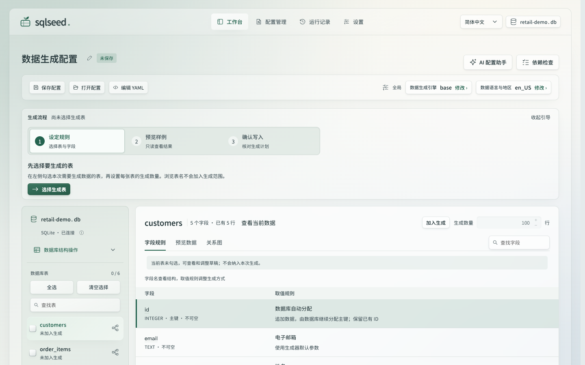
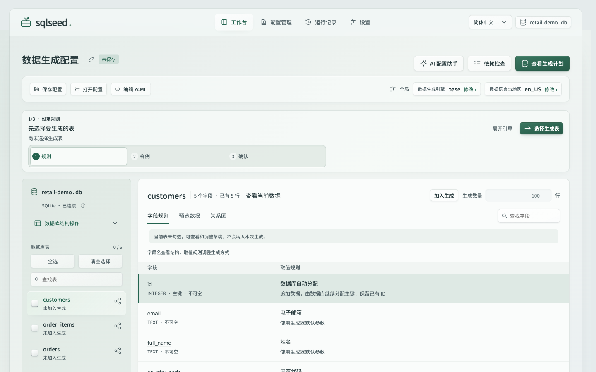
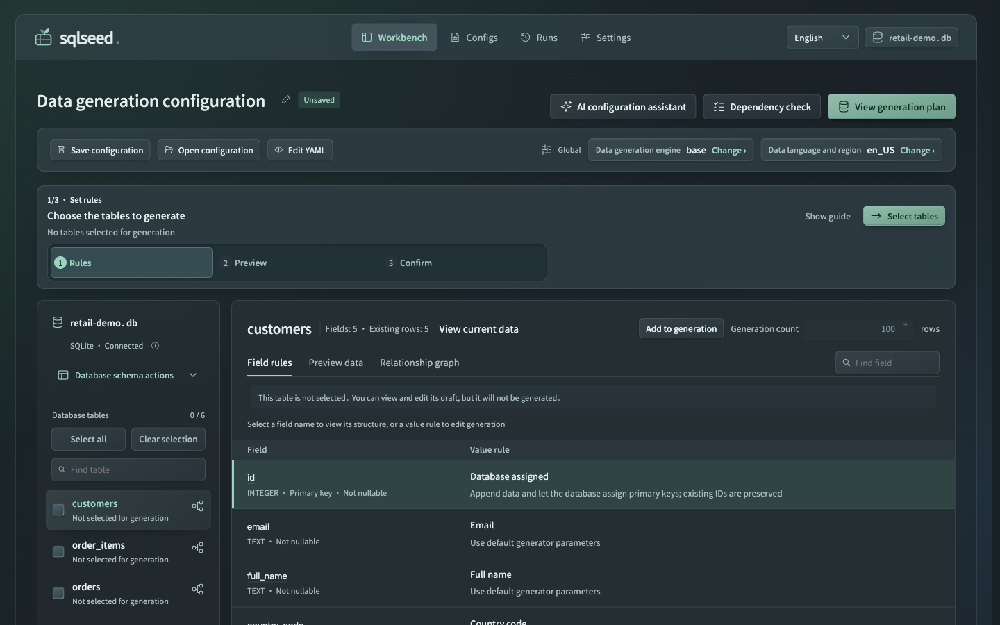
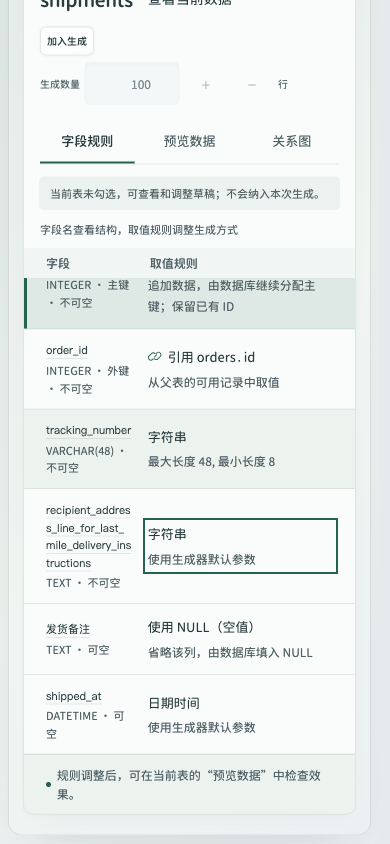
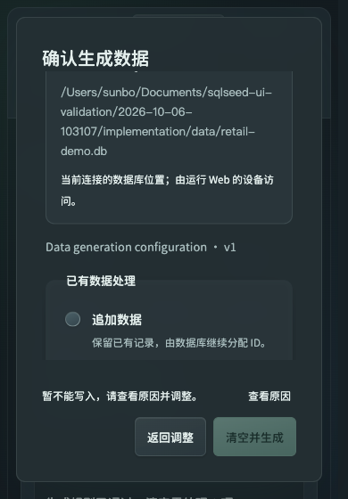

# Liquid Glass 工作台实施与验收记录

实施日期：2026-10-06，最后复核：2026-10-07。状态：**实施与验收进行中**。实现基线：`b7a5ba507cd8192779debf56d32502ba38e8e6af`，分支 `codex/liquid-glass-ui`。本文记录当前工作树的设计取舍及已经取得的证据；实际 200% 浏览器缩放仍待补验；实现已提交为 `87c2a046b0a2c5493c98b6e5c950761df7fcdfb8`，可审阅 [Draft PR #35](https://github.com/sunbos/sqlseed/pull/35)，候选 CI 正在运行；无手动刷新到运行成功的流程已于 10 月 7 日补验。辅助功能及 coarse 的浏览器模拟结果与真实设备边界分别记录在下文。历史评审结果不改写。

本报告随附 7 张原始截图和[便携证据摘要](liquid-glass-assets/evidence-summary.json)，包含布局、辅助功能、数据库、合成 AI 和性能的关键原始数值及截图 SHA256。摘要是原始记录的摘录，不是完整网络或浏览器 trace。正文中的其他文件名标识本轮证据来源，不依赖维护者的本机路径；自动结果摘自 `validation/automated-results.md`。

## 基线与可审阅预览

2026-10-07 提交前复核，GitHub main 与本地 HEAD 仍为上述基线，main 的 CI / doc-sync 通过；唯一打开的 PR #34 为独立清理草稿，未合并到本轮实现。main 的绿灯不能代替候选改动的检查。

候选为 [8641 工作台](http://127.0.0.1:8641/#/workbench)，对照为 [8640 工作台](http://127.0.0.1:8640/#/workbench)。10 月 7 日发现验收进程已停止后，通过原隔离 launcher 重启为 baseline PID 12509 / candidate PID 12582。重新核验两端各 123 个项目模块的启动路径及磁盘哈希、首页与 17 项 HTTP 静态资源字节，全部匹配相应源码；两端均为 management disabled。基线指向冻结的 main，候选指向本工作树；候选 `workbench.css` SHA256 为 `4393912aa46e9b7bd14c9c0c1529601855ead1393ef09b7bcec12babebc95d30`。这些是来源核验，重启后的 HTTP 正常不替代新的浏览器交互验收。用户的 8630 服务未用于本轮写入测试。

重启后一度因恢复到错误协议页面，工具的 URL 安全策略拒绝重新选取；用户随后手动打开有效 HTTP 页面，浏览器控制已恢复，未绕过限制。恢复时读取的原生 `cssVisualViewport.zoom=1`、`scale=1`，仍是 100%（`browser-restored-metrics-20261007.json`），不能作为 200% 验收。后续无手动刷新到运行成功的流程已补验，真实 200% 缩放仍待验证。

## 材质与业务层级

工作台需要持续阅读字段、规则、预览数据和写入影响。当前实现保留原有品牌标志、绿色操作强调、本地圆角字体与等宽标识符，并把材质明确分为画布、阅读内容、控制及临时浮层。

| 角色 | 当前 token | 浅色 / 深色 | 用途 |
| --- | --- | --- | --- |
| 画布 | `--canvas` | `#e5ebec` / `#172025` | 页面环境底色 |
| 阅读内容 | `--surface-data`，`--paper` 引用它 | `#fafcfb` / `#242e33` | 工作台数据区及配置、运行、设置阅读卡片；移除大面积数据区 backdrop blur |
| 控制层 | `--surface-control`，`--glass` 引用它 | `rgba(249,253,251,.58)` / `rgba(49,64,70,.74)` | 导航与操作表面，保留受控透明度及边缘 |
| 临时浮层 | `--surface-overlay`，`--glass-dialog` 引用它 | `rgba(251,253,252,.94)` / `rgba(35,46,51,.97)` | 高遮盖对话框及抽屉 |

内嵌规则说明与执行事实使用 `--wash`，避免在浮层中重复堆叠玻璃卡片。下拉继续使用独立的 `--glass-picker`。减少透明度和不支持 backdrop-filter 时保留实色回退；强制颜色模式保留系统颜色与语义状态。

Apple 建议把 Liquid Glass 主要用于位于内容上方的导航，避免把表格内容变成玻璃或叠加多层玻璃。本项目据此优先稳定阅读底色，而非增加全页透明度。[Meet Liquid Glass，Principles](https://developer.apple.com/videos/play/wwdc2025/219/)

这里使用 CSS 透明度、模糊、边缘和阴影，不实现 Apple 原生材料的完整折射与自适应光学系统。颜色、18px 模糊与动画时长均为项目取值；不能由材质选择推导“多年不会过时”或已改善帧率。

## 紧凑工作流

- 没有已存偏好时，引导默认收起；保留原有展开/收起偏好。折叠仅隐藏说明，当前下一步和三列阶段按钮始终可用。紧凑标签为“规则 / 样例 / 确认”，完整阶段名称留在 `aria-label`；按钮 DOM 与分段装饰底板持续复用。
- ≤760px 的表目录使用原生 `details/summary`。摘要分别显示当前查看表与已选生成表数；表选择复选框、表名与依赖路径按钮继续独立。定位选择或数量错误时先展开，选表后把当前表内容带入视口。
- 窄屏或 `pointer:coarse` 下，表选择标签、路径按钮及数量增减按钮提供至少 44×44 CSS 像素命中区。数量增减横排，不改变原生输入校验；非法草稿不能被步进按钮静默修正。
- 长字段标识在本列内换行，保留完整名称和查看结构入口，避免窄屏内容越过规则列；实现只给 `.wb-field-name` 增加 `overflow-wrap:anywhere`。
- 写入确认 footer 显示核对中、提交中、阻断、失败或就绪；提交按钮关联状态说明。“查看原因”只有在用户选择后才滚动并聚焦正文诊断。既有会话、epoch、修订、计划 hash、busy 和 `canRun` 门禁继续决定能否写入。

入口见 [工作台源码](../../../plugins/sqlseed-web/src/sqlseed_web/static/js/pages/workbench.js)、[工作台样式](../../../plugins/sqlseed-web/src/sqlseed_web/static/workbench.css)及[正式指南](../../web-workbench.md)。

## 动效与未来设备边界

tab 选择同步生效。横向反馈使用 160ms 指示线，快速反转从当前绘制位置继续；纵向反馈使用 140ms 装饰面淡出，文字本身不动。新选择、启用减少动态效果或目标移除时，取消待执行 frame 与现有装饰；同步重绘后可以定位替换的选中 tab。方向键的纯焦点移动不触发选择反馈。实现见 [tab-motion.js](../../../plugins/sqlseed-web/src/sqlseed_web/static/js/tab-motion.js)。

保留减少动态效果、减少透明度和高对比回退，是材料可用性的组成部分。Apple 的原生材料也响应这些辅助功能设置；Web 端需由自身实现并独立验证。[Meet Liquid Glass，Accessibility](https://developer.apple.com/videos/play/wwdc2025/219/)

对未来 XR，当前可复用的是业务状态、操作语义与材料角色。visionOS 的注视反馈由系统在应用进程外执行，空间交互尺寸也不同于 Web 的 CSS 像素。本轮没有 XR 客户端、注视输入模拟或 XR 验收；后续应由目标平台组件提供输入反馈，再验证布局与明确确认写入的流程。[Design hover interactions for visionOS](https://developer.apple.com/videos/play/wwdc2025/303/)

## 自动门禁

`validation/automated-results.md` 记录了五个本地包环境的结果。以下通过数是本轮执行结果，不是新增测试数量。

| 范围 | 结果与限制 |
| --- | --- |
| ruff check / format、mypy、lint-imports | 均 exit 0 |
| Web Node 测试 | 长字段修复后于 10 月 6 日及 10 月 7 日均重跑完整套件，1057 / 1057 通过，无失败或跳过；最新墙钟用时 26.235 秒 |
| 页面 Node 测试 | 47 / 47 通过，无失败或跳过 |
| 离线 Python 首轮 | 4367 passed、29 skipped、82 deselected、33 setup errors |
| 文档修复后定向复验 | 51 passed；覆盖并解决首轮全部 33 个 setup errors |
| Python 去重合并 | 4400 passed、29 skipped、82 deselected，未解决失败 0；不是第二次完整运行 |
| 架构与包边界 | 14 + 10 项通过，已包含在 Python 结果中 |
| 文档同步与 MkDocs strict | 10 月 7 日最终复验均 exit 0，strict 构建 6.403 秒 |
| 本地 mutation gate | 246 / 246 killed；survived、timeout、suspicious、skipped 均为 0 |
| 独立提交前源码审查 | 10 月 7 日未发现 P0 / P1 / P2；六组定向 Node 回归 115 / 115，diff check 通过 |

首轮 33 个错误均来自文档严格构建 fixture：非发布的 UI 评审材料断链。按既有发布范围将 `/ui-review/` 排除，并同步正式双语指南后定向复验通过；没有关闭 strict 或全局忽略 warning。29 个跳过包括 24 个 Windows 专有行为、2 个 PowerShell 不可用、2 个文件系统别名差异及 1 个可选 Pillow 缺失。82 个排除包括真实 PostgreSQL / LLM 等 79 个 integration 用例及 3 个 PG fixture 用例。

Python、静态门禁和 mutation 早于最后的长字段换行修复；679 项门禁源码 / 测试输入复核仅 `workbench.css` 变化，Python / JS 与测试未变，因此沿用对应结果，并非重新跑过全套。CSS 修复已在 320 / 390 / 1440px 浏览器复验，随后两次完整 Web Node 均为 1057 / 1057；最新日志为 `validation/logs/gates-20261007/node-web.log`，结果记录完成于 2026-10-07 06:11:31（本地时间）。原始门禁及去重分析位于 `validation/logs/gates-20261006/`，mutation 位于 `validation/mutation-20261006T031341187246Z/`。这些结果不代替真实浏览器、真实模型、PostgreSQL、跨平台安装或发行包验收。

实际检查命令如下；Python 工具在五个本地 editable 包的独立环境运行，缓存及构建输出位于隔离目录。

```sh
ruff check --no-cache src/ tests/ plugins/
ruff format --check --no-cache src/ tests/ plugins/
mypy src/sqlseed/ plugins/
lint-imports --no-cache
node --test plugins/sqlseed-web/tests/test_*.cjs
node --test tests/test_deploy_pages.cjs
python -m pytest -m 'not integration' -p no:cacheprovider -p offline_scope
python -m pytest tests/test_docs_site.py tests/test_doc_sync.py -p no:cacheprovider
python scripts/sync_docs.py --check
mkdocs build --strict --site-dir <isolated-output>
mutmut run
mutmut results
```

`offline_scope` 为验收环境的收集插件，仅排除依赖 `pg_url` / `available_llm_backend` 的外部服务用例，不替换 fixture、响应或断言。mutation 在源码和输入哈希匹配的隔离副本中执行仓库规定的目标。上述带隔离输出 / 插件的命令是执行记录，不把这些临时验收文件作为产品依赖。

独立审查记录为 `validation/final-diff-review-20261007.md`；10 月 7 日文档复验记录为 `validation/logs/gates-20261007/docs-result.json`。本轮 `.sonarcloud.properties` 仅精确列入上述 7 张已核验 PNG 的二进制排除项，没有扩大到目录或排除产品代码。

## 功能保留与验证矩阵

以下“自动回归”均指已执行通过的套件，不以测试文件存在代替结果。浏览器证据与自动边界分别列明；这是本轮改动的验收范围，不承诺所有状态的笛卡尔积或所有设备都已实测。

| 保留能力 | 本轮真实浏览器 / 数据证据 | 自动回归与边界 |
| --- | --- | --- |
| 四路由、三态主题、中英文 | 工作台、配置、运行、设置可达；深色刷新恢复、跨页浅色同步、system 响应变化后刷新恢复；英文五宽度导航可读 | shell、theme、i18n 全量通过；未做每页 × 每主题 × 每语言全组合 |
| 默认配置、插件与版本管理 | 10 月 7 日重验五项默认设置、三态外观选项和组件状态；ASGI 管理禁用原因明确显示 | settings、generation-defaults、plugin-management 通过；未执行环境安装 / 卸载 / 升级 |
| 数据库连接与配置模型 | 连接独立 SQLite；保存并重开 parents 3 / children 4 配置；无效 YAML 保留并报错 | connection、documents、model、session 通过；文件选择与所有导出格式未逐项浏览器操作 |
| 字段编辑、应用 / 取消 | 9–7 非法边界保留且不能应用；9–9 应用后真实预览 9 / 18；取消保留原值 | editor、rule-usability、execution 通过；覆盖本次编辑路径 |
| 预览不写入 | 预览前后数据库行数及存量值保持；首次写入前仍为 0 / 0 | preview、sample-budget、acceptance 通过；不把 SQLite 读数当作所有数据查看控件验收 |
| 查看、图定位、AI 与生成范围独立 | 手机查看 orders 和图中查看 warehouse_bins 后生成勾选仍为空；AI 合成建议只修改 children.amount，数量仍 3 / 4 | model、context、graph、AI scope 及 protected-operation 回归通过 |
| 配置筛选与批量操作 | 复制、筛选、删除确认仅列所选副本，取消后保留；无结果空态与语言切换保留搜索 | configs、workbench-configs 通过；未在用户配置上执行破坏性删除 |
| AI 审阅与不可用 | 真实待配置状态禁用；标注的合成建议需明确勾选才应用，取消保留原配置，应用后真实预览 | AI / handoff / stream 回归通过；未调用真实模型，本次浏览器替身不证明后端模型质量或流式协议 |
| 生成确认、追加、清空 | 短屏就绪和阻断 footer 可达；查看原因聚焦诊断；两次追加及一次清空重建直接核验行数 / FK；第四次追加库结果正确 | execution、clear-recovery、runtime、acceptance 通过；10 月 7 日再次写入后无手动刷新即显示成功 |
| 运行记录、版本与在途保护 | 清空运行显示计划 / 实插 7 行；10 月 7 日显式追加后无需刷新、重选或导航即显示成功及两表实插 3 / 4，与数据库一致 | runs、recovery、epoch / revision / hash / concurrency / late-response 回归通过；没有逐帧捕获所有中间状态 |
| 查看当前数据 | 第五次写入前，children 只读数据表显示 8 行、amount 7 / doubled 14，按主键 id 排序；仅一页，前后翻页均禁用 | table-data、workbench-data 通过；这次浏览器检查未覆盖多页翻页 |
| 焦点、选区、滚动和动效 | YAML 焦点陷阱 / Escape、日期浮层分层 Escape、快速 tab 反向与 reduced-motion 清理；五宽度和长名布局 | compact、tab-motion、segment/navigation、modal-scroll 等通过；真实 200% 缩放待补 |

10 月 7 日设置页补充原始记录为 `settings-defaults-20261007.txt`、`plugins-status-20261007.txt` 和 `theme-options-20261007.txt`；该次仅查看入口及状态，未修改偏好、检查远程更新或管理组件。

## 浏览器与真实数据证据

本轮使用独立 IAB 验收页面，基线与候选分别连接本地服务；候选 origin 为 `http://127.0.0.1:8641`。宽度采用浏览器视口模拟。下列观察是此环境内的结果，不外推为真实手机、Safari、Firefox、XR 或跨设备 GPU 验收。

### 布局、主题与焦点

最终中文浅色对照使用同一 retail schema、未勾选生成表、相同视口及各版本的新用户默认引导状态：基线展开，候选紧凑。这一默认状态变化就是本次设计变更的一部分，并非把基线手动折叠后比较纯材质。旧用户已有的展开偏好继续保留。

| 视口宽 × 高（CSS px） | 前后 documentWidth | 基线字段面板起点 | 候选字段面板起点 |
| --- | ---: | ---: | ---: |
| 320 × 844 | 309 | 1491.77 | 792.11 |
| 390 × 844 | 379 | 1430.77 | 750.91 |
| 768 × 1024 | 757 | 601.16 | 525.27 |
| 1024 × 768 | 1013 | 561.97 | 486.08 |
| 1440 × 900 | 1429 | 536.12 | 460.23 |

起点为文档坐标，单位 CSS px；来源为 `final-visual-pairs.json`。手机上能更早到达当前表面板，但不能解读为整个字段表都已进入首屏。文档宽度未超过视口也不等于所有内部表格和弹层都已验证。

| 390px 基线：展开引导 | 390px 候选：紧凑引导及折叠目录 |
| --- | --- |
|  |  |

| 1440px 基线 | 1440px 候选 |
| --- | --- |
|  |  |

英文深色也留存 320 / 390 / 768 / 1024 / 1440px 捕获。下列修正测量明确在 `scrollY=0` 采集，属于独立语言样本，不能与上述中文对照混算高度收益。

| 视口宽 × 高（CSS px） | documentWidth | 字段区 top（CSS px，英文深色） |
| --- | ---: | ---: |
| 320 × 844 | 309 | 1038.22 |
| 390 × 844 | 379 | 910.75 |
| 768 × 1024 | 757 | 570.32 |
| 1024 × 768 | 1013 | 570.32 |
| 1440 × 900 | 1429 | 460.23 |

因此不能宣称英文手机页的字段区已全部进入首屏。不同语言、引导和业务状态会改变高度。几何原始记录为 `after-en-dark-layouts.json`、`after-en-dark-layouts-corrected-capture.json`。



- 390px 表目录选中查看 `orders` 后收起，焦点落到 `H2 orders`，标题 top 为 24.91px，生成勾选仍为空；这支持“查看、目录展开与生成选择独立”的该条交互。证据：`mobile-directory-focus.json`。
- 清空 `customers` 会影响未选 `orders` 的场景中，footer 显示“暂不能写入，请查看原因并调整”，提交保持 disabled；主动选择“查看原因”后，焦点为 `wb-execution-details`，诊断 top 为 80px。证据：`blocked-confirmation.txt`、`blocked-confirmation-focus.json`。这条记录覆盖阻断态，不等同于五种 footer 状态均已逐项完成浏览器验收。
- 深色偏好刷新后保持，另一页改为浅色后跨页同步；“跟随系统”响应模拟的系统深浅变化，等待 media event 处理后由 dark 变为 light，刷新仍显示“跟随系统”。证据：`theme-persistence-system-cross-tab.json`。事件刚切换的中间采样仍为 dark，未把该瞬间当作最终状态。
- 设置 tab 快速切换的记录中，装饰 marker 随新选择更新并最终清理；约 566ms 后记录为 animations 0 / markers 0。启用模拟的减少动态效果和减少透明度后，记录为 animations 0、markers 0、glassBlur `0px`、深色 control `#29373c`，最终焦点和选择同为外观 tab。证据：`settings-native-motion-observation.json`、`reduced-motion-transparency.json`。这是特定流程和媒体特征模拟，未证明所有动效或真实设备辅助功能组合都已通过。

### 长字段、输入尺寸及辅助功能补充

长字段 `recipient_address_line_for_last_mile_delivery_instructions` 修复前宽度 86px、scrollWidth 293px，`overflow-wrap:normal` 导致越列。只增加 `overflow-wrap:anywhere` 后，320 / 390 / 1440px 下的宽度与 scrollWidth 分别均为 58 / 82 / 301px，文字高度为 106 / 70 / 42px；原始名称完整保留，靠换行适应本列。证据：`long-field-before-fix.json`、`long-field-after-fix.json`。

| 长字段换行后的手机字段表 | 手机阻断确认状态 |
| --- | --- |
|  |  |

- 1024px 模拟 `pointer:coarse` 时，6 个表选择 label 均为 44×58.09px，6 个路径按钮和 2 个数量步进按钮均为 44×44px，数量按钮横排。证据：`coarse-1024-hit-targets.json`。这验证已采样控件的浏览器计算尺寸，不证明所有控件或真实手指操作都已验收。
- 模拟 forced-colors 时，记录 `forced=true`、背景白色、文字黑色、checkbox appearance 为 `auto`，系统颜色与原生复选样式回退生效（`forced-colors.json`）。未据此声称整站对比度或真实 Windows 高对比模式全部通过。
- 无 backdrop-filter 回退使用**强制激活现有 CSS 声明分支**的方法验证：复制现有 unsupported-filter 声明，得到 control `#f2f6f4`、header filter `none`。引擎的 `nativeSupport` 仍为 true，因此这不是在真正不支持 filter 的浏览器中验证 `@supports` 分支选择（`no-filter-forced-branch.json`）。
- YAML 对话框打开时聚焦标题，Shift+Tab 回绕至“应用配置”、Tab 回绕至“读取文件”，均留在对话框内；Esc 关闭后焦点回到“编辑 YAML”。语言下拉 Esc 关闭，焦点回到“界面语言”，已选简体中文保留（`keyboard-focus-trap-escape.json`）。
- 手机日期选择器的 AX 记录显示 2000 年 1 月及已选日期；第一次 Esc 只关闭日期浮层，保留字段对话框并回到开始日期按钮；第二次 Esc 关闭字段对话框并回到日期时间规则入口（`date-picker-phone.txt`、`date-picker-escape.json`）。此处依据 AX / 焦点记录，不以 `date-picker-phone.png` 证明整个日历已进入视口，也不覆盖每一种日期键盘指令或日期边界。
- 10 月 7 日对当前 CSS 的浅 / 深色不透明 token 组合计算相对亮度，30 项正文、辅助文字、强调、错误、焦点和主按钮端点检查全部达到各自阈值，文字组合最低为 4.76:1（`source-token-contrast.json`）。方法依据 [W3C 文本对比度](https://www.w3.org/WAI/WCAG22/Understanding/contrast-minimum.html)及[非文本对比度](https://www.w3.org/WAI/WCAG22/Understanding/non-text-contrast.html)；这是源码颜色计算，不含透明背景合成采样，不是整站 WCAG 符合性或屏幕阅读器验收。

### SQLite 写入、字段编辑与不写入边界

真实临时库为 `validation/candidate/parents-children.sqlite3`。配置为 parents 3 行、children 4 行，`amount=7`，`doubled=amount * 2`；child 外键引用真实父表。浏览器明确确认后完成两次追加和一次清空重建，随后直接检查 SQLite，而非仅相信界面“成功”。

| 检查点 | parents 行数 | children 行数 | 已验证数据 |
| --- | ---: | ---: | --- |
| 首次写入前，YAML / 字段取消及预览后 | 0 | 0 | 无写入；integrity_check 为 ok，foreign_key_check 为空 |
| 第一次追加后 | 3 | 4 | child 的 amount / doubled 均为 7 / 14；完整性与外键检查正常 |
| 第二次追加后 | 6 | 8 | 旧行保留并新增；amount / doubled 仍为 7 / 14；完整性与外键检查正常 |
| 清空后重建，未勾选重置自增 | 3 | 4 | parent ID 为 7–9，child ID 为 9–12；amount / doubled 为 7 / 14；完整性与外键检查正常 |
| 后续字段及合成 AI 预览后 | 3 | 4 | 数据库值仍为 7 / 14，外键检查为空，运行记录仍为 3 条 |
| 第四次明确确认追加，次日重启后只读复核 | 6 | 8 | amount / doubled 仍为 7 / 14，integrity_check 为 ok，foreign_key_check 为空 |
| 第五次明确确认追加，运行页无需手动刷新即显示成功 | 9 | 12 | 本次实际提交 parents 3 / children 4；存量 amount / doubled 为 7 / 14，完整性与外键检查正常 |

原始记录：`database-before-write.json`、`database-first-append.json`、`database-second-append.json`、`database-clear-regenerate.json`、`database-after-AI-preview.json`、`database-after-restart.json`。第四次写入之前重新打开的运行页显示三条成功记录，清空重建本次计划 7 行、实际提交 7 行；“实际提交”是本次写入数，不是数据库累计数（`run-results-final.txt`）。第四次追加的 `run-auto-update-without-refresh.txt` 只捕获到生成中、parents 已成功的中间状态；次日数据库结果证明写入完成。该次不完整观察作为历史保留，不用它证明页面自动终态。

10 月 7 日再次打开原配置 v1，明确确认追加 7 行。运行 `56981906-f60a-4cbe-bda8-cddf2f5e1bde` 返回结果页后没有手动刷新、重选、导航或重新加载；首个 AX 采样已显示整体生成成功、本次实插 7 行、parents 3 / children 4 均成功，后续采样一致（`auto-refresh-confirmation-20261007.txt`、`auto-refresh-initial-20261007.txt`、`auto-refresh-final-20261007.txt`、`auto-refresh-result-20261007.json`）。直接只读 SQLite 复核累计 9 / 12 行、7 / 14 值及正常约束（`database-auto-refresh-20261007.json`）。这证明本流程无需手动刷新即可显示成功，不声称捕获了 queued → running → success 的每一帧。

本次追加前还打开了 children 的“数据库当前数据”浮层：显示 8 条真实记录、amount 7 / doubled 14，按主键 id 排序；页码为 1–8 / 8、每页 50 行，上一页 / 下一页均禁用（`current-data-ui-20261007.txt`）。此处是写入前的只读当前数据检查，不与后续 12 行混淆，也未覆盖多页分页。

字段抽屉中把最小值改成 9、最大值仍为 7 时，显示边界错误并禁用“应用规则”。合法应用 9–9 后，真实预览显示 amount 9、doubled 18，未改变数据库已存 7 / 14。取消编辑恢复 7–7。证据：`field-invalid-range.txt`、`field-applied-real-preview.txt`、`business-flow-browser.json`。同一业务记录还覆盖无效 YAML 错误提示、保存配置重开保留 4 / 3 行、筛选后删除确认仅列出目标配置及取消保留配置；未执行破坏性批量删除。

### AI：合成响应，真实审阅与预览

**这部分没有调用外部模型。** 仅对候选 origin 的 `GET /api/workbench/ai/config` 和 `POST /api/workbench/ai/suggest` 使用 CDP Fetch 合成响应。config 只模拟可用状态；suggest 使用产品支持的 HTTP 200 JSON 响应路径，未验证 NDJSON 流式服务。实际记录为 1 次 config、2 次 suggest 拦截，两次请求均通过限定范围校验。

响应绑定捕获请求的 `conn_id`、`schema_hash` 和候选临时库；`tables=["children"]`，`allowed_targets` 仅含 `children.amount`。两次建议均从实际请求中的 7–7 规则生成 9–9，保留 `doubled` 的 `derive_from=amount`、`expression=value * 2`，以及 parents 3 / children 4 的生成范围和行数。响应没有伪造后端验证成功或样例。模板与边界说明在 `validation/ai-browser-fixture.json` / `.md`，实际请求及响应在 `ai-synthetic-interceptions.json`。

浏览器记录依次证明：请求等待时分析和范围控件禁用、取消可用；收到建议时复选框未选中且“应用所选建议”禁用；取消后规则仍为 7–7；再次请求后明确勾选 `children.amount` 才能应用；应用后界面显示 9–9、派生规则未变，并提示预览。等待期间的计时是拦截测试停留时间，不代表模型延迟。对应证据为 `ai-synthetic-busy.txt`、`ai-synthetic-review-unchecked.txt`、`ai-synthetic-cancel.json`、`ai-synthetic-review-selected.txt`、`ai-synthetic-after-apply.txt`。

未手动调整的建议由现有前端补丁路径应用到配置，不会因为勾选应用而自动执行 `/api/workbench/check`；手动调整建议的确定性校验是另一条流程，本条未覆盖。应用后显式触发的 `POST /api/workbench/preview` 仍由真实本地后端运行，得到 4 行 amount 9 / doubled 18（`ai-synthetic-real-preview.txt`）。这一步没有提交生成任务；随后 SQLite 检查确认行数、7 / 14 的存量值和 3 条运行记录均未改变。

关闭拦截后，真实 AI 配置重新显示“AI 待配置”，提示模型、API Key 和 Base URL，“开始分析”禁用（`ai-real-status-restored.txt`）。上述证据覆盖真实 UI 的请求、等待、审阅、取消、明确应用和真实预览边界；不证明 AI 插件、鉴权、模型质量、后端 AI scope / 参数 / DAG 验证、AI 候选预览或流式时序已经通过。

### 26 表关系图

真实 `complex26.sqlite3` 的整库关系图显示 26 / 26 张表、55 条关系；适应画布约为 23%，切换到 100% 后显示自然阅读尺寸。搜索 `warehouse_bins` 的记录显示 24 / 26 张表、51 条关系的当前关联范围，不能写成“仅过滤出一张表”。查看该表后 `viewed=warehouse_bins`，生成勾选仍为空。证据：`complex26-full-graph.txt`、`complex26-natural-size.txt`、`complex26-search.txt`、`complex26-scope-independence.json`。

整份计划的真实依赖检查显示 1 项阻断、10 项提醒：departments / employees 循环且无可用来源，不能从空表重建；“查看生成计划”保持 disabled。此例验收的是结构呈现、范围独立和阻断说明，不是成功生成 26 张表（`complex26-dependency-check.txt`）。

## 性能原始样本与解释边界

基线和候选在独立 IAB 页面、本地服务上取样；加载各 3 轮，宽度 1440px、浅色、无生成表勾选。记录没有足够的重复次数、缓存控制与设备覆盖，不能证明统计显著更快。下表直接使用 Navigation Timing 的事件结束时间和 Paint Timing 的 FCP，单位均为 ms；轮次对应原始 `round=0/1/2`。

| 轮次 | 基线 FCP | 候选 FCP | 基线 DOMContentLoaded end | 候选 DOMContentLoaded end | 基线 load end | 候选 load end |
| --- | ---: | ---: | ---: | ---: | ---: | ---: |
| 1 | 276 | 340 | 278.6 | 292.8 | 566.9 | 736.2 |
| 2 | 232 | 136 | 213.4 | 114.9 | 215.8 | 117.1 |
| 3 | 208 | 148 | 189.2 | 117.6 | 191.1 | 118.2 |

候选首轮较慢、后两轮较快，只能保留为本次观察。原始 CDP `start/end` 中部分累计 TaskDuration / LayoutDuration 等跨导航后重置，相减会出现负值，故不把这些差值作为 CPU 节省证据。原始文件为 `performance-load-comparison.json`。

滚动和交互各只有一轮，均约 1.4 秒。以下为 rAF 记录的回调间隔，排除第一条起始偏移；p95 使用 nearest-rank。它们不是合成器或 GPU 呈现帧时间，也不能兑换为“真机稳定 60fps”。

| 单轮场景 | 有效间隔数 | 中位数 ms | p95 ms | 最大值 ms | 补充事实 |
| --- | ---: | ---: | ---: | ---: | --- |
| 基线滚动 | 85 | 16.6 | 18.1 | 18.5 | scrollY 范围 0–212，结束回到 0 |
| 候选滚动 | 82 | 16.7 | 18.4 | 33.0 | scrollY 范围 0–317.5，结束回到 0 |
| 基线交互 | 79 | 16.8 | 33.1 | 34.5 | 记录中选择状态变化 4 次，最终 marker 为 0 |
| 候选交互 | 77 | 16.8 | 33.2 | 48.5 | 记录中选择状态变化 4 次，最终 marker 为 0 |

滚动距离不同，不能把两条滚动记录视为严格等负载对照。交互采样中候选最大间隔更高，也没有证据宣称动效更快。移除数据区大面积模糊是减少效果范围的实现选择；其真实 GPU、功耗与帧率收益仍需目标设备和跨浏览器测量。原始文件为 `performance-scroll-comparison.json`、`performance-interaction-comparison.json`。

## 尚未完成与交付边界

- 实际浏览器 200% zoom：已尝试清除设备模拟后使用原生 Cmd+=，但前后 viewport 的 zoom / scale 均为 1，故没有取得有效 200% 结果；目前等待用户协助，不以 CSS zoom 或 page scale 替代（`browser-zoom-capability-probe.json`）。
- forced-colors / coarse 已有浏览器模拟证据，无 filter 已有现有声明分支的强制激活证据；真实高对比系统、真正不支持 filter 的引擎和触控设备仍未验证。
- 默认态前后截图、长字段和所列键盘 / 弹层流程已随本报告记录；其他业务状态组合仍不能由这些单次观察概括。便携摘要保留关键数值，完整原始日志和浏览器 trace 未全部纳入仓库。
- 实现已提交并推送，Draft PR #35 已关联本任务；尚未合并或发布。候选 CI 尚在运行，不能以 main 的绿灯替代。真实 LLM / PostgreSQL、Safari / Firefox、真实手机与 GPU、屏幕阅读器、发行包和 XR 均不在上述已验证结论内。
