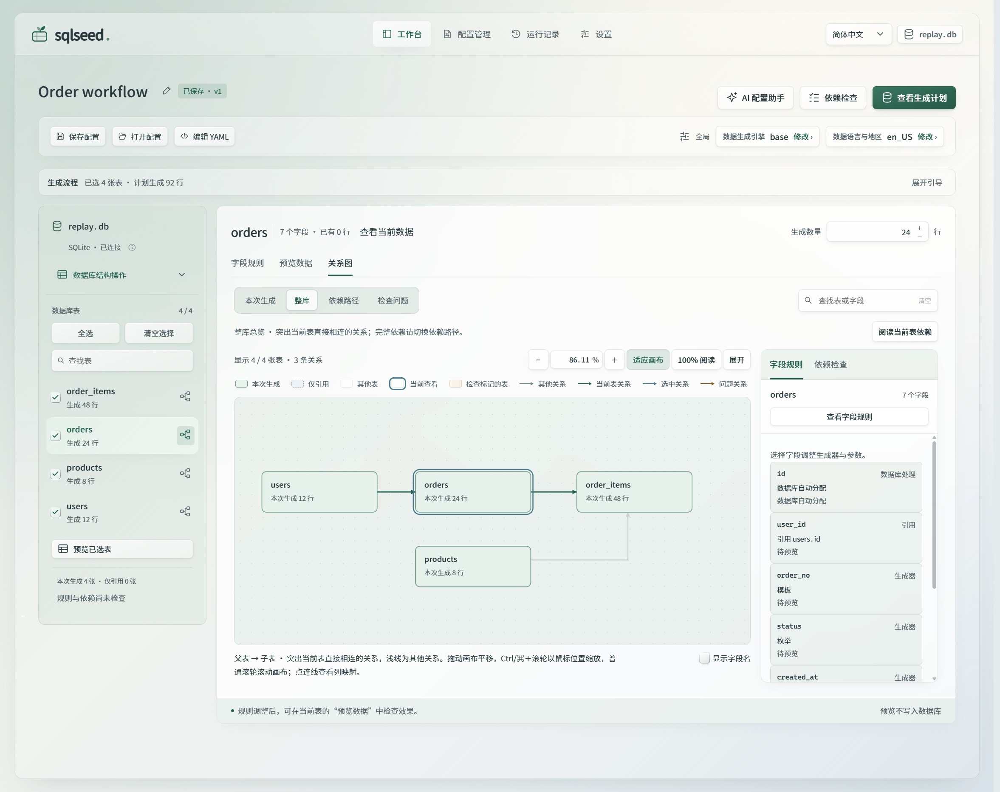

# Web 工作台

Web 工作台通过真实数据库结构建立生成配置。不安装 AI 插件，也可以完成连接、编辑、保存、检查、生成与运行记录查询。

正式页面为“工作台 / 配置管理 / 运行记录 / 设置”。本文描述 0.2.5 版本及其源码候选；发布状态以 [Releases](https://github.com/sunbos/sqlseed/releases) 为准。正式版本、源码与构建产物的安装方式见[升级说明](migration.zh-CN.md)，尚未发布的候选版本按其中的源码安装方式体验。

从已有数据库选择表、编辑字段规则、预览数据与检查关系，再确认写入；配置管理保存可复用的规则，运行记录展示各表结果和实际提交量。本文为中文操作指南，英文入口见 [Web README](https://github.com/sunbos/sqlseed/blob/main/plugins/sqlseed-web/README.md)。

0.2.5 工作台使用一套清透玻璃设计，提供浅色与深色模式；导航、操作区域、连接弹窗与规则抽屉共享材质层级，表格保留稳定的阅读底色。中英文 UI 均使用随包分发的寒蝉圆黑 400/500，代码与字段标识保留等宽字体，无需外部字体服务或系统安装。浏览器不支持背景模糊或系统要求减少透明度时提供实色回退。材质仅作用于网页内部，不依赖操作系统窗口特效。



0.2.5 正式界面的实际截图。[查看原尺寸高清 PNG](assets/screenshots/web-workbench-zh-CN-light.png)，或[查看深色主题下的只读样例预览](assets/screenshots/web-workbench-zh-CN-dark.png)。界面语言与生成数据的语言地区分别设置。

在 Python 3.10+ 虚拟环境中安装并启动 0.2.5：

```bash
python -m pip install "sqlseed==0.2.5" "sqlseed-web==0.2.5"
sqlseed-web
```

开发源码从仓库根同次安装：`python -m pip install -e . -e ./plugins/sqlseed-web`。

打开 `http://127.0.0.1:8630`，使用顶栏或首次空状态中的“连接数据库”按钮，在弹窗选择 SQLite 文件或填写 PostgreSQL 连接。SQLite 路径属于运行服务的电脑；连接信息只负责指定数据库目标。全局数据生成引擎和语言地区在生成配置中设置，不属于连接表单；使用可选引擎或数据库时需安装相应依赖。

SQLite 连接表单只打开已有文件；输入不存在的路径或目录时会提示修正，不会因拼写错误创建空库。已存在但尚无表的数据库会提供“重新读取结构”和“选择其他数据库”：先用数据库工具创建表，再重新读取即可开始配置。重读后仅查看新表，不自动勾选或生成数据。

切换已有连接后，工作台恢复该连接在当前网页会话中的配置；首次进入该连接时建立新配置。上一数据库的配置编号或运行快照链接不会随普通切库操作带到新数据库。未保存的工作按连接保留在当前网页内，不会因切库自动保存到另一数据库。直接打开属于其他数据库的配置链接时，页面会说明目标不匹配，提供返回当前数据库与选择对应数据库两种处理；这不等于数据库无法读取，也不会绕过目标身份校验。

PostgreSQL 需要在运行服务的 Python 环境中安装 Core 的 `postgres` extra（0.2.5 使用 `python -m pip install 'sqlseed[postgres]==0.2.5'`；源码使用 `python -m pip install -e '.[postgres]'`）。它提供 psycopg 3；普通 `postgresql://` 地址默认使用该驱动，显式指定的 driver 保持原样。数据库可以位于本机或网络可达的服务器。当前 Web 支持读取结构、预览、追加生成与查询结果；清空后生成仅支持 SQLite，PostgreSQL 复合外键与跨 schema 外键引用暂不支持。

## 界面语言与数据语言

0.2.5 工作台的顶栏提供“简体中文 / English”，正式导航对应 **Workbench / Configurations / Runs / Settings**。首次打开优先采用浏览器偏好中支持的语言；没有匹配时使用 English。主动选择会保存在当前浏览器，同源标签页同步；浏览器禁止存储时仍可在当前页切换。

切换只更新已显示的文案、可访问名称及显示用日期和数字，不刷新页面、不保存配置、不触发数据库或 AI 请求。未应用的规则、输入、焦点、选表和打开的窗口保持原状态。

“数据语言与地区 / Data language and region”决定生成内容，与界面语言独立。切换界面语言不会修改 provider、locale、数量、随机种子、配置名称、表列名称、YAML 或数据库原值。模型与组件名称继续使用原名。已有运行记录或第三方返回的未知诊断可能保留原文，界面用当前语言补充说明；不会自动翻译任意业务数据。

语言资源随安装包提供，不需要外部翻译服务。功能覆盖和新增文案的维护方式见[Web 双语维护](development/web-i18n.md)。本文描述实现约定，不代表所有浏览器或发行环境已经完成验收。

## 在服务器 Python 中运行

Core 和普通 Web 功能支持 Python 3.10 及以上，不要求使用本机的 `.venv`。0.2.5 工作台的 Core 依赖范围为 `>=0.2.5.dev0,<0.3`；Core 0.2.4 及更早版本缺少本版本所需的共享连接和诊断接口。测试开发源码时应从同一仓库一起安装 Core 与 Web。服务器上的 virtualenv 或已安装所需依赖的系统 Python 都可以运行；服务使用启动它的解释器。浏览器访问服务器时，数据库连接、文件访问与数据生成均由服务器执行，页面不能选择或操作另一台机器的任意 Python 环境。

默认 `sqlseed-web` 启动器面向本机访问，监听 `127.0.0.1:8630`。外部 ASGI 部署可使用 `sqlseed_web.app:create_app` factory；当前 Web 没有多用户认证，外部部署需要提供认证与访问控制，不能直接作为公共多用户服务开放。网页安装、卸载组件还要求受支持的独立环境、默认受管启动器和本机请求；系统 Python、外部 ASGI 托管或远程访问时，由部署管理员管理依赖，普通功能仍可使用。

## 安装、更新与卸载可选组件

默认启动的 Web 可直接在“设置 → 插件与版本”安装或卸载 AI、CLI、MCP、Mimesis。选择组件、审阅操作说明并确认后，页面展示准备、安装或卸载、恢复服务的进度；无需重新启动命令，也无需刷新页面。

检测到已安装可选组件有新稳定版时，可“查看更新计划”。计划只允许更新所选组件：核对官方 wheel、Python 版本、当前依赖和反向依赖，显示旧版本与新版本；缺少依赖或需要其他包一起升降版本时会明确阻止，请使用原环境管理工具成组处理。Core、Web、Faker 不提供网页更新入口，不自动降级开发版本。确认后核验文件及元数据 SHA256，冻结其他组件并安装已核验 wheel；失败不承诺回滚，服务恢复沿用下述流程。

服务只在空闲时接受操作。仍在执行的数据库请求、生成任务或 AI 分析会阻止切换，页面提示稍后重试；取消 AI 交付后，底层调用尚未退出时同样视为忙碌。服务先暂存连接与 AI 会话设置，停止业务进程，再由维护进程提供进度页面；包变更完成后启动新业务进程并恢复原连接 ID。页面保留当前草稿和编辑状态。SQLite 内存库不能跨进程保留，因此存在此类连接时会在变更前阻止操作。

安装固定当前解释器和已安装版本，不自动升级 Core/Web。卸载不自动清理依赖；保留 AI 时不能单独卸载 CLI，Core/Web/Faker/Base 也不能移除。没有兼容 wheel 或冻结版本无法满足依赖时会失败。安装失败也会尝试恢复业务服务；不自动回滚部分包变更。若服务恢复失败，可在页面“重试恢复”，该操作不会重复安装或卸载。部分数据库无法重连时单独提示，不替换为其他连接，也不会创建空 SQLite 文件。

**源码候选中的恢复诊断（尚未发布）：** 恢复失败时可展开“查看执行输出”，区分启动超时、初始化失败、就绪前退出，以及恢复确认失败。组件安装成功与工作台恢复成功是两个独立结果，无需因为恢复失败再次安装组件。若提示原进程尚未安全退出，应等待正在执行的工作结束后再重试恢复；系统会保留对该进程和环境锁的管理，不强行中断数据库任务，也不会让替代进程同时接管端口。

卸载后的组件重装取决于软件源是否提供兼容版本。开发版或本地安装的组件不一定能从默认软件源重新获取；卸载确认会说明这一限制。自动恢复 Web 服务不等于恢复已卸载的组件，加载异常时也应先确认存在兼容安装包，再决定是否卸载重装。

界面包变更支持 Windows、macOS 和 Linux 的可写独立 virtualenv。只读、系统管理、共享系统依赖及外部 `create_app()` 托管不开放此能力，普通 Web 仍可使用。默认启动器在整个生命周期持有环境独占锁；其他遵守此锁的服务不能同时使用相同环境。旧版本服务和外部终端不遵守此协议，不应同时修改同一环境。完整边界见[组件自动管理设计](https://github.com/sunbos/sqlseed/blob/main/docs/superpowers/specs/2026-09-10-plugin-management-design.md)。

手动安装不要求使用 PowerShell。设置页提供当前 Web 解释器的精确路径命令：Windows 可选 PowerShell 或 CMD，macOS/Linux 使用终端命令；含 `%` 或 `!` 等特殊字符的 Windows 路径只提供能保留字面值的 PowerShell 版本。也可以选通用的 `python -m pip ...`（环境只有 uv 时为 `uv pip ... --python python`），先激活运行 Web 的环境，并执行 `python -c "import sys; print(sys.executable)"`，确认输出与页面的 Python 路径一致后再安装。手动操作完成后重启 Web。Windows 受管启动使用共享文件句柄传递环境锁、Job Object 回收安装器及后代，并替换业务进程。若无法确认安装进程树已退出，会保留环境锁和维护状态；“重试恢复”先重试清理，不重复包操作。

## 连接与会话

“连接数据库”弹窗同时管理当前服务中的连接：

- **添加连接**：选择 SQLite 文件，或填写 PostgreSQL 主机、端口、数据库与登录信息。连接成功后切换到该数据库。
- **切换到此连接**：使用已有连接，不重复创建连接。当前连接会显示明确标记。
- **断开并移除**：关闭选中的连接会话，并从列表移除。此操作不会删除数据库、数据库中的数据、已保存配置或运行记录。正在执行任务或数据库操作的连接需要等待操作结束后再断开。

列表按数据库目标分组，同一目标可以保留多个独立会话。界面同时展示文件路径或脱敏后的服务器地址，避免同名文件或重复会话难以区分。移除未使用的会话不会改变当前工作台；移除当前会话后工作台保持未连接，刷新页面也不会自动切换到其他连接。

SQLite 的文件路径与等价 `file:` URI 共用目标身份，普通文件路径的既有配置 key 保持不变。旧版本错误解析过的 URI 配置需要导出后明确导入当前目标，不会按名称或相同结构自动重绑。Web 暂不支持自定义 SQLite VFS；URI 中含 NUL、未编码的 TAB/CR/LF 或无效 UTF-8 时会在打开数据库前拒绝。

裸文件路径保留字面文件名，例如 `%41.db` 不会被当作 `A.db`。SQLite URL 的文件名部分保持原文，嵌套 `file:` URI 仅解码一次；实际打开目标与工作台配置身份使用相同解析，兼容 SQLAlchemy 2.0 和 2.1。

这里管理的是**当前服务进程的连接会话，不是持久保存的连接档案**。重启服务后需要重新连接，PostgreSQL 凭据也需重新输入。浏览器只记住所选会话标识或显式断开状态，不保存连接密码。

## 从规则到运行

1. 在“工作台”连接成功后载入真实结构。左侧勾选本次生成的表，当前表标题旁设置生成数量。
2. 点击表名查看字段规则；右侧节点图标打开该表的完整依赖路径。勾选只改变生成范围，浏览其他表不会自动加入生成。
3. 点击字段名查看只读结构信息；点击取值规则，在右侧抽屉选择已有生成器并编辑参数。应用后更新同一份配置，取消不应用本次修改。外键保留数据库指定的引用来源；派生列使用来源字段和表达式。主键、唯一性和空值限制以 schema 为准。
4. “保存配置”把已应用的规则、未勾选表的编辑草稿和当前视图保存为一个版本。“打开配置”可以重新打开同一数据库的已保存配置。关闭抽屉或离开工作台会丢弃尚未应用的抽屉修改。
5. 使用“依赖检查”查看引用来源、规则问题和所选表的生成顺序。当前表有“字段规则 / 预览数据 / 关系图”三种视图。新配置的关系图默认“本次生成”，只展示勾选表及其所需引用表，未选下游及无关箭头不显示；“整库”和单表依赖路径保留完整结构。点击表内“预览数据”，首次生成当前表的临时记录，每表 1–100 行，默认 10 行，不执行 INSERT；预览未选表不会把它加入写入计划。需要同时检查多张表时，使用左侧选择区的“预览已选表”。
6. “查看生成计划”会保存当前配置并重新检查，进入写入确认；展开引导时使用其中的入口；收起引导后顶部显示同名入口，避免同时重复。确认目标、数量、版本和顺序后，点击“写入数据库”。
7. 在“运行记录”查看各表结果和实际提交量。任务由服务端执行，切换或关闭网页不会取消它。

正式工作台的行数和生成器规则来自当前配置，样例来自 core。页面不会填入演示记录。空父表尚未生成真实键时，依赖它的样例可能暂不可用；检查会说明原因，不会虚构自增 ID。

工作台的“使用引导”根据当前状态给出下一步：未选择表时定位选择区；选择后提供手动检查规则、可选 AI 和直接预览；配置变化后提醒重新预览；只有当前配置的所选表都返回完整样例时，才显示已预览全部所选表。输入错误优先定位错误控件，检查阻断项引导到依赖检查。提示不代表业务规则已经审阅，也不代替写入前检查。可以随时收起，浏览器记住该偏好。

引导用“设定规则 → 预览样例 → 确认写入”提供三个可返回的阶段；点击后标亮正在查看的阶段并定位规则、样例或确认窗口。未选表或输入有误时会解释前置条件并定位具体控件；返回规则不会清空配置或样例，修改后重新给出下一步建议。AI 保留顶部单一入口，侧栏只显示检查状态，统一从顶部“依赖检查”查看详情。标签选择提供短暂动效，减少动态效果时停用，不等待动画再处理选择。编辑或确认窗口保留底部“取消／返回”和提交操作；只读预览及数据库当前数据窗口保留右上角关闭，避免重复退出按钮。Esc 仍可退出，关闭后回到原操作入口；取消编辑不会应用尚未提交的修改。

生成默认追加，保留已有记录并继续分配 ID。SQLite 在生成确认页还可选择“清空所选表后生成”，先核对将删除的表与行数，再明确点击“清空并生成”。清空和生成共用事务，失败回滚原有数据；未选表的引用、触发器及未支持的场景会阻止操作，不会自动扩大范围或关闭外键。PostgreSQL 当前仅开放追加。

“追加生成检查通过”仅表示普通规则与依赖可用。切换清空模式会额外检查未选下游及删除影响；此时确认窗口和侧栏同步显示“正在检查”“清空检查未通过”或通过，不把两类检查混为一谈。

从清空确认窗口点击“返回调整”或按 Esc，仍保留本次清空方案的状态；修改表范围、数量或规则后显示“清空方案待重新检查”。再次打开“查看生成计划”会继续本次清空方案，并重新检查最新数据，不沿用上次计划；“重置自增计数”仍需重新选择。明确改为追加、离开工作台、切换连接或打开其他配置后结束这次调整，新的生成流程默认追加。

已经通过的清空范围在返回后保留“已核对”的提示，不把正常返回显示为失败。若有未选下游阻断，生成计划前部及工作台引导突出“补齐关联表，继续重建”，并直接列出可点击定位的关联表。“其他处理方式”收纳手动调整和改为追加。候选范围展示新增表、现有记录数、生成数量和扩大后的总范围，先做独立规则检查；循环或其他问题未解决时不能确认，并提供冲突表定位入口。点击“确认范围，查看清空计划”后保存新范围，自动重新检查并打开清空计划；此时只修改配置，最终点击“清空并生成”才写入数据库。

生成规则通过、清空范围仍需调整，是两个不同的结果：规则可用，并不表示删除已有记录不会影响其他表。若只想新增测试数据，可保留原有记录并改为追加；若要重建一组数据，需要把仍引用这些记录的下游纳入重建范围。已作为引用来源的上游表通常不需要重新生成；为消除提示而不断勾选上游，会扩大清空影响，甚至引入尚不支持的循环依赖。扩大范围前应核对新增表、现有记录数与生成数量，再重新检查；范围修改本身不会清空数据库。

跨表循环需要区分追加与从零重建。例如部门的负责人引用员工、员工又引用所属部门：SQLite 在环内每条**单列外键**已有非空父键时支持追加。预览和写入均使用开始前已有的父键，新生成的循环表记录不会互相引用；不会自动将字段改成 NULL，也不执行跨表回填。整个所选范围在同一事务中追加，写入前重新核对来源与规则，任一批次失败都会回滚本次新增记录。已有父键不代表 UNIQUE、CHECK 或其他约束一定满足，原有规则检查及数据库约束继续生效。

如果环内来源为空、涉及组合或重叠外键/配置关联或使用 PostgreSQL，当前工作台仍明确阻止该循环。全选、调整行数或原样重试不能替代缺失的来源。打开“检查问题”可查看准确的循环表与字段；可保留循环表及其上游基础数据，手动缩小生成范围，再检查其他表。SQLite 已有来源循环也**不能清空后重建**：清空会删除其父键来源，重置自增计数同样不能解决。若这些表必须从零重建，需要按真实约束分阶段生成与回填的专用方案；界面不会自动改规则或删除记录。

上述清空计划核对适用于 SQLite。PostgreSQL 当前只支持追加，清空重建需要在数据库工具或专用脚本中处理；缩小生成范围不会改变这一能力限制。

“重置自增计数”与清空独立：SQLite AUTOINCREMENT 只有明确重置才清除历史计数；普通 INTEGER PRIMARY KEY 没有这份历史序列，在空表中由数据库分配 ID 时从 1 开始，因此无需勾选重置。显式指定 ID 的规则不受这一说明保证。复选框禁用时会解释是追加模式、没有可重置的自增列，还是生成检查尚未通过、暂未取得可用清空计划；选择重置不能解除循环等生成阻断。预览不预测最终写入的 ID。运行记录分别展示计划行数、实际提交行数、处理方式与是否回滚；从快照新建配置默认仍为追加。

## 应用设置

“设置”无需连接数据库即可使用，包含“AI 服务”“插件与版本”“默认配置”和“外观”。

“外观”可选择浅色、深色或跟随系统，默认浅色，选择后立即生效。偏好仅保存在当前浏览器，刷新后保留，并同步到同源标签页；组件交互样板页头也使用同一外观设置。“跟随系统”会自动响应系统明暗变化。外观切换不修改 AI 服务设置或生成配置，也不发起 AI 或业务请求。

插件页动态读取运行 Web 服务的 Python 版本、组件发行版本与导入状态，分为当前应用（Core、Web）、可选扩展（AI、CLI、MCP）和数据生成引擎（Base、Faker、Mimesis）。版本是当前安装版本，不代表最新版；可用表示组件能够加载，不代表 AI 服务连通或所有数据库能力已验证。

每个条目分别标注内置、必需或可选，以及实际安装状态。Base 标为“内置”，Faker 标为“随 sqlseed 安装”，Mimesis 标为“按需安装”。Faker 本身是独立发行包，同时仍是当前 Core 必需依赖；基础 Web 无需 CLI，安装 AI 扩展会同时安装 Core 和 CLI，MCP 依赖 Core。可选组件根据当前管理能力显示安装或卸载入口；必需组件缺失或已安装但加载失败提供修复说明。安装器优先使用当前 Web 解释器的 pip；没有 pip 时检测 uv，并通过 --python 固定同一解释器，不根据操作系统猜测 pip 或 pip3。插件页提供主动“检查更新”，但不自动升级；操作与自动恢复流程见上文。

“检查更新”只在点击时向 PyPI 查询 Core、Web、AI、CLI、MCP、Faker、Mimesis 的最新未撤回稳定版本，按 PEP 440 比较；显示当前版本、最新版本、可更新或失败原因。开发版本高于最新稳定版时单独说明。成功结果缓存 15 分钟，失败缓存 30 秒；不会发送数据库信息、模型地址、密钥或本地路径，不会安装或升级。版本较新不代表与当前环境兼容，组件安装仍需通过现有依赖检查。

查询等待预算也覆盖域名解析和响应头阶段；超时后页面会结束等待并显示失败。仍未结束的请求继续占用该组件的查询名额，避免重复点击累积后台请求；迟到结果不会覆盖已返回的缓存状态。组件安装结束后若临时目录被占用或无法清理，会明确显示清理失败并保留安装结果，不自动再次安装；默认受管模式仍尝试恢复业务服务。

卸载后，即使进程仍能找到 editable 源码或缓存模块，Web 也将组件标为未安装并关闭对应可选功能。AI 缺失时保留普通服务设置的显示，禁用检测和规则分析；已安装却无法加载时显示修复指引。配置选中的 Mimesis 缺失或加载异常时，预览、检查和执行会明确提示安装或修复；配置仍可保存，系统不会自动更换生成引擎。

组件变更后，设置页重新读取可用状态；旧服务迟到的设置、检测和组件列表响应不会恢复已失效的状态。重新读取失败时可重试，未保存的服务设置仍保留。在不支持网页安装的环境中，缺失组件会保留可展开的管理员安装信息，不会同时隐藏安装入口和处理指引。

AI 的服务类型、地址和模型保存在用户应用数据目录的 `sqlseed/settings.json`；`SQLSEED_WEB_SETTINGS_PATH` 可以覆盖路径，设置 `SQLSEED_WEB_WORKSPACE_PATH` 时默认放在其同目录。保存采用原子替换，写入失败不会改变当前生效配置。设置在同一服务的浏览器间共享，重启后恢复。UI 会话覆盖、已保存设置、环境变量按优先级合并；密钥另按服务类型和完整 endpoint 绑定，不随切换地址传给其他服务。

界面显示的是当前服务实际使用的配置文件位置，按启动用户和操作系统选择，远程访问时属于服务器。保存按钮无修改时禁用，并说明“没有待保存的更改”；修改后可保存。本地服务的 API Key 通常可留空，只有服务启用认证时才需要填写。保存状态与模型连通性分别显示，保存成功不代表 AI 分析已通过。

密钥来自环境变量或本次服务内存，设置文件、URL、localStorage、生成配置和运行记录都不保存它。“停用本次服务的密钥”只在当前进程有效，重启后环境变量仍可生效。从助手进入设置时，范围和业务说明仅在内存保留；点击“返回 AI 助手”才恢复。离开其他页面、刷新网页、连接/配置/结构失效后不恢复，不自动开始分析或恢复旧建议。

“默认配置”将引擎、数据语言与地区、每表生成行数、每表预览行数和可选随机种子保存在当前浏览器，只用于首次或显式新建配置；打开、导入或复用运行快照不会被覆盖。预览行数只影响样例；种子进入新配置的各张表，便于在相同环境复现，已有数据与依赖变化仍可能影响结果。这里的语言影响生成内容，不改变界面语言。AI 默认模型仍在“AI 服务”设置。保存了暂不可用的 Mimesis 时保留该选择，并提示安装或主动更改引擎，不静默替换。清空写入与重置计数始终逐次确认，不存为默认偏好。小屏主导航显示在第二行，保留所有正式页面入口。

## AI 配置助手

工作台顶部保留“AI 配置助手”入口，使用引导提供进入同一助手的快捷操作；字段规则面板也可进入同一助手。引导按插件和服务设置状态显示了解、配置或建议规则，并默认选择已勾选的表；没有勾选时使用当前表。顶部入口仍默认当前表。范围选择、分析和建议审阅在同一助手完成；服务设置位于独立的“设置 → AI 服务”页面。它帮助识别字段含义、匹配已有生成器，并建议同一行字段之间的关系。分析范围与生成范围分开；它不会直接写入业务记录，也不会在后台替换已经确认的配置。

连接数据库后，即使未安装 AI 插件，入口也始终显示。助手顶部区分“AI 插件未安装”“AI 插件加载异常”“AI 待配置”和“AI 配置已填写”：未安装时提供插件设置入口，已安装但加载失败时引导查看插件状态并修复环境，待配置时提供“前往设置”；已配置时展示服务与模型摘要。“配置已填写”只表示必要设置已提供，不代表模型服务已经连接成功；状态读取失败时明确提示，不能误判为插件未安装。

软件源提供兼容版本时，可在“设置 → 插件与版本”安装 AI，等待页面自动恢复，再配置服务。开发者也可以在启动 Web 前从源码安装：

```bash
python -m pip install -e . -e ./plugins/sqlseed-cli -e ./plugins/sqlseed-ai -e "./plugins/sqlseed-web[ai]"
sqlseed-web
```

在 AI 面板中按以下顺序操作：

1. 进入“设置 → AI 服务”，选择 OpenAI 兼容服务、Google AI Studio、Ollama 或 LM Studio，填写服务地址和模型。本地服务通常无需 API Key；远程服务按提供方要求配置认证。Ollama 可调用云端模型，本机服务地址不代表推理一定发生在本机。
2. 点击“检测连接”，用当前未保存的表单读取模型列表；检测不会保存设置，也不证明模型已经成功完成分析。可以点击模型名称填入，再明确保存。修改服务或模型后需重新检测。界面填写的密钥只在当前服务会话使用，不回填到页面或保存进生成配置。
3. 选择当前表、已勾选表、整库、指定表多选或指定字段多选，也可以填写业务说明，例如“总额等于数量乘单价”。列分析会保留所在整表和必要上游结构作为上下文，但只允许修改所选列。分析仅发送结构、约束、受保护规则的依赖说明、引擎/语言、业务说明和生成器目录；不发送连接地址、凭据或已有记录。单次最多分析 50 张表；过大的结构会要求缩小范围，不会静默截断。
4. 对比当前规则、建议规则和原因，勾选后点击“应用所选建议”。存在关联的建议作为一组选择、原子应用；关系建议同时显示来源→目标及只读样例，有尚待生成的外键时明确说明样例暂不可用。建议默认不勾选；未勾选表的完整草稿（包括数量、seed 和高级设置）会保留，应用不会把该表加入生成范围。
5. 预览并检查应用后的配置，再点击“查看生成计划”，确认后才写入数据库。AI 的语义判断仍需结合实际业务确认。

建议卡的“调整规则”使用正式字段编辑器，在应用前微调范围、枚举及其他参数。保存只修改建议副本，取消保持原建议；已调整组需重新勾选，原样例及关系说明失效。最终应用前对完整候选配置做只读检查，通过且当前文档仍有效后才原子应用；无效输入或迟到响应不会修改原配置。

“指定字段”支持按表名、字段名或 `orders.promised_at` 查找。搜索只过滤显示，已有字段授权保留；界面分别显示已选总数、筛选内数量和筛选外数量。“选择筛选结果”只追加可修改字段，“清空选择”清除全部字段授权，包括筛选外的选择。受保护字段按表折叠显示原因，仍可作为分析上下文，不计入可修改数量。这些操作不会改变左侧的生成勾选。

关系建议仅支持服务端编译的四种模板：同类型复制、文本按顺序拼接、两个数值相乘、日期按固定天数偏移。模板明确传播 NULL，检查来源/目标类型、受保护字段和新旧派生 DAG；不能让模型提交任意表达式、原生方法或新生成器。主键、外键、计算列及已有派生/native 规则保持原样。DEFAULT 仅在当前规则实际使用数据库默认值时受保护；例如 `balance` 虽有 DEFAULT 0，但当前使用 float 生成器，仍可接受 AI 的范围建议。

整份候选配置经过只读检查和小批样例验证，包括可解析的单列 CHECK；这不等于对任意 SQL CHECK 的形式化证明，最终写入仍受数据库约束。未通过配置、来源或生成约束的建议不会应用。配置、连接或结构在分析期间改变时，需要重新分析，不能应用旧结果。

分析期间，弹窗底部持续显示实际阶段和已耗时：读取结构与规则、等待 AI 模型、校验建议、生成只读样例。模型等待阶段不虚构百分比。失败时通过“查看问题”定位具体表、字段和约束原因；网络、认证、限流或模型回复格式错误分别提示。样例检查设有尝试预算，避免不可能满足的唯一值或约束反复重试。

当前 AI 插件会区分空回答、达到输出长度上限、无效 JSON 和缺少建议列表。模型正常结束但漏掉 JSON 末尾结构括号时，可有限补齐确定的闭合括号，不补字段或业务值；达到输出长度上限时拒绝残缺建议。解析恢复后仍须经过授权范围与规则校验，不会自动应用或追加模型请求。独立安装的旧 AI 插件仍可使用，但错误诊断能力以其版本为准。

单次请求使用开始分析时的 AI 服务设置，其他页面修改设置不会改变正在执行的请求目标。关闭弹窗或等待超过 180 秒会停止接收结果并取消后续处理；已经发出的模型网络调用可能仍需等待服务返回，同一连接在旧任务退出前不能再次发起分析。若 Web 服务已重启，原连接会话失效，需要重新连接数据库后再分析。

存在自定义列映射或 enrichment 且涉及 DEFAULT 字段时，打开助手会先做一次只读规则解析，再显示可优化字段；关闭或修改配置会丢弃迟到结果。该预检不调用 LLM，也不返回数据库记录。

应用 AI 建议后，当前配置的使用引导提示先预览；修改配置会使该提示失效，不把 AI 建议当作业务正确性证明。

未安装插件、尚未配置模型、服务连接失败或分析超时时，面板会显示状态和下一步；手动编辑、预览与生成不受影响。生成阶段仍使用已经确认的规则，不再隐式调用 AI 自动修复。

## 数据库结构与生成配置

左侧“数据库结构操作”中的“导出整库结构”导出 `version: 1` 的 `nodes` / `edges` JSON。每条边保留父列和子列的成组对应，方向为父表到引用它的子表。导入此文件可以独立浏览结构；它不创建数据库表，也不会替换当前生成目标。

“编辑 YAML”直接打开配置文档，默认显示 YAML，兼容 core 已有的 JSON 加载/保存能力。读取文件、下载格式与下载操作在编辑区工具栏；底部只有取消与应用配置。它保留根级 mappings / associations、表级 seed / batch_size、字段 constraints / derived 等配置。未知字段或当前工作台不能执行的配置会明确报错，不会删除后继续运行。导出会省略 URL 密码等凭据；单独执行时按需要补充连接信息。

配置标题、保存/打开、生成引擎与语言地区、配置文档、检查和生成数据都属于同一份生成配置。字段页、关系图和右侧抽屉是它的不同视图。左侧“数据库结构操作”只管理结构，“重新读取结构”同步字段/外键/行数，不生成样例；点左侧库名查看整库图，旁边信息按钮显示连接事实。

关系图支持整库、完整依赖路径、上游、下游、仅相邻和检查问题范围。完整路径包含路径起点的下游，以及这些表需要的全部上游来源；不会继续展开来源表的其他无关下游。整库总览用于查看关系分布；“阅读当前表依赖”切到完整路径并以 100% 居中当前表。搜索支持表名与字段名，显示匹配数量，选择结果即可进入该表的完整依赖。“检查问题”汇集本次依赖检查中的错误和提醒，例如来源缺失或循环引用；显示问题数量。尚未检查和已检查无问题有不同说明，不代表所有数据库写入方式都已通过预检。

百分比表示图形的真实尺寸比例，100% 是节点的自然阅读尺寸。可直接输入百分比，按 Enter 或移开焦点应用，按 Esc 恢复当前比例；支持小数及带 `%` 的输入。有效范围随当前图与画布计算，越界或无效输入会保留原文并提示，不改变图形。“适应画布”把当前范围全部放进画布，较大的图会低于 100%；“100% 阅读”恢复自然尺寸，可继续平移查看。图内单击另一张表只切换当前检查对象，保持画布稳定；路径标题仍显示实际路径起点，不同时另标“当前查看”的表。点击“阅读当前表依赖”才同步切换路径，返回视图时也保留这一差异。

图例解释“本次生成”“仅引用”“其他表”，节点内框表示该表在本次计划中的状态，独立外圈表示“当前查看”。整库视图只突出当前表直接相连的关系，避免枢纽表使整张图同时高亮；完整依赖链仍可在依赖路径中查看。普通关系使用中性色，当前关系为绿色，选中关系为蓝色，问题关系保留警示色，同一条线及其箭头同色；图例同时解释这些状态。选择不会重新布局、改变缩放、路径起点或生成勾选，也不播放持续动画。“本次生成 / 整库 / 依赖路径 / 检查问题”和路径范围切换立即生效，仅选中底板短暂滑动，按钮与文字不移动；系统要求减少动态效果时直接切换。

图中移动鼠标保持普通光标，实际拖动空白画布时才显示抓取状态。连线使用独立的屏幕点击区域，缩小总览时仍容易选择；可见线条和文字不抢占命中区域。箭头尺寸独立于线宽，高亮关系不会放大箭头，放大阅读时箭头仍限制在 10 屏幕像素以内。

橙色表和橙色连线分别表示本次生成检查涉及的表与引用关系，可在“检查问题”查看具体原因；这不表示已有数据损坏或数据库已被修改。选择图中的表或关系时只播放一次短暂的高亮反馈，位置、尺寸和业务状态立即确定；减少动态效果时直接显示选中状态。依赖箭头保持静态，表达父表到引用它的子表的方向，不用于暗示实时数据流或生成进度。

鼠标位于关系画布时可按 Ctrl（macOS 为 Command）配合滚轮缩放，以指针位置为中心；普通滚轮继续平移滚动，画布外保留浏览器原有快捷键。工具栏仍可用于键盘操作。关系工具与右侧检查区使用稳定光标和悬停阴影，颜色及焦点继续表达反馈。流程步骤以柔和选中底色、数字和文字强调当前阶段，不以硬色描边包围每一步；键盘焦点仍有清晰轮廓。

写入确认中的“写入目标”显示数据库类型和当前连接的完整 SQLite 路径或脱敏 PostgreSQL 地址，文字可选取复制。目标来自连接结构响应，不使用固定示例路径；SQLite 位置由运行 Web 的设备访问。MySQL 当前不支持。

图旁的“本表相关生成顺序”说明当前表本次生成所需的已选上游；顶栏“依赖检查”覆盖所有勾选表，并展示整个计划。图中下游表示受当前表影响的表，不代表当前表必须先生成这些下游。完整结构路径与本次执行顺序有不同范围，未勾选的表也可以作为只读来源显示在图中。

检查结果先显示阻断与提醒数量，再列出需先处理的问题及定位操作，之后才是引用来源和生成顺序。整个计划的来源明细默认折叠，可按需展开查看字段映射和已有数据说明；图旁的本表来源默认展开。存在阻断时不能进入写入，不会因为收起来源明细而跳过检查。

例如 `orders.user_id` 引用 `users.id`，即使未勾选 `users`，只要数据库中已经存在有效的用户键，订单仍可引用这些记录，检查可以通过。若必需的父键来源为空，则需要将父表加入本次计划先生成，或先准备有效父行；父表未选且缺少必需来源时会阻止写入。允许 NULL 的外键按其空值规则检查，不能只用是否勾选判断依赖是否满足。

全选只会扩大生成范围，不会消除跨表循环。SQLite 环内单列外键已有可用父键时，可在检查通过后原子追加；缺少来源或其他未支持的循环仍被明确阻止。这不表示数据库现有记录有问题。

## 保存与恢复

工作台配置和运行记录存入服务端的独立 SQLite 文件。默认位置：

- macOS：`~/Library/Application Support/sqlseed/workspace.sqlite3`
- Linux：`$XDG_DATA_HOME/sqlseed/workspace.sqlite3`，未设置时使用 `~/.local/share/sqlseed/workspace.sqlite3`
- Windows：`%LOCALAPPDATA%/sqlseed/workspace.sqlite3`

可以在启动前用 `SQLSEED_WEB_WORKSPACE_PATH` 指定文件路径。该文件不包含连接密码；连接在服务重启后需重新建立。连接到同一物理数据库后可以重新打开已保存配置。未保存的修改只能在当前网页会话中保留。

每次保存校验版本，避免另一页面的更新被覆盖。每次运行绑定明确的保存版本，并重新核对结构、规则和引用来源。记录中的配置快照不会随后续编辑改变。

## 如何阅读运行结果

“运行记录”同时展示本次运行的总体状态和每张表的执行情况。

| 数量 | 含义 |
| --- | --- |
| 计划生成 | 本次提交的固定配置中，各表计划行数之和 |
| 实际已提交 | 本次新增并已确认写入数据库的记录数，不包含数据库中原有的数据 |
| 统计中 | 当前表仍在执行，最终提交数量尚未确定 |
| 待核对／至少 N 行 | 无法确认完整提交数量；“至少”只保留已经确认的数量 |

例如计划生成 200 行，运行失败前已经提交 80 行，两个指标分别显示 200 和 80。已提交量不是计划量，也不是数据库当前总行数。多表运行可能部分成功，应结合逐表结果判断，不以一个总数推断全部完成。

精确记录的追加失败提供“修正并生成剩余数据”：新配置扣除每表已提交行数，已完成父表改为引用已有数据，原快照保持不变。修正规则后仍需预览、检查和确认写入。服务中断、计数缺失/不一致或清空模式不自动计算剩余数量；“从此快照新建配置”仍复用全部行数，可能再次生成已完成数据。

逐表结果明确区分“生成成功”“生成失败”“等待执行”“生成中”“未执行”和“服务中断”。成功表说明数据已提交；失败表展示错误原因；前序任务未完成而被跳过的表标记为“未执行”。记录读取暂时失败时保留上次结果并重试，不会把网络故障当成生成失败。

服务中断或连接异常可能使最后一批提交情况无法确认。此时应先核对数据库，再决定是否再次生成，避免将未知数量误认为零。配置快照可以导出，也可以用“从此快照新建配置”作为后续调整的起点；原始运行记录保持不变。

## 查看数据库当前数据

运行结束后，每张表的结果旁提供“查看当前数据”；工作台当前表标题旁也有同一入口。面板每页读取 50 行，支持上一页、下一页、刷新和展开长值，并显示真实列类型、主键、数据库目标与读取时间。空表仍显示字段信息。字段值只读，操作不修改记录或生成配置。

这里展示查询时的数据库当前内容，可能包含原有记录、本次新增记录和其他后续变化，不是该次运行的不可变快照，也不能据此认定每行都由本次运行新增。主键表按完整主键排序；没有主键时提示分页顺序可能变化。数据库在翻页期间发生变化也会影响不同页内容。

运行记录按自身目标身份匹配连接，读取时服务端再次验证目标和表范围。连接失效或尚未连接相同数据库时明确提示，不切换到另一个活动数据库，也不按脱敏地址猜测凭据。读取失败保留旧结果，关闭或切换运行后忽略旧请求。查看当前数据不执行 SQL 编辑、DDL、更新或删除。

## 执行边界

普通无跨表循环的追加按表顺序执行，不是整库原子事务；某表失败后停止后续表，已经提交的数据保留。SQLite 中经检查确认可使用已有父键的循环追加例外：全部所选表在同一事务中写入，任一写入失败会回滚本次全部新增记录，保留原有记录。SQLite“清空所选表后生成”同样将删除、可选序列重置与生成放在同一事务中，失败整体回滚；这两种原子执行在提交前均显示已提交 0 行。服务进程中断后，未结束的记录标记为“服务中断”，最后提交状态可能未知，不能直接根据旧计划重跑。

循环追加会在写入前固定可引用的已有父键；每个来源按键值排序，最多取 100,000 个非空不同键，与 Core 单列外键的采样上限一致。超过此数量时，后续键不会进入本次引用池；这不改变生成行数，也不删除或更新已有父表记录。

自引用按 core 已支持的顺序与空值规则处理。从空表生成的跨表循环、组合或重叠外键或配置关联构成的循环、PostgreSQL 循环追加、空表组合自引用、三列以上组合外键、PostgreSQL 清空后重建、服务器 Python transform、snapshot_dir 文件输出、运行取消和断点续跑尚未接入。不同于全局引擎的每列 provider 也会被检查阻止。工作台已支持可选的 AI 分析与逐条建议审阅；生成时自动修复、AI 自动执行和未审阅规则直接写入仍不属于当前流程。

验收使用隔离数据库，并同时核对运行记录、实际提交行数、范围外数据与外键完整性。复杂关系或模型样例通过只证明对应场景，不代表任意结构及模型语义都受支持；本轮源码的实测范围、检查结果与能力限制见[质量核验记录](https://github.com/sunbos/sqlseed/blob/main/docs/code-review/2026-10-01-quality-verification.md)。

## 配置与控件

“配置管理”集中展示已保存配置，可按名称/数据库搜索、筛选当前库、新建、导入、打开、复制、重命名、导出或删除。删除确认包含配置名/数据库/版本，只删除这份配置；正在执行的任务、运行快照及业务数据都保留。工作台的“打开配置”保留为当前库的快捷入口。

保存、打开和“编辑 YAML”与当前引擎、数据语言放在紧凑的配置上下文区；引擎和语言仍直接可见，配置标题旁显示保存状态，“查看生成计划”保留主入口。完整配置通过弱化的“编辑 YAML”按钮直达；原生方法及复杂参数在字段编辑器的高级配置中折叠。字段信息和规则编辑通过同一抽屉的两个分页切换，只有“应用规则”会改变规则。日期支持直接输入 YYYY-MM-DD、自绘日历、年月跳转、今天/清空；方向键按天/周移动，PageUp/Down 切月，Shift 组合切年，Esc 只关闭日历。

设计参考 [WCAG 2.2](https://www.w3.org/TR/WCAG22/)、[WAI-ARIA APG](https://www.w3.org/WAI/ARIA/apg/) 与 [NN/g 渐进披露](https://www.nngroup.com/articles/progressive-disclosure/)。导航按功能职责组织，数量由产品需求决定。键盘与视觉回归不等于辅助技术完整合规认证。

## 连续点击与连接忙碌

Web 直接调用 Python core，不启动 CLI 子进程。预览、检查、保存、结构读取等操作进行中，相关按钮暂时禁用并显示进度；仍可查看表和编辑字段。请求失败后恢复操作，顶部展示具体原因。服务端也会拒绝忙碌连接上的新请求，避免连续点击形成等待队列。

同一数据库不能同时启动多个生成任务；请在运行记录中等待已接受的任务结束，再明确发起下一次生成。独立数据库可分别运行。系统不会自动重试写入。正在执行任务或处理请求的连接暂时不能断开；空闲连接断开后立即从会话列表移除，数据库文件和业务数据保留。

“预览数据”按当前规则临时生成记录，用于检查取值和格式；正式写入时会重新取值。预览窗口每行是一条记录，按表切换，显示实际返回行数。每表返回数量不超过所选预览上限与正式生成数量；字段规则视图只显示字段与取值规则，不再重复展示三条样例。当前表预览内嵌，批量预览在独立窗口按表切换。

缺少已有父键的跨表循环等当前不支持的生成范围也可能没有新样例。预览会直接说明能力限制，并提供查看原因与当前数据库记录的入口；已有记录仍可只读查看，不会替代或冒充新样例。其他表已成功返回的样例继续保留，单表预览仍只检查该表所需的范围。

正式生成数量必须是大于 0 的完整整数。工作台每表能精确表示的上限为 9,007,199,254,740,991；这不是可承诺的生成容量，实际规模受运行时间、磁盘、唯一值空间和外键约束影响。“默认配置”的 1,000,000 行上限仅用于初始偏好，不限制工作台单独配置的生成规模。数量无效时保留原输入，引导和侧栏显示待修正，不再展示旧配置的总行数。即使预览行数合法，正式配置有错误也不能预览；提示会说明具体表和原因，点击修正入口可回到该表的数量输入框，未选表不会因此加入生成范围。

预览表头第二行展示真实字段类型及 PK、FK、NULL 等关键信息。列名直接打开字段信息，“规则：…”直接打开取值规则，两者在各自悬停时显示下划线；同一时刻只打开一个字段面板。批量预览的字段编辑沿用相同宽度的窗口，通过“返回预览”或“应用并返回预览”回到原表、列和滚动位置；不会在宽预览上叠加窄抽屉。当前表的内嵌预览仍使用右侧字段面板。应用后保留旧样例并标记需重新预览，不把旧值冒充新规则结果。规则面板也可进入 AI 助手，针对该列提出建议。字段信息是只读结构，规则编辑不修改数据库 schema。批量预览优先按后端执行顺序排列标签，保留无法排入顺序的错误表；浏览顺序不改变生成范围。

预览表标签下方按当前表提供可展开的关联关系，分别说明父表来源、引用本表的子表及自引用，完整展示复合外键字段组。已经包含在本次预览且有样例的关联表可以直接切换；未选来源、外部表或没有样例的表只作说明，不自动加入生成。这里说明结构与范围，各表样例不是逐行配对，不能据此推断 ID 对应。

取消返回原表、列、行数和滚动位置；应用规则或 AI 建议后保留旧样例，并提示需要重新预览，不自动生成新样例。从 AI 前往设置再显式返回也保留上述上下文。该返回状态仅存于内存；连接、配置或结构失效时不恢复旧结果。

引擎设置先显示用途与当前服务的可用状态，格式示例和详细边界按需展开：

- **Faker**：随 sqlseed 安装，适合常见本地化姓名、地址、电话等自然格式，首次使用可优先考虑。[Faker 官方说明](https://faker.readthedocs.io/en/master/)
- **Mimesis**：可选依赖，侧重高性能取值与多语言数据。上游基准只说明 Mimesis 自身的生成性能，不能推导 sqlseed 的整体写库倍速；后者还受规则、外键和数据库影响。[Mimesis 官方特点](https://mimesis.name/master/about.html)、[上游基准](https://mimesis.name/master/benchmarks.html)
- **Base**：内置，适合验证类型、规则与流程；语义字段是程序占位值，选择中文也不会变成自然中文姓名。

未安装的 Mimesis 仍可查看说明，但不能应用。通过安装入口进入“设置 → 插件与版本”，在支持的环境中直接安装并等待服务自动恢复；其他环境说明不可用原因和管理员处理方式。已安装时显示“已安装”。打开设置或查看其他引擎说明不会修改配置；只有应用可用引擎才会更新当前文档，原有配置不会自动切换引擎。


## 当前表布局与复杂业务夹具

左侧数据库工具区保留展开状态，切表和重新读取结构不会自动折叠。表名与“生成 N 行／仅引用已有数据／未加入生成”状态分行，勾选、查看字段和打开依赖路径保留独立点击区域；完整表名也可通过提示获取。查找表只过滤导航，不更改生成勾选。侧栏与内容区独立按内容收缩；字段较多时表内滚动并保留表头，数据较宽时可横向滚动。数据库 NOT NULL 字段不显示不可编辑的 NULL 控件；可空字段启用 NULL 后才显示百分比。NULL 按每条记录的概率抽样，少量预览可能没有空值；修改后需要应用规则并重新预览。受支持的单列自引用在空表初始化时，引用回填也可能影响实际空值比例，不能承诺精确个数。复合自引用缺少整组有效引用键时，当前工作台不支持初始化，调整 NULL 百分比不能解除这一限制。

可复用的订单履约业务夹具（仓库内 `examples/scenario_lab/README.md`）包含 24 表、38 组外键、121 条合法种子、重建与只读校验脚本。baseline 配置在临时副本中验证六表正常追加；stress 配置用于检测三列外键等未支持边界；其中 SQLite 已有来源的单列循环可追加，但三列外键仍使整个配置检查失败，不代表整库自动生成已经支持。

预览刷新时保留上次结果及所选表、滚动位置，状态区明确标注正在更新；失败时保留旧记录并说明失败原因。首次加载使用有限占位，短内容按自然高度显示。

当前表默认 10 行预览自然展开，较长结果在表格内滚动并保留表头。批量预览根据实际剩余空间选择一个纵向滚动区域：空间足够时固定表头、滚动数据；窄屏、短屏或提示内容较多时，整个弹窗内容滚动，避免嵌套的纵向滚动条。宽表仍可横向滚动。调整窗口尺寸或从字段面板返回时，保留所选表及预览位置。

### 配置批量管理

配置列表可逐份勾选，或全选当前筛选结果。选择范围跟随“仅当前数据库”和名称搜索；切换筛选会清除隐藏项的选择。若要删除所有配置，先关闭数据库筛选、清空搜索，再全选结果。

“删除所选”先展示名称、数据库和版本清单，确认后逐份核对版本再删除。其他页面更新过的配置会保留并报告冲突；网络结果不明时停止后续删除，刷新核对后再选择。处理中可停止尚未提交的删除，已经提交的请求仍会完成。删除配置保留运行记录、运行快照和数据库中的数据。
